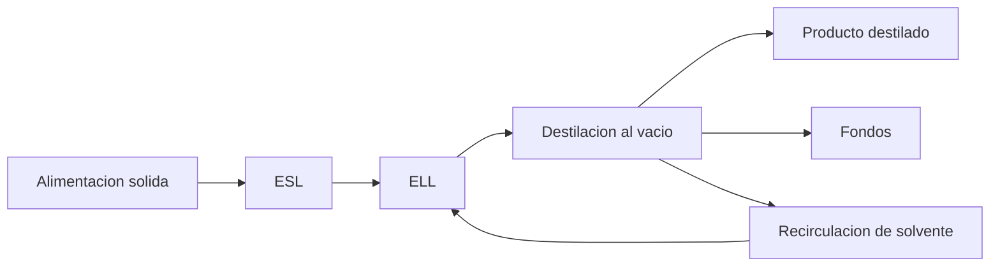
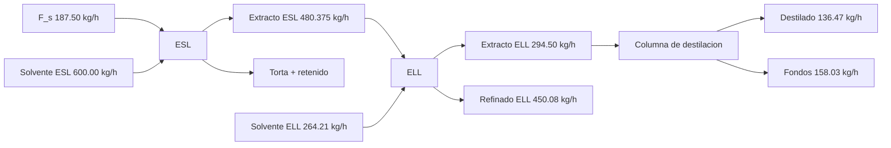

# Informe integrado de cumplimiento - Proyecto 3er Bloque

Fecha de actualizacion: 2026-04-06

Documentos de referencia:

- [Documento maestro de calculo](Calculos%20Proyecto%203er%20Bloque.md)
- [Auditoria post-recalculo](Auditoria_kg_h_verificacion.md)
- [Planteamiento oficial](plantemiento%203erbloque.md)

## 1. Introduccion

Este informe consolida la ingenieria del 3er bloque para la cadena ESL -> ELL -> Destilacion al vacio -> Recirculacion.

En esta version se integran tres componentes: cumplimiento tecnico de separacion, dimensionamiento de equipos ESL/ELL y analisis economico simplificado de materiales y consumos operativos.

## 2. Objetivos

### 2.1 Objetivo general

Verificar y documentar un diseno coherente del bloque de separacion que cumpla simultaneamente criterios de masa, energia, recuperacion y operacion.

### 2.2 Objetivos especificos

1. Mantener la recuperacion de acetato en destilacion en 99.3%.
2. Mantener pureza minima de destilado de 90.0% mol.
3. Dimensionar preliminarmente los equipos de ESL y ELL.
4. Cuantificar costos operativos simplificados en USD para materiales y utilidades.
5. Preservar trazabilidad completa entre calculos, auditoria y criterios contractuales.

## 3. Alcance y criterios contractuales

El bloque se considera conforme cuando cumple en simultaneo:

- Recuperacion de acetato en destilacion &gt;= 99.3%.
- Pureza minima de destilado &gt;= 90.0% mol.
- Recuperacion global minima del proceso total &gt;= 25.0%.
- Consumo especifico de vapor &lt; 2.2 kg/kg.
- Cierre de masa por etapa y cierre global.

## 4. Evidencia de diagramas y trazabilidad visual

### 4.1 Diagrama de bloques integrado

### 4.2 Diagrama de flujo operativo

### 4.3 Soporte grafico del diseno

- Metodo grafico ELL (diagrama triangular): [image.png](../media/images/image.png)
- Curvas de destilacion y escalonamiento: [curvas_destilacion_test.html](../media/images/curvas_destilacion_test.html)

## 5. Base oficial del caso

| Item | Valor |
|---|---:|
| Capacidad de planta | 1500 kg/d |
| Operacion | 8 h/d |
| Alimentacion horaria ESL | 187.50 kg/h |
| S/F en ESL | 3.2 kg/kg |
| Eficiencia ESL | 72% |
| Solvente fresco ELL | 264.21 kg/h |
| Eficiencia ELL | 80% |
| Alimentacion a destilacion, F | 294.50 kg/h |
| xF, xD, xB | 0.42, 0.90, 0.0055 |
| Reflujo, R | 2.0 |
| Volatilidad relativa, alpha | 2.5 |
| Recuperacion objetivo de acetato | &gt;= 99.3% |

## 6. Calculos empleados

### 6.1 ESL

- Balance de masa por componentes y cierre de etapa.
- Calculo de recuperacion real (72%) e ideal de referencia.
- Dimensionamiento preliminar de tanque: volumen, geometria y potencia de agitacion.

### 6.2 ELL

- Punto de mezcla global y reparto por linea de equilibrio.
- Ajuste de etapa real (80%) y cierre de masa.
- Dimensionamiento preliminar de mixer-settler: volumen de mezclador, volumen/area de decantador y potencia de mezcla.

### 6.3 Destilacion al vacio

- Balance de masa de columna.
- Fenske, McCabe-Thiele y conversion a etapas reales.
- Cargas termicas y dimensionamiento hidraulico (diametro/altura).

### 6.4 Analisis economico simplificado (USD)

- Costos operativos por vapor, electricidad auxiliar, reposicion de solvente y materia prima.
- OPEX anual simplificado y costo unitario por kg de destilado.
- Supuestos base: 2920 h/ano (8 h/dia x 365 d/ano), tarifa termica 0.035 USD/kWh, tarifa electrica 0.10 USD/kWh, solvente 1.25 USD/kg, materia prima 0.80 USD/kg.

## 7. Resultados tecnicos resumidos

### 7.1 ESL

- Extracto liquido: 480.375 kg/h.
- Soluto en extracto: 13.50 kg/h.
- Cierre de masa ESL: conforme.
- Dimensionamiento ESL: $V=0.802$ m3, $D=1.06$ m, $H=0.90$ m, motor 1.10 kW.

### 7.2 ELL

- Extracto ELL: 294.50 kg/h.
- Refinado ELL: 450.08 kg/h.
- Cierre de masa ELL: conforme.
- Dimensionamiento ELL: $V_m=0.078$ m3, $V_d=0.314$ m3, $A_d=0.784$ m2, motor 0.18 kW.

### 7.3 Destilacion al vacio

- Destilado: 136.47 kg/h.
- Fondos: 158.03 kg/h.
- Recuperacion de acetato: 99.3%.
- Configuracion adoptada: 20 platos reales + rehervidor (21 etapas).
- Cargas termicas: Qcond = 41.62 kW, Qreb = 41.62 kW.

### 7.4 Recirculacion y balance global

| Indicador | Valor |
|---|---:|
| Acetato recuperado en destilado | 122.83 kg/h |
| Reposicion de solvente | 141.38 kg/h |
| Entradas globales | 928.88 kg/h |
| Salidas globales | 928.88 kg/h |
| Cierre global | 100% |
| Consumo global de solvente | 4.69 kg/kg |

### 7.5 Economia operativa simplificada

| Concepto | Costo anual (USD) |
|---|---:|
| Vapor | 4,263.20 |
| Electricidad auxiliar ESL + ELL | 373.76 |
| Reposicion de solvente | 516,051.60 |
| Materia prima | 438,000.00 |
| **OPEX total simplificado** | **958,688.56** |

Costo operativo unitario de referencia:

$$
2.41\ \text{USD/kg destilado}
$$

## 8. Matriz de cumplimiento del alcance obligatorio (1-11)

| Item | Requisito del alcance | Evidencia de cumplimiento | Estado |
|---:|---|---|---|
| 1 | Diagrama de bloques | Seccion 4.1 de este informe | Cumplido |
| 2 | Diagrama de flujo integrado | Seccion 4.2 de este informe | Cumplido |
| 3 | Balance global de masa | Seccion 7.4 + documento maestro | Cumplido |
| 4 | Diseno ESL analitico | Documento maestro, seccion ESL | Cumplido |
| 5 | Diseno ELL por metodo grafico triangular | Seccion 4.3 + documento maestro, seccion ELL | Cumplido |
| 6 | Diseno de destilacion (analitico + McCabe) | Documento maestro, seccion destilacion | Cumplido |
| 7 | Numero de platos teoricos y reales | Seccion 7.3 de este informe | Cumplido |
| 8 | Cargas termicas en condensador y rehervidor | Seccion 7.3 de este informe | Cumplido |
| 9 | Diametro preliminar por criterio hidraulico | Documento maestro, seccion 4.5 | Cumplido |
| 10 | Integracion de recirculaciones | Seccion 7.4 de este informe | Cumplido |
| 11 | Evaluacion de indicadores globales | Seccion 9 de este informe | Cumplido |

## 9. Indicadores obligatorios con umbral y estado

| Indicador | Formula usada | Umbral | Resultado | Estado |
|---|---|---|---:|---|
| Recuperacion global minima (proceso total) | eta_global = (D x xD)/(F x xF) x 100 | &gt;= 25.0% | 99.3% | Cumplido |
| Pureza minima de destilado | Pureza_D = xD x 100 | &gt;= 90.0% mol | 90.0% mol | Cumplido |
| Recuperacion de acetato en destilacion | eta_A = (D x xD)/(F x xF) x 100 | &gt;= 99.3% | 99.3% | Cumplido |
| Consumo especifico de vapor | CE_v = m_vapor / D | &lt; 2.2 kg/kg | 0.50 kg/kg | Cumplido |
| Numero total de etapas reales | Platos reales + rehervidor | Reporte obligatorio | 21 etapas | Cumplido |
| Consumo global de solvente | CGS | Reporte obligatorio | 4.69 kg/kg | Cumplido |
| Cierre global de masa | (m_out/m_in) x 100 | 100% +/- 0.1% | 100.0% | Cumplido |

Nota: para el umbral de recuperacion global minima (25%), se adopta la definicion oficial acordada para proceso total en base de destilacion.

## 10. Conclusiones

1. El bloque mantiene cumplimiento tecnico del alcance obligatorio y criterios contractuales.
2. El dimensionamiento preliminar de ESL y ELL queda incorporado y trazable en el documento maestro.
3. El analisis economico simplificado identifica como principales contribuyentes del OPEX a solvente y materia prima.
4. El informe queda estructurado para uso academico y tecnico, con secciones formales y referencia cruzada a calculos/auditoria.

## 11. Anexos (estructura para completar)

### Anexo A. Memoria de calculo detallada de ESL

Contenido a agregar por el autor.

### Anexo B. Memoria de calculo detallada de ELL

Contenido a agregar por el autor.

### Anexo C. Soporte grafico complementario

Contenido a agregar por el autor.

### Anexo D. Soportes de costos y cotizaciones

Contenido a agregar por el autor.
