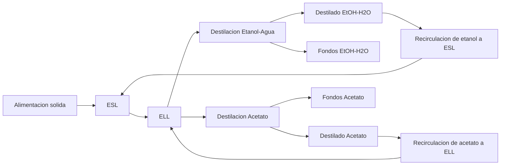
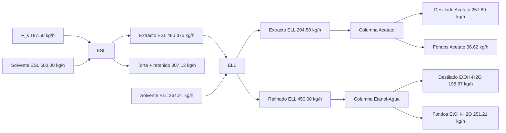

# Informe integrado de cumplimiento - Proyecto 3er Bloque

Fecha de actualizacion: 2026-04-10

Documentos de referencia:

- [Documento maestro de calculo](Calculos%20Proyecto%203er%20Bloque.md)
- [Planteamiento oficial](plantemiento%203erbloque.md)

## 1. Introduccion

Este informe consolida la ingenieria del 3er bloque para la cadena:

ESL -> ELL -> (Destilacion Etanol-Agua + Destilacion Acetato-Flor de Jamaica) -> Recirculacion dual.

En esta version se integran cuatro componentes:

1. Cumplimiento tecnico de separacion por etapas.
2. Trazabilidad de corrientes entre operaciones unitarias.
3. Verificacion de balances de masa por etapa y globales.
4. Analisis economico simplificado de materiales y utilidades.

## 2. Objetivos

### 2.1 Objetivo general

Verificar y documentar un diseno coherente del bloque de separacion que cumpla simultaneamente criterios de masa, recuperacion y operacion para dos trenes de destilacion.

### 2.2 Objetivos especificos

1. Mantener la recuperacion de etanol en su columna de recuperacion en 94.68%.
2. Mantener pureza minima de destilado etanol-agua en 90.0%.
3. Mantener recuperacion de acetato en 99.3% en la columna de acetato.
4. Cuantificar recirculacion dual y reposicion de solventes.
5. Recalcular costos operativos simplificados en USD con la nueva base integrada.

## 3. Alcance y criterios contractuales

El bloque se considera conforme cuando cumple en simultaneo:

- Pureza minima de destilado etanol-agua &gt;= 90.0%.
- Recuperacion de etanol en columna EtOH-H2O segun base de hoja.
- Recuperacion de acetato en columna de acetato &gt;= 99.3%.
- Consumo especifico de vapor en columna etanol-agua &lt; 2.2 kg/kg.
- Cierre de masa por etapa y cierre global del sistema.
- Trazabilidad explicita de corrientes ELL -> Destilacion EtOH-H2O y ELL -> Destilacion Acetato.

## 4. Evidencia de diagramas y trazabilidad visual

### 4.1 Diagrama de bloques integrado

### 4.2 Diagrama de flujo operativo

### 4.3 Soporte grafico del diseno

- ELL binodal y lineas de reparto (HTML): [ell_binodal_reparto.html](../media/images/ell_binodal_reparto.html)
- ELL binodal y lineas de reparto (PNG): [ell_binodal_reparto.png](../media/images/ell_binodal_reparto.png)
- McCabe-Thiele etanol-agua (HTML): [mccabe_etanol_agua.html](../media/images/mccabe_etanol_agua.html)
- McCabe-Thiele etanol-agua (PNG): [mccabe_etanol_agua.png](../media/images/mccabe_etanol_agua.png)

## 5. Base oficial del caso

| Item | Valor |
|---|---:|
| Capacidad de planta | 1500 kg/d |
| Operacion | 8 h/d |
| Alimentacion horaria ESL | 187.50 kg/h |
| S/F en ESL | 3.2 kg/kg |
| Eficiencia ESL | 72% |
| Solvente fresco ELL | 264.21 kg/h |
| Eficiencia ELL | 80% |
| Alimentacion a destilacion EtOH-H2O | 450.08 kg/h |
| Alimentacion a destilacion Acetato | 294.50 kg/h |
| Reflujo EtOH-H2O | 0.79 |
| Reflujo Acetato | 2.00 |
| Recuperacion objetivo acetato | &gt;= 99.3% |

## 6. Calculos empleados

### 6.1 ESL

- Balance de masa por componentes y cierre de etapa.
- Calculo de recuperacion real (72%) e ideal de referencia.
- Dimensionamiento preliminar de tanque: volumen, geometria y potencia de agitacion.

### 6.2 ELL

- Punto de mezcla global y reparto por linea de equilibrio.
- Ajuste de etapa real en base de hoja consolidada.
- Definicion de dos corrientes puente a destilacion.

### 6.3 Destilacion etanol-agua

- Balance de masa de columna.
- Fenske, McCabe-Thiele y conversion a etapas reales.
- Cargas termicas y dimensionamiento hidraulico (diametro/altura).

### 6.4 Destilacion acetato-flor de jamaica

- Balance de masa de columna.
- Fenske y conversion a etapas reales.
- Cargas termicas y dimensionamiento hidraulico (diametro/altura).

### 6.5 Analisis economico simplificado (USD)

- Costos operativos por vapor, electricidad auxiliar, reposicion de solvente y materia prima.
- OPEX anual simplificado y costo unitario por kg de destilado combinado.
- Supuestos base: 2920 h/ano, tarifa termica 0.035 USD/kWh, tarifa electrica 0.10 USD/kWh, solvente 1.25 USD/kg, materia prima 0.80 USD/kg.

## 7. Resultados tecnicos resumidos

### 7.1 ESL

- Extracto liquido: 480.375 kg/h.
- Soluto en extracto: 13.50 kg/h.
- Cierre de masa ESL: conforme.
- Dimensionamiento ESL: $V=0.802$ m3, $D=1.06$ m, $H=0.90$ m, motor 1.10 kW.

### 7.2 ELL

- Extracto ELL: 294.50 kg/h.
- Refinado ELL: 450.08 kg/h.
- Cierre de masa ELL: conforme por base de hoja.
- Parametros reales reportados: Xe=88.10%, Ye=2.12%, Xr=1.06%, Yr=1.62%.

### 7.3 Destilacion etanol-agua

- Destilado: 198.87 kg/h.
- Fondos: 251.21 kg/h.
- Recuperacion de etanol: 94.68%.
- Configuracion adoptada: 15 etapas reales (incluye rehervidor).
- Cargas termicas: Qcond = 89.10 kW, Qreb = 222.86 kW.
- Consumo especifico de vapor: 1.83 kg/kg.

### 7.4 Destilacion acetato

- Destilado: 257.89 kg/h.
- Fondos: 36.62 kg/h.
- Recuperacion de acetato: 99.3%.
- Configuracion adoptada: 23 etapas reales (incluye rehervidor).
- Cargas termicas: Qcond = 78.66 kW, Qreb = 78.66 kW.

### 7.5 Recirculacion y balances globales

| Indicador | Valor |
|---|---:|
| Solvente recuperado EtOH-H2O | 198.87 kg/h |
| Reposicion de etanol a ESL | 401.1283 kg/h |
| Solvente recuperado de acetato | 257.89 kg/h |
| Reposicion de acetato a ELL | 6.32 kg/h |
| Entradas globales (sin recirculacion) | 1051.71 kg/h |
| Salidas globales (sin recirculacion) | 1051.71 kg/h |
| Entradas netas (con recirculacion) | 594.95 kg/h |
| Salidas netas (con recirculacion) | 594.95 kg/h |
| Cierre global | 100.0% |
| Consumo global de solvente | 2.17 kg/kg |

### 7.6 Economia operativa simplificada

| Concepto | Costo anual (USD) |
|---|---:|
| Vapor (dos columnas) | 30,815.34 |
| Electricidad auxiliar ESL + ELL | 373.76 |
| Reposicion total de solvente | 1,487,186.30 |
| Materia prima | 438,000.00 |
| **OPEX total simplificado** | **1,956,375.40** |

Costo operativo unitario de referencia (destilados combinados):

$$
1.47\ \text{USD/kg}
$$

## 8. Matriz de cumplimiento del alcance obligatorio

| Item | Requisito del alcance | Evidencia de cumplimiento | Estado |
|---:|---|---|---|
| 1 | Diagrama de bloques | Seccion 4.1 de este informe | Cumplido |
| 2 | Diagrama de flujo integrado | Seccion 4.2 de este informe | Cumplido |
| 3 | Balance global de masa | Seccion 7.5 + documento maestro | Cumplido |
| 4 | Diseno ESL analitico | Documento maestro, seccion ESL | Cumplido |
| 5 | Diseno ELL por metodo grafico | Seccion 4.3 + documento maestro, seccion ELL | Cumplido |
| 6 | Diseno destilacion EtOH-H2O (analitico + McCabe) | Documento maestro, seccion 4 | Cumplido |
| 7 | Diseno destilacion Acetato (analitico) | Documento maestro, seccion 5 | Cumplido |
| 8 | Numero de etapas teoricas y reales | Secciones 7.3 y 7.4 | Cumplido |
| 9 | Cargas termicas en condensador y rehervidor | Secciones 7.3 y 7.4 | Cumplido |
| 10 | Integracion de recirculaciones | Seccion 7.5 | Cumplido |
| 11 | Evaluacion de indicadores globales | Seccion 9 | Cumplido |

## 9. Indicadores obligatorios con umbral y estado

| Indicador | Formula usada | Umbral | Resultado | Estado |
|---|---|---|---:|---|
| Recuperacion global minima (proceso total) | $\eta_{global}=(D x x_D)/(F x x_F) x 100$ (base EtOH-H2O) | &gt;= 25.0% | 94.68% | Cumplido |
| Pureza minima destilado EtOH-H2O | $x_D x 100$ | &gt;= 90.0% | 90.0% | Cumplido |
| Recuperacion de acetato | Valor reportado de hoja | &gt;= 99.3% | 99.3% | Cumplido |
| Consumo especifico de vapor (EtOH-H2O) | $CE_v = m_{vapor}/D$ | &lt; 2.2 kg/kg | 1.83 kg/kg | Cumplido |
| Etapas reales EtOH-H2O | Platos reales + rehervidor | Reporte obligatorio | 15 etapas | Cumplido |
| Etapas reales Acetato | Platos reales + rehervidor | Reporte obligatorio | 23 etapas | Cumplido |
| Consumo global de solvente | CGS | Reporte obligatorio | 2.17 kg/kg | Cumplido |
| Cierre global de masa | $(m_{out}/m_{in}) x 100$ | 100% +/- 0.1% | 100.0% | Cumplido |

## 10. Conclusiones

1. El bloque integrado queda consolidado con dos trenes de destilacion conectados a una sola etapa ELL.
2. La trazabilidad de corrientes y cierres de masa queda explicitada en base sin recirculacion y con recirculacion.
3. El consumo operativo esta dominado por reposicion de solvente, seguido por materia prima.
4. El paquete de informe queda sincronizado con la memoria de calculo para uso academico y tecnico.

## 11. Anexos (estructura para completar)

### Anexo A. Memoria de calculo detallada de ESL

Contenido a agregar por el autor.

### Anexo B. Memoria de calculo detallada de ELL

Contenido a agregar por el autor.

### Anexo C. Soporte grafico complementario

Contenido a agregar por el autor.

### Anexo D. Soportes de costos y cotizaciones

Contenido a agregar por el autor.
