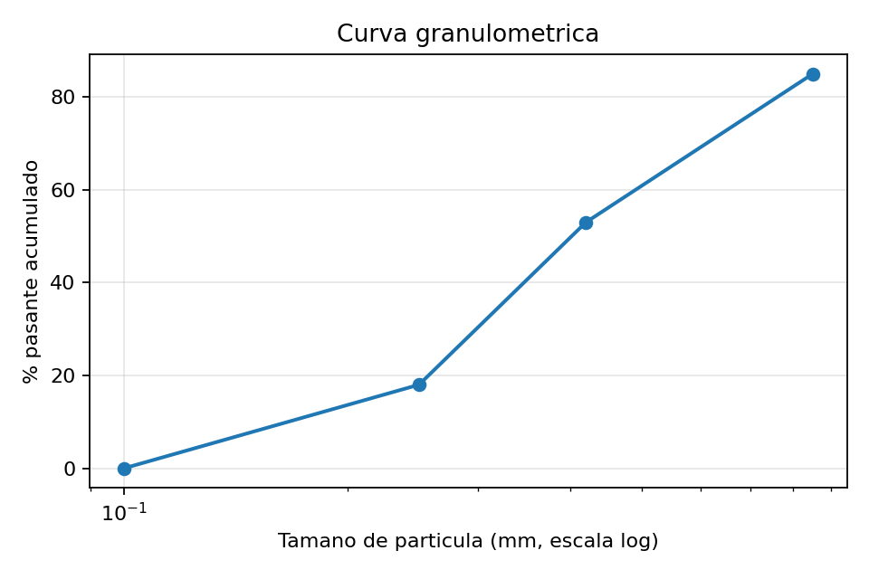
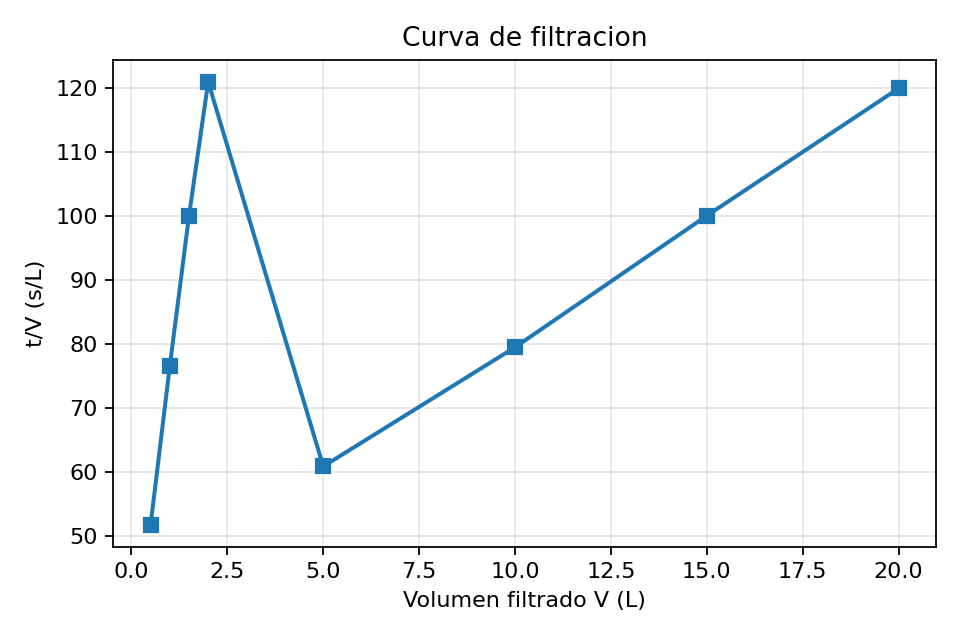
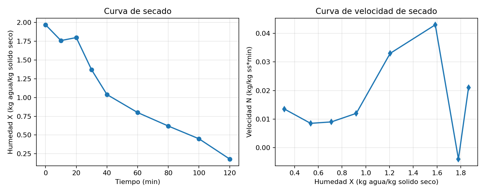

# Calculos Proyecto 4to Bloque

## 0) Criterio de trabajo y supuestos aprobados

1. Se usan como base numerica los datos tabulados de la imagen.
2. Se calculan todos los entregables solicitados en el planteamiento.
3. Humedad de torta para balance integrado: calculada desde el dato experimental $X_i=1.97$ kg agua/kg solido seco.
4. Energia de secado: minima teorica ($m_{evap}\times\lambda$).
5. Metodos Kick y Rittinger: calibrados para coincidir con Bond en el punto de diseno.
6. Eficiencia de tamizado: fraccion objetivo 0.25-0.42 mm sobre alimentacion total.
7. Se reportan dos visiones de balance:
	- Balance por etapa (operacional integrado).
	- Balance global integrado de la linea.
8. Base oficial de reporte para cierre global: base experimental trazable (misma base en suspension, filtracion y secado).
9. Filtracion: el ajuste de Ruth se reporta con los 8 puntos y se agrega contraste estadistico con subrango V >= 5 L.

## 1) Datos base (transcripcion)

### 1.1 Materia prima

| Parametro | Valor |
|---|---|
| Materia prima | Hojas te |
| Masa inicial | 10.0 kg |
| Humedad inicial | 60 % bh |
| Tamano inicial promedio, d_i | 4.0 mm |
| Indice de Bond, Wi | 13 kWh/ton |

### 1.2 Molienda y tamizado

Despues de la molienda, el material es clasificado:

| Tamano (mm) | Masa (kg) |
|---:|---:|
| 0.85 | 1.50 |
| 0.42 | 3.20 |
| 0.25 | 3.50 |
| 0.10 | 1.80 |

| Parametro | Valor |
|---|---|
| Fraccion seleccionada para proceso | 0.25-0.42 mm |
| Relacion agua/solido | 1.2 kg agua/kg solido |

### 1.3 Filtracion

| Parametro | Valor |
|---|---|
| Presion, Delta P | 50 kPa |
| Area del filtro disponible | 0.05 m^2 |
| Viscosidad, mu | 1x10^-3 Pa*s |
| Concentracion de solidos, C | 454 kg/m^3 |

| Volumen V (L) | Tiempo t (s) |
|---:|---:|
| 0.5 | 25.9 |
| 1.0 | 76.6 |
| 1.5 | 150.1 |
| 2.0 | 242.0 |
| 5.0 | 304.5 |
| 10.0 | 795.2 |
| 15.0 | 1501.3 |
| 20.0 | 2399.7 |

### 1.4 Secado

| Tiempo (min) | Humedad X (kg agua/kg solido seco) |
|---:|---:|
| 0 | 1.97 |
| 10 | 1.76 |
| 20 | 1.80 |
| 30 | 1.37 |
| 40 | 1.04 |
| 60 | 0.80 |
| 80 | 0.62 |
| 100 | 0.45 |
| 120 | 0.18 |

| Parametro | Valor |
|---|---|
| Condicion final | 8 % bh |

## 2) Calculos de molienda

### 2.1 Diametro medio de particula (promedio ponderado)

$$
d_{prom} = \frac{\sum(d_i\,m_i)}{\sum m_i}
$$

$$
d_{prom} = \frac{0.85(1.50)+0.42(3.20)+0.25(3.50)+0.10(1.80)}{10.0} = 0.3674\ \text{mm}
$$

Diametro geometrico ponderado (referencia):

$$
d_{geom} = \exp\left(\sum w_i\ln d_i\right)=0.3007\ \text{mm}
$$

### 2.2 Relacion de reduccion

$$
R_r = \frac{d_{inicial}}{d_{final}} = \frac{4.0}{0.3674}=10.8873
$$

### 2.3 Energia de molienda (Bond)

Se usa Bond con unidades consistentes en mm:

$$
E_{Bond}=W_i\left(\frac{1}{\sqrt{d_f}}-\frac{1}{\sqrt{d_i}}\right)
$$

$$
E_{Bond}=13\left(\frac{1}{\sqrt{0.3674}}-\frac{1}{\sqrt{4.0}}\right)=14.9474\ \text{kWh/ton}
$$

### 2.4 Energia por Kick y Rittinger (calibrados)

Kick:

$$
E_{Kick}=K_K\ln\left(\frac{d_i}{d_f}\right),\quad
K_K=\frac{E_{Bond}}{\ln(d_i/d_f)}=6.2604\ \text{kWh/ton}
$$

Rittinger:

$$
E_{Ritt}=K_R\left(\frac{1}{d_f}-\frac{1}{d_i}\right),\quad
K_R=\frac{E_{Bond}}{(1/d_f-1/d_i)}=6.0471\ \text{kWh*mm/ton}
$$

Por calibracion en el punto de diseno:

$$
E_{Kick}=E_{Ritt}=E_{Bond}=14.9474\ \text{kWh/ton}
$$

## 3) Calculos de tamizado

### 3.1 Fraccion retenida, acumulada y % pasante

$$
f_i=\frac{m_i}{m_T},\quad F_{acum}=\sum f_i,\quad \%\,pasante = 100(1-F_{acum})
$$

| Tamano (mm) | Masa (kg) | Fraccion retenida | Fraccion acumulada | % pasante |
|---:|---:|---:|---:|---:|
| 0.85 | 1.50 | 0.1500 | 0.1500 | 85.0 |
| 0.42 | 3.20 | 0.3200 | 0.4700 | 53.0 |
| 0.25 | 3.50 | 0.3500 | 0.8200 | 18.0 |
| 0.10 | 1.80 | 0.1800 | 1.0000 | 0.0 |

### 3.2 Diametro medio D50

Se interpola entre 0.42 mm (53 % pasante) y 0.25 mm (18 % pasante) en escala logaritmica:

$$
\log_{10}D_{50}=\log_{10}(0.42)+\frac{50-53}{18-53}\left[\log_{10}(0.25)-\log_{10}(0.42)\right]
$$

$$
D_{50}=0.4017\ \text{mm}
$$

### 3.3 Eficiencia de tamizado (criterio del planteamiento)

Fraccion objetivo: 0.25-0.42 mm (masa = 3.50 kg).

$$
\eta_{tam} = \frac{3.50}{10.0}\times100 = 35.0\%
$$

### 3.4 Datos para curva granulometrica

X recomendado: $\log_{10}(d\,\text{[mm]})$, Y: % pasante.

| d (mm) | log10(d) | % pasante |
|---:|---:|---:|
| 0.85 | -0.0706 | 85.0 |
| 0.42 | -0.3768 | 53.0 |
| 0.25 | -0.6021 | 18.0 |
| 0.10 | -1.0000 | 0.0 |

## 4) Preparacion de suspension

Se toma la fraccion 0.25-0.42 mm como masa de solido de proceso.

### 4.1 Masa de solido seco

$$
m_s=3.50(1-0.60)=1.40\ \text{kg}
$$

### 4.2 Masa de agua anadida

$$
m_w = 1.2\frac{\text{kg agua}}{\text{kg material seleccionado}}\times3.50 = 4.20\ \text{kg}
$$

### 4.3 Concentracion de solidos

$$
C_{s,kg/kg} = \frac{m_s}{m_{mezcla}}=\frac{1.40}{7.70}=0.1818\ \text{kg solido/kg mezcla}
$$

$$
C_{s,\%}=18.18\%
$$

Valor equivalente aproximado en base volumetrica (si $\rho\approx1000\ \text{kg/m}^3$):

$$
C_{s}\approx181.8\ \text{kg/m}^3
$$

Nota: el valor $C=454\ \text{kg/m}^3$ se mantiene en el bloque de Ruth porque fue dato base reportado para ese ajuste experimental.

## 5) Calculos de filtracion

### 5.1 Curva de filtracion solicitada (X: V, Y: t/V)

| V (L) | t (s) | t/V (s/L) |
|---:|---:|---:|
| 0.5 | 25.9 | 51.8000 |
| 1.0 | 76.6 | 76.6000 |
| 1.5 | 150.1 | 100.0667 |
| 2.0 | 242.0 | 121.0000 |
| 5.0 | 304.5 | 60.9000 |
| 10.0 | 795.2 | 79.5200 |
| 15.0 | 1501.3 | 100.0867 |
| 20.0 | 2399.7 | 119.9850 |

### Procedimiento para obtener la recta en SI

La curva de filtracion no se ajusta sobre $t$ vs $V$ directamente, sino sobre la forma linealizada de Ruth:

$$
\frac{t}{V}=mV+b
$$

Para llevar los datos a SI se hace lo siguiente:

1. El volumen de cada punto se convierte de litros a metros cubicos:

$$
V_i\,[m^3]=\frac{V_i\,[L]}{1000}
$$

2. Se calcula la variable dependiente de la regresion:

$$
y_i=\frac{t_i}{V_i}
$$

3. Se usa como variable independiente el volumen en SI:

$$
x_i=V_i\,[m^3]
$$

La tabla de trabajo queda asi:

| V (L) | V (m^3) | t (s) | y = t/V (s/m^3) |
|---:|---:|---:|---:|
| 0.5 | 0.0005 | 25.9 | 51800.0 |
| 1.0 | 0.0010 | 76.6 | 76600.0 |
| 1.5 | 0.0015 | 150.1 | 100066.6667 |
| 2.0 | 0.0020 | 242.0 | 121000.0 |
| 5.0 | 0.0050 | 304.5 | 60900.0 |
| 10.0 | 0.0100 | 795.2 | 79520.0 |
| 15.0 | 0.0150 | 1501.3 | 100086.6667 |
| 20.0 | 0.0200 | 2399.7 | 119985.0 |

Con estos valores se obtienen las sumas de minimos cuadrados:

$$
n=8
$$

$$
\sum x_i=0.0550
$$

$$
\sum y_i=709{,}958.3333
$$

$$
\sum x_i^2=0.0007575
$$

$$
\sum x_i y_i=5{,}495.3
$$

La pendiente y el intercepto se calculan con las expresiones estandar de regresion lineal:

$$
m=\frac{n\sum x_i y_i-(\sum x_i)(\sum y_i)}{n\sum x_i^2-(\sum x_i)^2}
$$

$$
b=\frac{\sum y_i-m\sum x_i}{n}
$$

Sustituyendo numéricamente:

$$
m=\frac{8(5{,}495.3)- (0.055)(709{,}958.3333)}{8(0.0007575)-(0.055)^2}=1{,}619{,}338.2757\ \frac{s}{m^6}
$$

$$
b=\frac{709{,}958.3333-1{,}619{,}338.2757(0.055)}{8}=77{,}611.8410\ \frac{s}{m^3}
$$

Interpretacion fisica:

- $m$ representa la sensibilidad del cociente $t/V$ frente al aumento de volumen filtrado; en el modelo de Ruth se relaciona con la resistencia de la torta.
- $b$ es el intercepto extrapolado a $V\to0$ y representa la contribucion del medio filtrante antes de que la torta domine la caida de presion.
- El ajuste global no es perfectamente lineal porque la serie completa incluye transitorios iniciales; por eso se reporta tambien el contraste con $V\ge5$ L.

Volumen final de filtrado medido:

$$
V_f=20.0\ \text{L}
$$

### 5.2 Ajuste lineal Ruth en SI

Ecuacion lineal usada:

$$
\frac{t}{V}=mV+b
$$

Con $V$ en m^3 y $t/V$ en s/m^3:

$$
m=1{,}619{,}338.2757\ \frac{s}{m^6},\quad
b=77{,}611.8410\ \frac{s}{m^3}
$$

Recta ajustada:

$$
\frac{t}{V}=1{,}619{,}338.2757\,V+77{,}611.8410
$$

Indicadores de calidad del ajuste:

- $R^2$ global (8 puntos): 0.2141.
- $R^2$ en subrango $V\ge5$ L: 0.9996.

Nota metodologica: para mantener trazabilidad con la serie completa de datos de laboratorio, el reporte oficial conserva la recta de 8 puntos; el subrango $V\ge5$ L se usa como contraste de robustez en regimen cuasi lineal.

### 5.3 Resistencia de torta (alpha) y resistencia de medio (Rm)

Modelo a presion constante:

$$
\frac{t}{V}=\frac{\mu\alpha C}{2A^2\Delta P}V+\frac{\mu R_m}{A\Delta P}
$$

Despejes:

$$
\alpha = m\frac{2A^2\Delta P}{\mu C},\quad
R_m = b\frac{A\Delta P}{\mu}
$$

Con $\mu=1\times10^{-3}$ Pa*s, $A=0.05$ m^2, $\Delta P=50{,}000$ Pa, $C=454$ kg/m^3:

$$
\alpha = 8.9171\times10^8\ \text{m/kg}
$$

$$
R_m = 1.9403\times10^{11}\ \text{m}^{-1}
$$

Interpretacion breve:

- La resistencia de la torta ($\alpha$) es la oposicion que genera el propio solido acumulado sobre el filtro; aumenta conforme la torta se hace mas gruesa y dificulta mas el paso del liquido.
- La resistencia del medio ($R_m$) es la oposicion inherente del material filtrante limpio, por ejemplo la tela, malla o membrana, incluso antes de que se forme la torta.

### 5.4 Masa de torta humeda y humedad de torta

Dato base experimental de secado: $X_i=1.97$ kg agua/kg solido seco.

Con $m_s=1.40$ kg de solido seco:

$$
m_{agua,torta}=X_i\,m_s=1.97\times1.40=2.7580\ \text{kg}
$$

$$
m_{torta,hum}=m_s+m_{agua,torta}=1.40+2.7580=4.1580\ \text{kg}
$$

$$
H_{torta,bh}=\frac{m_{agua,torta}}{m_{torta,hum}}\times100=\frac{2.7580}{4.1580}\times100=66.33\%
$$

Filtrado por balance de lote (misma base experimental):

$$
m_{filtrado}=7.70-4.1580=3.5420\ \text{kg}
$$

## 6) Calculos de secado

Nota metodologica de secado:

- Se usa una base unificada: datos experimentales de humedad ($X_i$) y balance integrado del lote.

### 6.1 Humedad inicial y final

De la curva experimental (tabla):

$$
X_i=1.97\ \frac{\text{kg agua}}{\text{kg solido seco}}
$$

Condicion final pedida: 8 % bh.

$$
X_f=\frac{0.08}{1-0.08}=0.0869565\ \frac{\text{kg agua}}{\text{kg solido seco}}
$$

### 6.2 Masa final del producto

Con base de $m_s=1.40$ kg de solido seco:

$$
m_{producto}=m_s(1+X_f)=1.40(1+0.0869565)=1.5217\ \text{kg}
$$

### 6.3 Agua evaporada

Calculo por curva experimental:

$$
m_{evap}=m_s(X_i-X_f)=1.40(1.97-0.0869565)=2.6363\ \text{kg}
$$

Verificacion por balance de agua en torta:

$$
m_{evap}=m_{agua,torta}-m_{agua,final}=2.7580-0.1217=2.6363\ \text{kg}
$$

### 6.4 Tiempo de secado para cumplir 8 % bh

Con extrapolacion lineal del ultimo tramo de curva (100-120 min):

$$
p=\frac{0.18-0.45}{120-100}=-0.0135\ \frac{\text{kg/kg ss}}{\text{min}}
$$

$$
t_{objetivo}=120+\frac{0.0869565-0.18}{-0.0135}=126.8921\ \text{min}
$$

### 6.5 Energia minima teorica de secado

Se toma $\lambda=2257$ kJ/kg (agua).

Con $m_{evap}=2.6363$ kg:

$$
Q_{min}=m_{evap}\lambda=2.6363\times2257=5950.0408\ \text{kJ}
$$

$$
Q_{min}=1.6528\ \text{kWh}
$$

### 6.6 Curva de secado (X: tiempo, Y: humedad)

| Tiempo (min) | Humedad X (kg agua/kg solido seco) |
|---:|---:|
| 0 | 1.97 |
| 10 | 1.76 |
| 20 | 1.80 |
| 30 | 1.37 |
| 40 | 1.04 |
| 60 | 0.80 |
| 80 | 0.62 |
| 100 | 0.45 |
| 120 | 0.18 |

### 6.7 Curva de velocidad de secado (X: humedad, Y: velocidad)

Se usa diferencia finita por intervalo:

$$
N\approx-\frac{\Delta X}{\Delta t}
$$

| Intervalo (min) | X medio (kg/kg ss) | Velocidad N (kg/kg ss*min) |
|---|---:|---:|
| 0-10 | 1.8650 | 0.0210 |
| 10-20 | 1.7800 | -0.0040 |
| 20-30 | 1.5850 | 0.0430 |
| 30-40 | 1.2050 | 0.0330 |
| 40-60 | 0.9200 | 0.0120 |
| 60-80 | 0.7100 | 0.0090 |
| 80-100 | 0.5350 | 0.0085 |
| 100-120 | 0.3150 | 0.0135 |

Nota: el valor negativo en 10-20 min refleja dispersion experimental de la serie.

## 7) Balance de masa

### 7.1 Balance por etapa (operacional integrado)

| Etapa | Entrada (kg) | Salida (kg) | Cierre |
|---|---:|---:|---:|
| Tamizado | 10.0000 | 1.5000 + 3.2000 + 3.5000 + 1.8000 = 10.0000 | 0.0000 % |
| Suspension | 3.5000 + 4.2000 = 7.7000 | 7.7000 | 0.0000 % |
| Filtracion | 7.7000 | 4.1580 (torta) + 3.5420 (filtrado) = 7.7000 | 0.0000 % |
| Secado | 4.1580 | 1.5217 (producto) + 2.6363 (evaporada) = 4.1580 | 0.0000 % |

### 7.2 Balance global integrado (lote completo)

Entradas:

$$
m_{in}=10.0\ (\text{materia prima})+4.2\ (\text{agua anadida})=14.2\ \text{kg}
$$

Salidas:

$$
m_{out}=6.5\ (\text{rechazos tamizado})+3.5420\ (\text{filtrado})+1.5217\ (\text{producto})+2.6363\ (\text{agua evaporada})
$$

$$
m_{out}=14.2\ \text{kg}
$$

Cierre:

$$
\%\,cierre=\left|\frac{m_{out}-m_{in}}{m_{in}}\right|\times100 = 0.0000\%
$$

## 8) Resumen de cumplimiento del planteamiento

| Bloque solicitado | Resultado calculado |
|---|---|
| Molienda: relacion de reduccion | $R_r=10.8873$ |
| Molienda: diametro medio | $d_{prom}=0.3674$ mm |
| Molienda: energia Bond/Kick/Rittinger | 14.9474 kWh/ton (Kick y Rittinger calibrados) |
| Tamizado: fraccion retenida/acumulada/% pasante | Calculado en tabla completa |
| Tamizado: D50 | $D_{50}=0.4017$ mm |
| Tamizado: eficiencia | 35.0 % |
| Tamizado: curva granulometrica | Tabla $(\log d,\%\ pasante)$ lista para graficar |
| Suspension: masa de solido seco | 1.40 kg |
| Suspension: masa de agua anadida | 4.20 kg |
| Suspension: concentracion de solidos | 0.1818 kg/kg (18.18 %) |
| Filtracion: volumen de filtrado | 20.0 L (serie experimental) |
| Filtracion: masa de torta humeda | 4.1580 kg |
| Filtracion: humedad de torta | 66.33 % bh (calculada desde $X_i=1.97$) |
| Filtracion: resistencia de torta | $\alpha=8.9171\times10^8$ m/kg |
| Filtracion: resistencia del medio | $R_m=1.9403\times10^{11}$ m^-1 |
| Filtracion: curva X=V, Y=t/V | Tabla completa V-t/V incluida |
| Secado: humedad inicial/final | $X_i=1.97$ bs, $X_f=0.08696$ bs (8 % bh) |
| Secado: masa final producto | 1.5217 kg |
| Secado: agua evaporada | 2.6363 kg |
| Secado: tiempo para 8 % bh | 126.8921 min (extrapolado) |
| Secado: energia de secado | 1.6528 kWh (minima teorica) |
| Secado: curva de secado | Tabla tiempo-humedad incluida |
| Secado: curva de velocidad | Tabla X medio - N incluida |
| Balance global de masa | Entrada 14.2 kg, salida 14.2 kg, cierre 0.0000 % |

## 9) Graficas simples

### 9.1 Curva granulometrica

### 9.2 Curva de filtracion (t/V vs V)

### 9.3 Curva de secado y velocidad de secado

