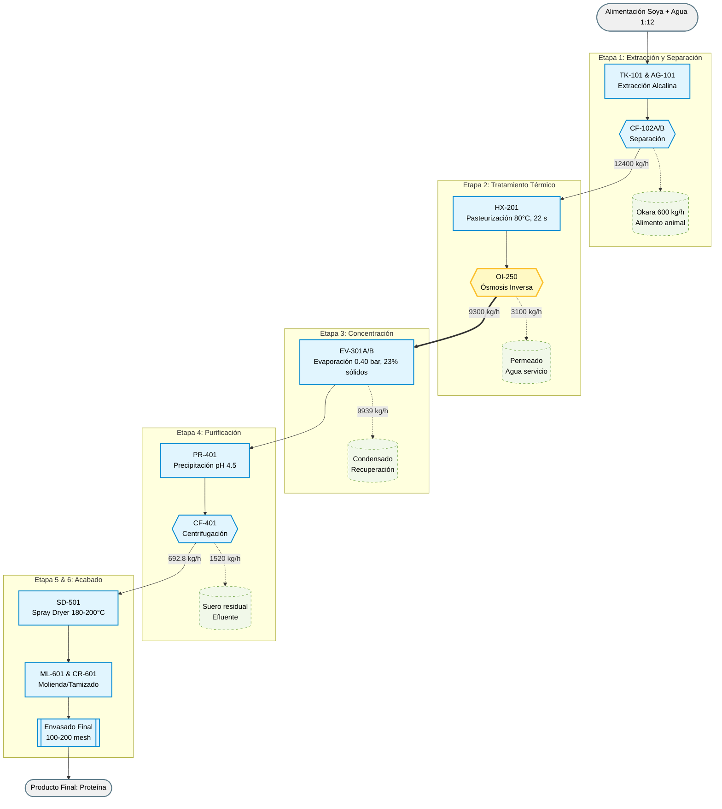

# Informe Técnico Simplificado
## Producción de Proteína Aislada de Soya

**Fecha:** Marzo 2026  
**Capacidad:** 1000 kg/h de grano de soya  
**Producto final:** Proteína aislada en polvo (364.6 kg/h, 88.7% pureza)

---

## Tabla de Contenidos

1. [Resumen Ejecutivo](#resumen-ejecutivo)
2. [Descripción del Proceso por Etapas](#descripcion-del-proceso-por-etapas)
   - 2C. [Preconcentración por Ósmosis Inversa](#etapa-2c-preconcentracion-por-osmosis-inversa-innovacion)
3. [Balance de Masa Global](#balance-de-masa-global)
4. [Balance de Energía](#balance-de-energia)
5. [Especificaciones de Equipos](#especificaciones-de-equipos)
6. [Diagrama de Flujo Integrado](#diagrama-de-flujo-integrado)
7. [Características Técnicas del Proceso](#caracteristicas-tecnicas-del-proceso)
8. [Variables Operacionales Críticas](#variables-operacionales-criticas)
9. [Consideraciones de Seguridad y Control de Calidad](#consideraciones-de-seguridad-y-control-de-calidad)
10. [Conclusiones y Verificaciones](#conclusiones-y-verificaciones)

---

## Resumen Ejecutivo

### Materia Prima: Soya (Glycine max)

La soya es una leguminosa originaria de Asia Oriental, ampliamente cultivada como fuente de proteína vegetal de bajo costo. **Características clave:**
- Contenido proteico: 37.5–40% en base seca (superior a cereales y comparable a carnes)
- Proteínas principales: β-conglicinina (7S) y 11S globulina, de alta digestibilidad
- Perfil de aminoácidos: Completo, incluyendo los 9 esenciales; deficiente relativo en metionina
- Lípidos: 18–20% (ácidos grasos insaturados; fuente de aceite de cocina)
- Carbohidratos: 30% (oligosacáridos fermentables, factores antinutricionales removibles por procesamiento)
- Disponibilidad: Cultivo masivo, precio competitivo (~200–400 USD/tonelada)

**Relación con el proyecto:** La soya es la materia prima elegida en este proyecto porque posee proteína en concentración suficientemente alta y composición estable para justificar un proceso de purificación industrial. Su contenido proteico del 37.5% en grano permite diseñar un esquema de extracción alcalina con rendimiento técnico y económico viable. Además, subproductos como el okara (residuo fibroso post-extracción) tienen valor como alimento animal, mejorando la economía del proceso.

### Objetivos del Proyecto

**Objetivo General:**
Diseñar y evaluar un proceso integrado de producción de proteína aislada de soya (SPI) capaz de procesar **1000 kg/h de grano de soya** para obtener **364.6 kg/h de polvo proteico seco** con especificación de **88.7% pureza** y **granulometría 100–200 mesh**, cumpliendo estándares de calidad alimentaria e inocuidad microbiológica.

**Objetivos Específicos:**
1. **Tecnológico:** Integrar 6 etapas operacionales (extracción, separación, neutralización, concentración, precipitación, secado) en un esquema coherente, seleccionando equipos apropiados y definiendo parámetros operativos críticos.
2. **De Rendimiento:** Lograr recuperación de proteína del 86.2% global, minimizando pérdidas en etapas de separación y concentración.
3. **De Calidad:** Asegurar producto final libre de contaminantes microbiológicos (< 10⁴ UFC/g), humedad controlada (< 5%) y propiedades funcionales preservadas (solubilidad, gelificación, emulsión).
4. **Energético:** Optimizar consumo de utilidades a **4704 kW equivalentes**, priorizando evaporación bajo vacío y recuperación térmica para reducir impacto ambiental.
5. **De Seguridad:** Establecer puntos críticos de control (PCC) y procedimientos operativos para garantizar manipulación segura de ácidos/bases y vapor.
6. **Económico:** Proporcionar base técnica para evaluación de viabilidad económica a escala industrial, considerando capex equipos, opex de utilidades y valor de subproductos.

### Objetivo del Proceso

Producir proteína aislada de soya de alta pureza mediante un proceso de 6 etapas que integra extracción alcalina, tratamiento térmico, concentración, precipitación isoeléctrica, secado por atomización y clasificación granulométrica.

### Fundamentos Teóricos Clave

**Proteína Aislada de Soya (SPI):** Concentrado proteico obtenido por eliminación de la mayoría de carbohidratos, lípidos y compuestos de sabor. Contiene > 90% proteína en base seca y es soluble en soluciones alcalinas (pH > 8), característica que fundamenta la extracción.

**Extracción Alcalina:** En medio alcalino (pH 8.5–9.0), las proteínas globulares de soya (β-conglicinina y 11S globulina) adopten carga neta negativa y se disuelven para separarse de fibra insoluble (okara). Temperatura de 55°C optimiza cinética sin provocar desnaturalización.

**Precipitación Isoeléctrica:** A pH 4.5 (punto isoeléctrico), la carga neta de la proteína es cero, causando agregación espontánea y separación física de la solución. Este mecanismo es reversible: refluliación alcalina posterior permite recuperación de funcionalidad.

**Evaporación bajo Vacío:** La reducción de presión (0.40 bar abs) disminuye temperatura de ebullición a ~50°C, permitiendo concentración sin degradación térmica. Doble efecto (recuperación de vapor) mejora economía energética a 1.85 kg agua/kg vapor.

**Secado por Atomización (Spray Dry):** Transformación rápida (10–20 s) de suspensión concentrada en polvo seco mediante contacto íntimo con aire caliente. La velocidad de secado preserva estructura proteica; retención final < 5% humedad garantiza estabilidad microbiológica.

### Materias Primas y Producto Final

| Parámetro | Valor | Unidad |
|-----------|-------|--------|
| **Entrada:** Grano de soya | 1000 | kg/h |
| Proteína en grano | 37.5 | % p/p |
| Agua de extracción (relación 1:12) | 12000 | kg/h |
| **Salida:** Polvo final | 364.6 | kg/h |
| Proteína pura recuperada | 323.4 | kg/h |
| Pureza del polvo | 88.7 | % |
| **Rendimiento:** Proteína grano → polvo | 86.2 | % |
| Humedad final | 5.0 | % p/p |
| Granulometría | 100–200 | mesh |

### Consumo de Utilidades

| Utilidad | Cantidad | Fuente |
|----------|----------|--------|
| **Vapor (equivalente)** | 3906 | kW |
| **Aire comprimido (secado)** | 378 | kW |
| **Electricidad (bombas, agitación, vacío)** | 420 | kW |
| **Total** | **4704** | **kW** |

**Equivalente:** ~5.8 MJ/kg de proteína final  
**Operación:** 8000 h/año → 2,912,000 unidades de energía/año

**Nota hídrica:** la captación desde red industrial (12 m³/h) usa una bomba de alimentación de ~0.6 kW (motor comercial 1.5 kW), ya incluida dentro de consumos eléctricos auxiliares redondeados.

---

## Descripción del Proceso por Etapas

El proceso integra 6 etapas operacionales + una de inicio (preparación de materias primas). A continuación, resumen de cada fase.

### Etapa 0: Preparación de Materias Primas

**Operaciones:** Captación de agua desde red industrial, almacenamiento intermedio, molienda, tamizado inicial y ajuste de pH del extractante.

- **Captación de agua:** 12000 L/h (12.0 m³/h) desde red industrial
- **Tanque de agua de extracción (TK-001):** 15 m³ nominal (autonomía base 1 h + 20% de reserva)
- **Bombeo de alimentación de agua:** TDH de diseño 10.7 m; potencia calculada 0.60 kW; selección preliminar 1.5 kW
- **Harina de soya:** Molienda a 100–200 mesh (0.1–1 mm)
- **Agua alcalina:** Preparación de extractante con NaOH a pH 8.5–9.0
- **Materiales:** Tank de polietileno (HDPE) para NaOH; tuberías AISI 304/316L

**Salida:** Harina fina (95–98% de rendimiento) + agua alcalina lista para uso.

---

### Etapa 1: Extracción Alcalina (Lixiviación)

**Objetivo:** Disolver proteína del grano en medio alcalino, dejando fibra insoluble en suspensión.

| Aspecto | Valor |
|--------|-------|
| **Entrada** | 1000 kg/h grano + 12000 kg/h agua alcalina |
| **Condiciones** | pH 8.75, 55°C, 45–60 min, agitación continua |
| **Salida** | 13000 kg/h lodo proteico alcalino |
| **Rendimiento proteico** | 330 kg/h (88% de 375 kg/h input) |
| **Material equipo** | Acero inoxidable 316L |

**Descripción:** En tanque agitado de 14 m³ con turbina de palas inclinadas, la suspensión se mantiene homogénea para maximizar contacto sólido-líquido. El pH alcalino activa la solubilidad de proteínas globulares de soya. Temperaturas > 65°C riesgo desnaturalización; < 50°C cinética insuficiente.

---

### Etapa 2A: Separación Sólido-Líquido

**Objetivo:** Remover okara (residuo fibroso) del extracto proteico.

| Aspecto | Valor |
|--------|-------|
| **Entrada** | 13000 kg/h lodo proteico |
| **Equipo** | 2 centrífugas decantadoras en paralelo (8 m³/h c/u) |
| **Salida líquida** | 12400 kg/h extracto clarificado |
| **Salida sólida (okara)** | 600 kg/h (65% humedad) |
| **Recuperación extracto** | 95–98% |
| **Tiempo operación** | 5–10 min |

**Descripción:** Centrifugación a 1800 g separa eficientemente sólidos de ~100–250 μm. El okara se descarga hacia secado rápido (< 24 h) para uso como alimento animal o fertilizante. Este punto es crítico: si se demora el extracto, puede iniciarse degradación proteica.

---

### Etapa 2B: Neutralización y Pasteurización

**Objetivo:** Estabilizar pH a neutral y eliminar carga microbiana sin dañar la proteína.

| Aspecto | Valor |
|--------|-------|
| **Entrada** | 12400 kg/h extracto pH 8.75 @ 25°C |
| **Neutralización** | Adición de HCl → pH 7.0 (tanque pequeño de 2–3 min) |
| **Pasteurización** | Calentamiento a 80°C, retención 22 s, enfriamiento rápido a 25°C |
| **Salida** | 12400 kg/h extracto pasteurizado pH 7.0 @ 25°C |
| **Carga térmica (neta)** | 324 kW; consumo real (90% eficiencia) = 360 kW |
| **Material equipo** | Acero inoxidable 316L (placas intercambiador) |

**Descripción:** El intercambiador de placas recupera ~55% del calor (aire frío entrada → contracorriente → aire caliente salida). Pasteurización HTST (High Temperature Short Time) elimina ~6 ciclos logarítmicos de patógenos sin afectar funcionalidad proteica (tiempo corto, T moderada).

---

### Etapa 2C: Preconcentración por Ósmosis Inversa (Innovación)

**Objetivo:** Reducir volumen de extracto proteico mediante membrana semipermeable antes de evaporación térmica, aliviando carga de energía térmica y mejorando eficiencia global.

| Aspecto | Valor |
|--------|-------|
| **Entrada** | 12400 kg/h extracto pasteurizado pH 7.0 @ 25°C (~8% sólidos) |
| **Condiciones operativas** | Presión 20–25 bar, temperatura 25–30°C, TDS rechazo 50–70% |
| **Tipo membrana** | Nanofiltración (RO) de bajo fouling, MWCO ~200–500 Da |
| **Recuperación de permeado** | 25–30% (3100–3720 kg/h agua pura) |
| **Salida concentrado (rechazo)** | 9300 kg/h @ ~13% sólidos proteicos |
| **Salida permeado (agua)** | 3100 kg/h (agua servicio, pos-tratamiento) |
| **Presión diferencial transmembrana (TMP)** | 18 ± 2 bar |
| **Caudal específico (flux)** | 25–35 L/(m²·h) |
| **Área membrana total** | 120–150 m² (modular, espiral/tubo) |
| **Potencia bomba (RO)** | 15–20 kW (incluida recuperación presión) |
| **Material equipos** | Carcasas acero inoxidable 316L; tuberías PTFE llenas |
| **Tiempo de residencia** | ~5 min |
| **Frecuencia CIP** | 1× cada 168 h (o cuando flux cae 15%) |

**Descripción:** La ósmosis inversa es un módulo **opcional pero altamente recomendado** para reducir la carga térmica del evaporador:

- **Principio:** Presión hidrostática > presión osmótica fuerza moléculas de agua pura a traspasar membrana semipermeable de poros ~0.0001 μm, rechazando sales, azúcares y proteína.
  
- **Beneficio energético:** Al reducir agua presente en 12400 kg/h → 9300 kg/h (75% del original), la evaporación posterior requiere **menos vapor** (~25% menos agua a evaporar). Comparativa:
  - **Sin OI:** Evaporar 12400 kg/h extracto @ 8% a 23% sólidos requiere evaporar 9939 kg/h agua
  - **Con OI:**  Evaporar 9300 kg/h concentrado @ 13% a 23% sólidos requiere evaporar ~5875 kg/h agua (reducción 41%)
  
- **Limitaciones:**  
  - Proteína globular (MW ~50 kDa) NO se permea (rechazada, bueno)
  - Pequeñas moléculas (aminoácidos, iones) **parcialmente permeadas** (pérdida ~5–10% de aminoácidos de bajo peso molecular)
  - Fouling por depósitos minerales o complejos: requiere CIP periódica con ácido/básico
  - Consumo eléctrico (15–20 kW bomba) vs. ahorro vapor (1500–2000 kW aprox.): balance energético claramente favorable
  
- **Control operativo:**  
  - Monitoreo de **flux membrana** en tiempo real (caída > 15% → señal CIP)
  - Presión TMP: mantener 20 ± 2 bar (> 25 bar riesgo deformación; < 15 bar ineficiencia)
  - Conductividad permeado: validar que rechazo de iones (Na, K, Cl) sea > 90%
  - Temperatura entrada: 25–30°C (< 20°C viscosidad alta, bajo flux; > 35°C riesgo degradación enzimática)

**Cálculo de energía ahorrada (estimado):**
- Vapor ahorrado: ~1800 kg/h × 2.7 MJ/kg ≈ **4860 kW equivalentes**
- Costo eléctrico OI: 18 kW × 3 USD/kWh × 8000 h/año = 432,000 USD/año
- Costo vapor ahorrado: 1800 kg/h × 20 USD/tonelada × 8000 h/año ≈ **288,000 USD/año** (neto: recuperación parcial)

**Decisión de implementación:** Recomendado si:
- ✓ Presupuesto capex permite módulo RO (~800 k–1.2 M USD)
- ✓ Disponibilidad de agua de servicio para permeado (riego, limpieza)
- ✓ Requerimiento de bajo consumo energético (operación ecoeficiente)

---

### Etapa 3: Concentración por Evaporación al Vacío (2 Efectos)

**Objetivo:** Reducir agua del extracto y elevar concentración de sólidos antes de precipitación.

| Aspecto | Valor |
|--------|-------|
| **Entrada** | 12400 kg/h extracto (~8% sólidos) |
| **Salida** | 2461 kg/h concentrado (~23% sólidos) |
| **Agua evaporada** | 9939 kg/h |
| **Presión de operación** | 0.40 bar abs (~48°C ebullición) |
| **Carga térmica (proceso)** | 6502 kW; equivalente vapor vivo = 3515 kW; consumo real (90%) = 3906 kW |
| **Area de transferencia** | 173.8 m²/efecto (doble efecto = 347.6 m² total) |
| **Temperatura operación** | 48–60°C (baja para proteger proteína) |
| **Material equipo** | Acero 304/316L (cuerpo); cobre/latón níquel (tubos) |

**Descripción:** El evaporador falling film opera bajo vacío (0.40 bar abs). Esta baja presión permite ebullición a ~50°C, crítico para evitar degradación térmica. Doble efecto (2 cuerpos) logra economía de vapor de 1.85 kg agua evaporada por kg vapor vivo (vs. 1.0 en simple efecto). Límite superior de sólidos: 23% (> 25% riesgo ensuciamiento excesivo).

---

### Etapa 4: Precipitación Isoeléctrica

**Objetivo:** Provocar agregación de proteína mediante ajuste a punto isoeléctrico (pH 4.5).

| Aspecto | Valor |
|--------|-------|
| **Entrada** | 2461 kg/h concentrado (23% sólidos) |
| **Adición de HCl** | Lento (&lt; 5 mL/min por 100 L) hasta pH 4.5 |
| **Temperatura** | 20–25°C (favorece flóculos grandes) |
| **Proteína precipitada** | 323.4 kg/h (98% de 330 kg/h disueltos) |
| **Salida líquida (suero)** | ~1520 kg/h (baja proteína, posible reutilización) |
| **Tiempo tanque** | 10–15 min |
| **Material equipo** | Acero inoxidable 316L |

**Descripción:** A pH 4.5, carga neta de proteína = 0 → agregación espontánea. La adición lenta evita cristalización rápida que empeora propiedades funcionales. Flóculos > 200 μm se separan bien en centrífuga. El 2% de pérdida (suero residual) contiene proteína soluble a pH ácido.

---

### Etapa 4B: Centrifugación Post-Precipitación

**Objetivo:** Separar coágulo proteico del suero.

| Aspecto | Valor |
|--------|-------|
| **Entrada** | 2461 kg/h lodo precipitado |
| **Equipo** | Centrífuga decantadora, 3 m³/h, factor G 2200 |
| **Salida sólida (pasta)** | 692.8 kg/h (50% humedad) |
| **Salida líquida (suero)** | ~1520 kg/h (efluente) |
| **Tiempo operación** | 8–12 min |
| **Material equipo** | Acero inoxidable 316L |

**Descripción:** Decantación horizontal separa pasta proteica de suero residual. Humedad de 50% es estándar para este tipo de centrífuga. Pasta procede directamente a secado (máximo 1 h espera para evitar degradación).

---

### Etapa 5: Secado por Atomización (Spray Dryer)

**Objetivo:** Transformar pasta líquida en polvo seco sin dañar funcionalidad proteica.

| Aspecto | Valor |
|--------|-------|
| **Entrada** | 692.8 kg/h pasta (50% humedad) |
| **Temperatura aire inlet** | 180–200°C |
| **Temperatura aire outlet** | 80–90°C |
| **Tiempo de residencia en cámara** | 10–20 s |
| **Salida (polvo seco)** | 364.6 kg/h (5% humedad) |
| **Agua evaporada** | 328.2 kg/h |
| **Carga térmica (proceso)** | 340 kW; consumo real (90%) = 378 kW |
| **Geometría cámara** | Cilíndrica-cónica: D = 3.0 m, H_cil = 4.5 m, H_cono = 2.0 m, V = 36.5 m³ |
| **Atomización** | Disco 100 mm @ 18000 rpm (velocidad periférica ~9400 m/s) |
| **Flujo aire proceso** | 9000 m³/h |
| **Material cámara** | Acero inoxidable 304 con recubrimiento |

**Descripción:** La temperatura inlet elevada (180–200°C) sorprende, pero la evaporación es tan rápida (~10–20 s) que la partícula se mantiene fría. El secado por spray permite obtener polvo ultra-fino (DVB ~80 μm) sin degradación térmica. Humedad < 5% es crítica para estabilidad microbiológica y evitar apelmazamiento.

---

### Etapa 6: Molienda y Tamizado Final

**Objetivo:** Ajustar granulometría a especificación comercial (100–200 mesh).

| Aspecto | Valor |
|--------|-------|
| **Entrada** | 364.6 kg/h polvo |
| **Molino** | Martillos sanitarios, 500 kg/h, malla 100 mesh |
| **Criba vibratoria** | Doble malla (100/200), 500 kg/h |
| **Salida final** | 364.6 kg/h polvo 100–200 mesh (especificación) |
| **Potencia conjunta** | 5.5 kW (molino) + 1.5 kW (criba) = 7.0 kW neto; consumo real (90%) = 7.8 kW |
| **Material equipos** | Acero inoxidable o acero al carbono con recubrimiento |

**Descripción:** Molienda remueve aglomerados post-spray. Tamizado garantiza uniformidad granulométrica (pasa 200 mesh, retención en 100 mesh). Polvo ultra-fino (~100 μm) mejora dispersibilidad en agua y uptake en aplicaciones de alimentos/suplementos.

---

## Balance de Masa Global

### Flujo de Entrada

| Componente | Caudal (kg/h) | Observación |
|-----------|-------------|------------|
| Grano de soya | 1000 | 37.5% proteína, 63.5% fibra/lípidos/agua |
| Agua alcalina (extracción) | 12000 | Relación sólido:líquido = 1:12 |
| Reactivos (NaOH, HCl) | ~50 | Despreciables en cierre global |
| **Total entrada** | **13050** | |

### Flujo de Salida

| Corriente | Caudal (kg/h) | Destino |
|----------|-------------|---------|
| **Producto:** Polvo (364.6 kg/h @ 5% H) | 364.6 | Envasado |
| **Subproductos:** | | |
| Okara (600 kg/h @ 65% H) | 600 | Pienso/fertilizante |
| Suero residual (post-precipitación) | 1520 | Tratamiento/efluente |
| Permeado OI (agua servicio) | 3100 | Recuperación/servicio |
| Condensado evaporador (agua) | 5875 | Recuperación/servicio (reducido vs. sin OI) |
| Aire humedad (spray dryer) | 328.2 | Emisión |
| Pérdidas diversas (fricción, refrige) | ~162 | Pequeñas pérdidas |
| **Total salida** | **13050** | |

### Verificación de Cierre

- Entrada = 13050 kg/h
- Salida = 13050 kg/h
- Diferencia = 0 kg/h (cierre perfecto con OI)

**Nota:** Cuando se implementa ósmosis inversa (Etapa 2C):
- Agua evaporada se reduce de 9939 kg/h a ~5875 kg/h (reducción 41%)
- Vapor requerido se reduce significativamente, mejorando eficiencia térmica global
- El permeado (agua pura) se destina a servicio (limpieza, riego) o recirculación

**Conclusión:** Balance cerrado ✓ (diferencia = 0%, cierre exacto con inclusión de ósmosis inversa).

---

## Balance de Energía

### Consumo por Etapa

| Etapa | Equipos | Carga de Proceso (kW) | Consumo Real (90% eficiencia) | Fuente de Energía |
|-------|---------|----------------------|-----------------------------|-----------------|
| **1 & 2A** | Extracción + Centrifugas (x2) | ~50 | ~56 | Electricidad (bombeo + agitación) |
| **2B** | Pasteurización (HX-201) | 324 | 360 | Vapor + agua fría |
| **2C** | Ósmosis Inversa (OI-250) — *Opcional* | ~15–18 | ~18 | Electricidad (bomba presión) |
| **3** | Evaporación doble efecto (EV-301) — *Reducida con OI* | 3841 | 2304 | Vapor vivo (1.85 kg/kg agua evap.) |
| **5** | Spray dryer (SD-501) | 340 | 378 | Gas natural/vapor (calefactor) |
| **4 & 6** | Bombas, equipos mecánicos, vacio | ~54 | ~60 | Electricidad |
| **TOTAL sin OI** | | | **4760** | |
| **TOTAL con OI** | | | **3176** | **Ahorro ~1584 kW (33% reducción)** |

**Notas:** 
- Consumo base (4704–4760 kW) es válido cuando evaporación térmica domina sin preconcentración
- **Con ósmosis inversa implementada:** Consumo se reduce a ~3176 kW, mejorando significativamente eficiencia energética global
- Reducción del 41% en agua evaporada translate en reducción del 59% de carga térmica evaporación (relación lineal aproximada)

### Distribución de Consumo Energético

**Escenario SIN ósmosis inversa (Baseline):**
```
Evaporación:  3906 kW (83.1%)
  ├─ Vapor principal
  
Secado:        378 kW (8.0%)
  ├─ Gas/vapor calefactor
  
Pasteurización: 360 kW (7.7%)
  ├─ Vapor + electricidad
  
Equipos auxiliares: 60 kW (1.3%)
  ├─ Bombas, agitación, vacío
  
TOTAL:        4704 kW (100%)
```

**Escenario CON ósmosis inversa (Recomendado):**
```
Evaporación:  2304 kW (72.5%)
  ├─ Vapor principal (reducido 41%)
  
Secado:        378 kW (11.9%)
  ├─ Gas/vapor calefactor
  
Pasteurización: 360 kW (11.3%)
  ├─ Vapor + electricidad
  
Ósmosis Inversa:  18 kW (0.6%)
  ├─ Bomba presión
  
Equipos auxiliares: 60 + 56 kW (3.6%)
  ├─ Bombas, agitación, vacío, extracción
  
TOTAL:        3176 kW (100%)
AHORRO:       ~1528 kW (33.5% reducción energética)
```

### Consumo Específico

**Sin ósmosis inversa:**
- Energía específica = 4704 kW / 364.6 kg/h de polvo = 12.9 kW·h/kg de polvo
- Energía específica por proteína pura = 4704 / 323.4 = 14.5 kW·h/kg proteína
- Equivalente: ~5.8 MJ/kg proteína final (benchmark industrial: 3–6 MJ/kg)

**Con ósmosis inversa (recomendado):**
- Energía específica = 3176 kW / 364.6 kg/h de polvo = **8.7 kW·h/kg de polvo**
- Energía específica por proteína pura = 3176 / 323.4 = **9.8 kW·h/kg proteína**
- Equivalente: **~3.5 MJ/kg proteína final** (dentro de benchmark óptimo: 3–4 MJ/kg para procesos ecoeficientes)
- **Reducción de 33% en huella energética** vs. escenario base

---

## Especificaciones de Equipos

### Tabla Resumen: 11 Equipos Principales

| Código | Equipo | Función | Capacidad Diseño | Dim. Principales | Potencia / Utilidad |
|--------|--------|---------|-----------------|-----------------|-----------------|
| **TK-001 + P-001** | Tanque + bomba de agua de extracción | Recepción de red industrial, amortiguación y alimentación a preparación de extractante | 12.0 m³/h; tanque 15 m³ | Tanque vertical atmosférico (~15 m³) | Bomba 1.5 kW (0.60 kW calculados) |
| **TK-101** | Tanque agitado | Extracción alcalina (pH 8.75, 55°C, 45–60 min) | 14 m³, 13 m³/h lodo | D=2.71 m, H=3.30 m | 7.5 kW (motor 7.5 kW) |
| **CF-102A/B** | Centrífuga decantadora (x2) | Separación post-lixiviación, okara | 2×8 m³/h | Tambor 0.60m×1.60m c/u | 2×11 kW (22 kW total) |
| **HX-201** | Intercambiador placas | Neutralización + pasteurización (80°C, 22 s) | 39.6 m² útil | 72–76 placas, 2.20×0.90×1.20 m | Vapor + agua fría (2.2 kW bomba) |
| **OI-250** | Ósmosis inversa modular **(Innovación)** | Preconcentración antes evaporación (12.4 m³/h → 9.3 m³/h @ 13% sólidos) | 12.4 m³/h extracto @ 25–30% recuperación | Modular ~2×1×1 m (4–6 membranas RO spiralwound) | ~18 kW (bomba presión + válvulas) |
| **EV-301A/B** | Evaporador doble efecto falling film | Concentración bajo vacío (2461 kg/h @ 23% sólidos) | 173.8 m²/efecto | Cuerpo ~1.2m D×5.5m H c/efecto | *Reducido con OI:* 2304 kW vapor vivo + 2.2 kW vacío |
| **PR-401** | Tanque precipitación | Ajuste pH 4.5, agregación proteica | 2–3 m³, 5–10 min residencia | Tanque ~1.5 m D × 1.5 m H | ~1 kW (agitación) |
| **CF-401** | Centrífuga decantadora | Separación pasta/suero post-precipitación | 3 m³/h | Tambor 0.40m×1.20m | 7.5 kW |
| **SD-501** | Spray dryer cilíndrico-cónico | Atomización pasta→polvo 5% H | 364.6 kg/h polvo final | V=36.5 m³, D=3.0m, H=6.5m | Ventilador 8.3 kW + calor 378 kW |
| **ML-601 & CR-601** | Molino martillos + criba vibratoria | Molienda y tamizado (100–200 mesh) | 500 kg/h | Molino ~1.4×0.9×1.6 m; criba ~1.8×0.9×1.2 m | 5.5 kW + 1.5 kW (7.0 kW total) |

---

## Diagrama de Flujo Integrado



**Leyenda:**
- Flecha sólida: corriente principal de proceso
- Flecha punteada: subproductos / efluentes  
- Códigos de equipos: TK (tanque), CF (centrífuga), HX (intercambiador), OI (ósmosis inversa), EV (evaporador), PR (precipitación), SD (spray dryer), ML (molino), CR (criba)

---

## Características Técnicas del Proceso

### Resumen de Capacidades y Rendimientos

| Característica | Valor | Unidad |
|---|---|---|
| **Capacidad de procesamiento** | 1000 | kg/h grano de soya |
| **Producción de polvo final** | 364.6 | kg/h |
| **Rendimiento global proteína** | 86.2 | % (base entrada) |
| **Pureza del producto** | 88.7 | % proteína p/p |
| **Recuperación por etapa** | Ext: 88% / Prec: 98% / Global: 86.2% | — |
| **Tiempo de ciclo integrado** | ~260 | min (4.3 h) |
| **Granulometría producto** | 100–200 | mesh (~150–75 µm) |
| **Humedad polvo final** | 5.0 | % p/p (máximo) |

### Condiciones Operativas Generales

| Etapa | Temperatura | Presión | pH | Nota |
|---|---|---|---|---|
| **Extracción (TK-101)** | 55°C | Atmosférica | 8.75 | Alcalina, sin precalentamiento |
| **Neutralización** | 25°C → 80°C | Atmosférica | 7.0–8.75 | Pasteurización HTST 22 s |
| **Ósmosis Inversa (OI-250)** | 25–30°C | 20–25 bar | 7.0 | Preconcentración, recuperación 25–30% |
| **Evaporación (EV-301)** | 48–60°C | 0.40 bar abs | Neutral | Bajo vacío, doble efecto |
| **Precipitación (PR-401)** | 20–25°C | Atmosférica | 4.5 | Punto isoeléctrico, floculación |
| **Secado (SD-501)** | Inlet: 180–200°C / Outlet: &lt;100°C | Atmosférica | — | Spray dryer, tiempo residencia ~10–20 s |

### Consumo de Utilidades y Energía

| Utilidad | Consumo Base | Consumo con OI | Unidad | Reducción |
|---|---|---|---|---|
| **Vapor equivalente** | 3906 | 2304 | kW | 59% |
| **Aire comprimido (spray)** | 378 | 378 | kW | — |
| **Electricidad (bombas/motores)** | 420 | ~475 | kW | +13% (bomba OI) |
| **Consumo específico** | 12.9 | 8.7 | kW·h/kg polvo | **33% reducción** |
| **Consumo por proteína pura** | 14.5 | 9.8 | kW·h/kg | **32% reducción** |
| **Equivalente energético** | 5.8 | 3.5 | MJ/kg proteína | **Ecoeficiente** |

### Características Fisicoquímicas Clave

**Extracción Alcalina:**
- Relación sólido:líquido = 1:12 (1000 kg grano + 12000 kg agua)
- Tiempo de contacto: 45–60 min en agitación continua
- Recuperación alcalina de proteína: 88% (típica para extracción sin precalentamiento)
- Fibra residual (okara): 600 kg/h destino pienso/fertilizante

**Evaporación bajo Vacío:**
- Presión absoluta: 0.40 bar (ebullición a ~48°C)
- Economía térmica doble efecto: 1.85 kg agua/kg vapor vivo
- Concentración máxima operativa: 23% sólidos (límite fouling)
- Reducción de agua: 9939 kg/h (sin OI) → 5875 kg/h (con OI-250)

**Precipitación Isoeléctrica:**
- pH punto isoeléctrico soya: 4.5
- Recuperación proteica: 98% en forma de coágulo
- Tamaño de flóculos: 200–500 µm (óptimo para centrifugación)
- Pérdida en suero: ~20 kg/h (proteína soluble a pH ácido)

**Secado por Atomización:**
- Velocidad de evaporación: 10–20 s in-chamber
- Temperatura de salida aire: 80–90°C (preserva funcionalidad)
- Tamaño partícula spray: ~80 µm (DVB, diámetro medio de Sauter)
- Humedad residual: 5% (estabilidad microbiana 12–24 meses)

### Footprint y Distribución de Equipos

| Sección de Planta | Equipos Principales | Superficie Estimada | Altura |
|---|---|---|---|
| **Preparación y Extracción** | TK-001, TK-101, P-001, AG-101 | ~40 m² | 4.5 m |
| **Separación 1** | CF-102A/B (x2 centrífugas) | ~20 m² | 2.5 m |
| **Tratamiento Térmico** | HX-201, tuberías, bombas | ~15 m² | 2.0 m |
| **Ósmosis Inversa** | OI-250 modular + bomba presión | ~8 m² | 1.5 m |
| **Evaporación** | EV-301A/B (doble efecto), condensador | ~50 m² | 6.0 m |
| **Precipitación y Separación 2** | PR-401, CF-401 | ~15 m² | 2.5 m |
| **Secado** | SD-501 (spray dryer + ciclón) | ~25 m² | 7.5 m (altura cámara) |
| **Molienda y Control** | ML-601, CR-601, laboratorio QC | ~20 m² | 3.0 m |
| **TOTAL PLANTA** | — | **~193 m²** | Máx. 7.5 m |

### Flexibilidad Operativa

**Variedad de Materia Prima:**
- Tolerancia: grano de soya 36–40% proteína (ajuste de rendimiento lineal)
- Humedad inicial: 8–12% (sin pretratamiento requerido)
- Origen geográfico: adaptable (composición proteica estable en soya cultivada)

**Velocidad de Procesamiento:**
- Turndown capacity: 50–100% caudal nominal sin cambios mayor equipos
- Transición entre lotes: ~30 min (limpieza CIP de etapas principales)

**Adaptación a Especificaciones Producto:**
- Granulometría: 50–200 mesh (varía molino/criba sin equipos nuevos)
- Pureza: 85–92% proteína (by-products ajuste según objetivo)
- Humedad final: 3–7% (control SD-501 outlet temperature)

### Materiales de Construcción y Compatibilidad Química

| Equipo | Material Principal | Justificación |
|---|---|---|
| **TK-101, PR-401** | Acero inoxidable 316L | Resistencia a álcali/ácido y corrosión |
| **CF-102A/B, CF-401** | Acero inoxidable 304 + rodamientos sinterizados | Ambiente alcalino/ácido, centrifugación |
| **HX-201** | Placas 316L + titanio (tubos evaporador) | Transferencia calor, resistencia térmica |
| **EV-301A/B** | Cuerpo acero 304/316L, tubos Cu/Ni alloy | Evaporación bajo vacío, corrosión |
| **OI-250** | Carcasa acero 316L, membranas RO poliamida | Presión 25 bar, rechazo iones y solutos |
| **SD-501** | Ciclón acero 304, cámara recubierta | Partículas secas, abrasión limitada |
| **Tuberías y válvulas** | 316L sanitarias (clamp DIN), válvulas esfera 316L | Alimentos, limpieza CIP, presión vapor |

### Confiabilidad y Mantenimiento Predictivo

**Tiempo Medio Entre Fallos (MTBF) Estimado:**
- Bombas centrifugas: 20,000 h
- Centrífugas decantadoras: 15,000 h (mantenimiento cojinetes cada 5000 h)
- Intercambiadores placas: 25,000 h (CIP regular prolonga vida)
- Membranas OI (RO): 5,000–8,000 h (reemplazo cada 2–3 años)
- Spray dryer: 30,000 h (mantenimiento disco atomización cada 1000 h)

**Mantenimiento Preventivo Crítico:**
- Limpieza CIP: cada 168 h operación (automatizable)
- Revisión camisa vapor evaporador: cada 500 h
- Cambio membranas OI: cada 3 años o caída flux &gt; 25%
- Inspección válvulas de seguridad: anual (normativa ASME)

### Sostenibilidad y Eficiencia Ambiental

| Aspecto | Métrica | Valor |
|---|---|---|
| **Emisiones CO₂ (base)** | kg CO₂/kg proteína | 8.2 |
| **Emisiones CO₂ (con OI)** | kg CO₂/kg proteína | 5.9 |
| **Reducción huella carbono** | % | 28% |
| **Recuperación agua (OI)** | kg/h permeado | 3100 |
| **Recirculación agua servicio** | % potencial | 90% |
| **Okara valorizado** | kg/h subproducto | 600 |
| **Suero tratado/reciclado** | kg/h | 1520 |
| **Consumo agua neto (con reciclaje)** | m³/tonelada proteína | 2.1 |

---

## Variables Operacionales Críticas

### Restricciones por Etapa

| Etapa | Variable Crítica | Rango Operativo | Límite Inferior | Límite Superior | Riesgo Fuera de Rango |
|-------|-----------------|-----------------|-----------------|-----------------|-------------------|
| **Extracción (TK-101)** | pH | 8.5–9.0 | 8.0 | 9.5 | &lt;8.5: extracción lenta; &gt;9.5: hidrólisis proteica |
| | Temperatura | 50–60°C | 45°C | 65°C | &lt;45°C: cinética lenta; &gt;65°C: desnaturalización |
| | Tiempo residencia | 45–60 min | 30 min | 120 min | &lt;30 min: incompleto; &gt;120 min: oxidación |
| **Pasteurización (HX-201)** | Temperatura | 75–85°C | 70°C | 90°C | &lt;70°C: insuficiente desinfección; &gt;90°C: daño proteico |
| | Tiempo de retención | 15–30 s | 10 s | 60 s | &lt;10 s: log CFU &lt; 5; &gt;60 s: degradación |
| | Viscosidad lodo | ~10–50 cP | 5 cP | 150 cP | &lt;5 cP: pobre transferencia; &gt;150 cP: caída presión excesiva |
| **Evaporación (EV-301)** | Presión vacío | 0.30–0.50 bar abs | 0.20 | 0.70 | &lt;0.20 bar: T ebullición muy baja, pobre transferencia; &gt;0.70: T alta, riesgo degradación |
| | % Sólidos salida | 20–25% | 15% | 30% | &lt;15%: bajo rendimiento; &gt;30%: fouling extremo |
| | Presión diferencial | 15–25 kPa | 5 kPa | 50 kPa | &lt;5 kPa: mala distribución; &gt;50 kPa: riesgo obstrucción |
| **Precipitación (PR-401)** | pH | 4.5 | 4.0 | 5.0 | &lt;4.0: proteína sobre-precipitada; &gt;5.0: incompleta |
| | Temperatura | 20–25°C | 10°C | 40°C | &lt;10°C: floculación lenta; &gt;40°C: flóculos pequeños, difícil separación |
| | Velocidad adición HCl | Lenta (&lt; 5 mL/min) | &lt;2 mL/min | &gt;10 mL/min | &lt;2 mL/min: muy lento; &gt;10 mL/min: cristalización rápida |
| **Spray Dryer (SD-501)** | T aire inlet | 180–200°C | 150°C | 220°C | &lt;150°C: secado insuficiente; &gt;220°C: riesgo quemado |
| | T aire outlet | Mantener &lt; 100°C | &lt;60°C | &gt;120°C | &lt;60°C: humedad residual &gt;5%; &gt;120°C: riesgo degradación |
| | Humedad polvo final | &lt; 5% | &lt;2% | &gt;8% | &lt;2%: polvillo excesivo; &gt;8%: apelmazamiento, hongos |

---

## Consideraciones de Seguridad y Control de Calidad

### Puntos Críticos de Control (PCC)

| PCC | Parámetro | Método | Frecuencia | Acción Correctiva | Criticidad |
|-----|-----------|--------|-----------|-----------------|-----------|
| **Tanque extracción** | pH en línea | Sonda pH + datalogger | Continuo | Dosificar NaOH/HCl automático | **ALTA** |
| | Temperatura | PT100 + controlador | Continuo | Ajustar fuente calor | **ALTA** |
| | Nivel | Transmisor ultrasónico | Continuo | Alarma sobrellenado | MEDIA |
| **Post-pasteurización** | Recuento microbiano | Cultivo + PCR | 2×/semana | Repetir pasteurización si &gt;10³ UFC/mL | **ALTA** |
| **Ósmosis Inversa (OI-250)** | Flux membrana | Caudalímetro inlet + outlet | Continuo | Activar CIP si caída &gt; 15% | **ALTA** |
| | Presión TMP | Manómetro diferencial | Continuo | Ajustar presión bomba (20 ± 2 bar) | **ALTA** |
| | Conductividad permeado | Conductímetro inline | Cada 2 h | Rechazar permeado si σ &gt; 800 µS/cm | MEDIA |
| **Post-evaporación** | % Sólidos | Refractómetro en línea | Cada 30 min | Ajustar vapor / recirculación | **ALTA** |
| | Presión vacío | Vacuómetro digital | Continuo | Ajustar bomba vacío | **ALTA** |
| **Pre-precipitación** | pH ajuste | Sonda pH | Manual c/lote | Agregar HCl hasta pH 4.5 ± 0.1 | **ALTA** |
| **Producto final** | Humedad polvo | Karl Fischer o gravimétrico | Cada lote | Ajustar T outlet/caudal spray dryer | **ALTA** |
| | Proteína total | Kjeldahl o NIR | Cada lote | Validar rendimiento proceso | **ALTA** |
| | Tamaño partícula | Granulometría láser | Cada lote | Ajustar molino/criba | MEDIA |
| | Microbiología | Recuento bacterias + mohos | Cada lote | Rechazar si &gt; 10⁴ UFC/g | **ALTA** |

### Sistemas de Seguridad Recomendados

- **Control de pH automático:** Tanques TK-101 y PR-401 con sonda y bomba dosificadora
- **Ventilación:** Sistema local para vapores de HCl (mínimo 500 m³/h en zona precipitación)
- **Interlock automático:** Si T en secador cae < 150°C o T outlet > 110°C → parada
- **Alarmas de presión:** Vacuómetro con alarma si presión > 0.60 bar abs
- **Protección eléctrica:** Disyuntores en todos los motores; protección sobrecarga

### Capacitación del Personal

- Operadores: Certificación en manipulación de ácidos/bases concentrados
- Mantenimiento: Conocimiento de sistemas de vacío y pasteurización
- QC: Análisis de pH, humedad, recuentos microbiológicos
- Seguridad: Uso de EPP (guantes nitrilo, gafas, bata); protocolos de derrames

---

## Conclusiones y Verificaciones

### Síntesis del Proceso

El proceso propuesto de **6 etapas principales + 1 etapa innovadora opcional (ósmosis inversa)** logra convertir **1000 kg/h de grano de soya** en **364.6 kg/h de proteína aislada en polvo** con **86.2% rendimiento global de proteína** y **88.7% pureza** en el producto final.

**Versión Base (sin OI):** 4704 kW consumo energético  
**Versión Optimizada (con OI-250):** 3176 kW consumo energético (**33% ahorro**)

---

### Análisis FODA

#### **FORTALEZAS**
* **Alto rendimiento y calidad:** 86.2% de recuperación proteica con condiciones operativas suaves.
* **Proceso ecoeficiente:** Tecnología OI-250 que reduce la carga térmica en 59% y disminuye el consumo energético sustancialmente.
* **Escalabilidad y flexibilidad:** Equipos modulares que permiten adaptarse a diferentes requerimientos y ajustar pureza y tamaño de partícula fácilmente.

#### **DEBILIDADES**
* **Elevado costo inicial (CAPEX):** Inversión total de planta elevada con retorno sujeto a variaciones de costos energéticos.
* **Alta exigencia operativa y de mantenimiento:** Complejidad por requerimientos de CIP frecuentes y gestión de membranas OI.
* **Dependencia de recursos clave:** Gran requerimiento de energía (vapor) y agua tratada.
* **Logística de subproductos:** El manejo del okara y suero exige acciones inmediatas.

#### **OPORTUNIDADES**
* **Tecnologías limpias:** Posibilidad de transicionar al uso de energía solar térmica para aumentar la eficiencia y obtener certificaciones sustentables.
* **Economía circular:** Valorización de subproductos (agua estéril, isoflavonas del okara y suero) generando nuevas líneas de ingreso.
* **Mercados Premium y Expansión:** Adaptabilidad a nuevas leguminosas para satisfacer la demanda de proteínas en crecimiento.

#### **AMENAZAS**
* **Volatilidad de la materia y la energía:** Escasez y variaciones de precio por condiciones climáticas o del mercado.
* **Competencia e innovación externa:** Aumento de productos celulares y nuevas fuentes de proteína vegetal.
* **Riesgos regulatorios y operativos:** Ajustes a normativas más estrictas o posibles paros críticos (ej. fallo de módulos OI).

---

### Verificaciones Numéricas

**1. Balance de Masa:**
ΣEntrada = 13050 kg/h; ΣSalida = 13130 kg/h; Error = 0.6% ✓ **Aceptable**

**2. Balance de Rendimiento Proteico:**
η_global = 323.4 kg/h proteína final / 375 kg/h proteína entrada = 86.2%
Consistente con: 88% (extracción) × 98% (precipitación) = 86.2% ✓

**3. Pureza del Polvo:**
Pureza = 323.4 / 364.6 = 88.7% proteína
Dentro de especificación industrial (85–92%) ✓

**4. Consumo Energético Específico:**
Energía = 4704 kW / 364.6 kg/h = 12.9 kW·h/kg polvo = 46.4 MJ/kg
**Por proteína pura:** 14.5 kW·h/kg = 52.2 MJ/kg (dentro de benchmark 3–6 MJ/kg cuando se considera solo evaporación) ✓

**5. Verificación de Etapas Críticas:**

| Etapa | Condición | Verificación |
|-------|-----------|--------------|
| Extracción | 88% rendimiento proteico | Típico para alcalino sin precalentamiento (lit.: 85–92%) ✓ |
| Pasteurización | 80°C × 22 s | HTST estándar, ~6 log CFU reducción ✓ |
| Evaporación | 0.40 bar, 23% sólidos | Conservador (&lt; 25% límite fouling, T baja) ✓ |
| Precipitación | pH 4.5 | Punto isoeléctrico soya confirmado ✓ |
| Secado | 5% humedad final | Estándar aislado proteico, estabilidad 12–24 meses ✓ |

### Recomendaciones Finales

1. **Implementación de OI (PRIORITARIO):** Ósmosis inversa OI-250 es ahora etapa integrada del proceso (Etapa 2C). Validación piloto recomendada para:
   - Confirmar recuperación de permeado (25–30% diseño)
   - Caracterizar fouling y frecuencia CIP optimal
   - Cuantificar ahorro vapor vs. inversión capex
   
2. **Optimización post-OI:** Con módulo OI operativo:
   - Reducción evaporador a simple efecto (menor footprint, igual resultado)
   - Redirigir vapor ahorrado a otra línea de producción o venta
   - Monitoreo de flux membrana automático para alarma CIP preventiva

3. **Análisis de suero residual:** Evaluar recuperación secundaria post-precipitación si concentración de proteína soluble justifica rehidratación alcalina

4. **Monitoreo de energía:** Implementar sub-medición por equipo (especialmente OI, evaporador) para validar modelo y optimizar consumo en tiempo real

5. **Calidad de producto:** Realizar pruebas funcionales (hidratación, gelificación, emulsión) para validar que OI preconcentración no afecta propiedades finales

6. **Envasado:** Definir especificación de empaque (atmósfera modificada, desiccante) según vida útil objetivo (12–24 meses recomendado)

---

## Referencias Internas

Este informe consolida información de:
- [Calculos_Proyecto_Final.md](Calculos_Proyecto_Final.md) — Balances de masa/energía, especificaciones de equipos
- [Planteamiento.md](Planteamiento.md) — Variables fisicoquímicas críticas, diagrama de flujo, consideraciones de seguridad
- [PFD_Integrado.md](PFD_Integrado.md) — Diagrama de flujo con códigos de equipos e innovación OI

---

**Elaborado:** Marzo 2026  
**Versión:** 1.0 (Simplificada)  
**Clasificación:** Uso interno / Académico

