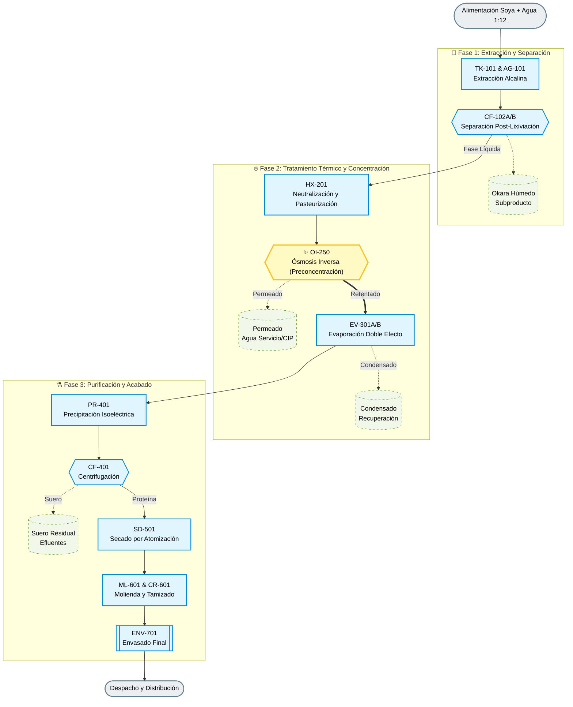

# PFD Integrado - Produccion de proteina aislada de soya

Este diagrama integra el tren principal del caso base (1 ton/h de grano) y el nodo de operacion innovadora de preconcentracion por osmosis inversa (OI).

## Convenciones

- Corriente continua de proceso: flecha principal.
- Descarga lateral: subproducto o servicio.
- OI: modulo innovador de preconcentracion previo a evaporacion.

## Diagrama (Mermaid)

## Resumen de corrientes principales

1. Proceso principal: extraccion -> separacion -> pasteurizacion -> OI -> evaporacion -> precipitacion -> centrifugacion -> secado -> molienda/tamizado -> envasado.
2. Corrientes laterales: okara, permeado OI, condensado de evaporador y suero residual.
3. Punto de control clave de innovacion: modulo OI para aliviar carga termica de EV-301A/B.
