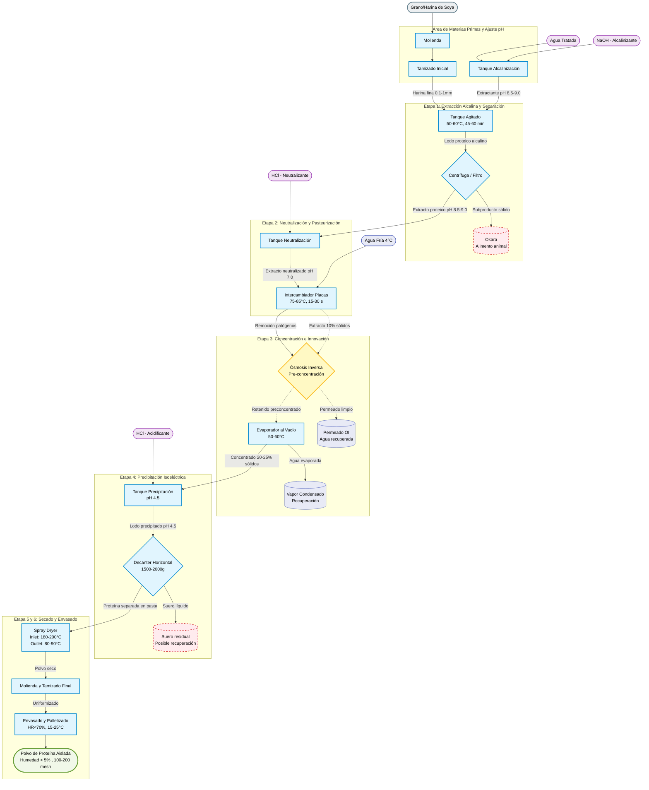

# Planteamiento del problema — Proyecto final: Procesos Unitarios

## Título
Producción de proteína aislada de soya o arveja

## Antecedentes
La demanda de proteínas vegetales como ingredientes para alimentos y suplementos ha aumentado. Este proyecto propone un flujo de proceso para obtener proteína aislada a partir de grano de soya o arveja, preservando su funcionalidad y seguridad microbiológica.

## Objetivo general
Diseñar y describir un proceso unitario para la extracción, concentración y envasado de proteína aislada a partir de soya o arveja.

## Alcance
- Materia prima: grano de soya o arveja.
- Salidas: proteína aislada en polvo o concentrado listo para envasado como suplemento alimenticio.
- Caso base hídrico: suministro de agua desde red industrial a 12 m³/h para la extracción (relación 1:12).
- No se incluye diseño detallado de empaques industriales ni análisis económico exhaustivo en esta etapa.

## Descripción general del proceso (operaciones unitarias)

### Etapa 0: Preparación de materias primas e insumos

**0.1. Captación y tratamiento de agua**
   - Suministro de agua de la red industrial con caudal de diseño de 12000 L/h (12 m³/h).
   - Tratamiento de ablandamiento para evitar incrustaciones en equipos de transferencia de calor y tuberías.
   - Agua destilada o desionizada para ajustes de pH críticos.
   - **Almacenamiento:** Tanque atmosférico de 15 m³ (autonomía base 1 h + 20% de reserva operativa).
   - **Bombeo de alimentación:** Bomba sanitaria de 1.5 kW (potencia calculada aproximada de 0.60 kW con TDH de 10.7 m).

**0.2. Preparación de soluciones alcalinas y ácidas**
   - Solución de NaOH: Proceso de alcalinización mediante la adición de hidróxido de sodio para alcanzar un pH de 8.5 a 9.0 en el agua de extracción.
   - Solución de HCl: Preparación de ácido clorhídrico para precipitación isoeléctrica (pH 4.5).
   - **Almacenamiento:** Tanques de plástico de polietileno de alta densidad (HDPE) o acero inoxidable con sistemas de enmascarado seguro.

**0.3. Secado y molienda inicial**
   - Molienda del grano de soya cruda o harina desgrasada para obtener harina fina.
   - Tamizado inicial para homogeneizar el tamaño de partícula (100-200 mesh ideal).
   - **Equipos:** Molino de martillos y criba vibratoria.
   - **Rendimiento esperado:** 95-98% de harina con tamaño controlado.

### Etapa 1: Extracción Alcalina (Lixiviación)

**1.1. Suspensión y ajuste de pH (Tanque agitado)**
   - Suspender la harina en agua alcalina (relación sólido-líquido 1:10 a 1:15, p/v).
   - Objetivo: Disolver proteína y dejar fibra insoluble en suspensión.
   - **Diseño del equipo:** Tanque cilíndrico de **acero inoxidable 316L** con deflectores (baffles) y agitador tipo **turbina de palas inclinadas (Pitched Blade Turbine)** para mantener suspensión homogénea.
   - **Condiciones operacionales:**
     - pH: 8.5-9.0
     - Temperatura: 50-60°C (controlar para evitar desnaturalización)
     - Tiempo de residencia: 45-60 minutos
     - Velocidad de agitación: 50-100 rpm (según volumen del tanque)
   - **Materiales:** Acero inoxidable 304/316L para contacto directo con fluido; tuberías de acero inoxidable schedule 40.

**1.2. Separación sólido-líquido (Filtración o Centrifugación inicial)**
   - Extracción de proteínas solubles de la matriz del grano.
   - Separación de la fibra insoluble (okara) del extracto proteico.
   - **Opciones de equipos:**
     - **Centrífuga decantadora:** Separación rápida y eficiente con recuperación de ~95% de extracto.
     - **Filtro prensa:** Mayor recuperación (~98%) pero tiempo más largo (20-40 minutos).
     - **Hidrociclón:** Separación previa de grueso antes de filtración fina.
   - **Materiales:** Camisas de acero inoxidable 316L (resistencia a corrosión del medio alcalino).
   - **Rendimiento esperado:** 85-92% de proteína extraída en el licor; okara como subproducto reutilizable (alimento animal).

### Etapa 2: Neutralización y Pasteurización

**2.1. Neutralización del extracto proteico**
   - Adición de HCl para ajustar pH de 8.5-9.0 a pH 7.0 (neutro).
   - Esta etapa es crítica para evitar degradación posterior de proteína.
   - **Equipos:** Tanque de neutralización con agitación, sonda de pH en línea, bombas dosificadoras.
   - **Materiales:** Acero inoxidable 304/316L (resistencia a ácidos y bases).
   - **Control:** Sistema de control automático de pH en tiempo real.

**2.2. Pasteurización (Intercambiador de calor)**
   - Tratamiento térmico del lodo proteico (slurry) para eliminar carga microbiana.
   - **Diseño del equipo:** **Intercambiador de calor de placas de acero inoxidable**, ideal para fluidos alimentarios viscosos.
   - **Condiciones operacionales:**
     - Temperatura de entrada: 20-25°C
     - Temperatura objetivo: 75-85°C (retención 15-30 segundos)
     - Temperatura de salida: Enfriamiento rápido a 20-30°C
   - **Materiales:** Placas de titanio o acero inoxidable 316L; juntas de elastómero alimentario (viton o EPDM).
   - **Consideración:** La viscosidad del lodo proteico (fluido no newtoniano) afecta el coeficiente global de transferencia de calor.

### Etapa 3: Concentración

**3.1. Evaporación al vacío**
   - Concentración del lodo proteico para reducir contenido de agua y volumen.
   - Protección térmica mediante operación a baja temperatura bajo vacío.
   - **Diseño del equipo:** **Evaporador de película descendente (Falling Film)** operando bajo vacío (aprox. 0.3-0.5 bar abs, equivalente a ~60°C de ebullición).
   - **Condiciones operacionales:**
     - Concentración entrada: 10% sólidos totales
     - Concentración salida: 20-25% sólidos totales
     - Temperatura de operación: 50-60°C (crítico para preservar propiedades proteicas)
   - **Materiales:** Acero inoxidable 304/316L para cuerpo del evaporador; tubos de cobre o latón níquel en la sección de calentamiento (resistencia térmica).
   - **Sistema de vacío:** Bomba de vacío robusta con separador de vapor para condensación eficiente.

### Etapa 4: Precipitación Isoeléctrica y Separación

**4.1. Precipitación isoeléctrica**
   - Adición de ácido clorhídrico (HCl) para ajustar pH a **4.5** (punto isoeléctrico de proteína de soya).
   - Formación de coágulos proteicos que precípitan y se separan del suero.
   - **Equipos:** Tanque de precipitación con agitación suave, dosificadores de ácido.
   - **Materiales:** Acero inoxidable 304/316L (resistencia a pH ácido).
   - **Rendimiento esperado:** ~98% de proteína precipitada; pérdidas en suero ~2%.

**4.2. Centrifugación (Decanter horizontal)**
   - Separación eficiente de la proteína precipitada del suero líquido residual.
   - **Diseño del equipo:** **Decantador Centrífugo Horizontal** de 2 fases, con tornillo interno para transporte.
   - **Especificaciones técnicas:**
     - Factor centrífugo: 1500-2000 g
     - Velocidad de rotación: 1500-3600 rpm (según modelo)
     - Recuperación de sólidos: ~98-99%
   - **Materiales:** Acero inoxidable 316L para cilindro y tornillo (corrosión por ácido y sales).
   - **Subproducto:** Suero residual con bajo contenido proteico, potencial para procesamiento secundario.

### Etapa 5: Secado Final

**5.1. Secado por Atomización (Spray Dryer)**
   - Transformación del concentrado líquido precipitado en polvo final.
   - **Condiciones operacionales:**
     - Temperatura aire entrada (Inlet): 180-200°C
     - Temperatura aire salida (Outlet): 80-90°C
     - Tiempo de residencia en cámara: 10-20 segundos
   - **Materiales:** Cámara de secado con recubrimiento interno de acero inoxidable 304; atomizador de disco.
   - **Ventaja:** Aunque la entrada es caliente, el producto se mantiene a baja temperatura por evaporación rápida.
   - **Rendimiento esperado:** Humedad final <5%.

**5.2. Molienda y Tamizado Final**
   - Molienda de aglomerados (si existen) con molino de martillos.
   - Tamizado final con criba vibratoria para clasificación de tamaño de partícula.
   - **Especificación final:** Polvo fino que pasa por mallas de 100-200 mesh (diámetro medio: 74-149 μm).
   - **Materiales:** Acero inoxidable o acero al carbono con recubrimiento (molino); acero inoxidable para criba.

### Etapa 6: Envasado y Almacenamiento

**6.1. Envasado**
   - Producto altamente higroscópico y sensible a luz y oxígeno.
   - **Formato:** Bolsas de papel kraft multicapa con barrera interior de polietileno (PE) termosellada (20-25 kg) o bolsas de polietileno de baja densidad (LDPE) con doypack.
   - **Adición de antioxidantes:** Consideración de N₂ inerte o desecantes (sílica gel) dentro del empaque.

**6.2. Almacenamiento**
   - Almacenamiento sobre pallets de plástico o madera en lugar seco (humedad relativa <70%).
   - Temperatura ambiente: 15-25°C.
   - Evitar exposición directa a luz solar.
   - **Vida útil esperada:** 12-24 meses en condiciones optimales.

## Consideraciones sobre Materiales y Compatibilidad Química

La selección correcta de materiales es fundamental para la durabilidad, eficiencia y seguridad del proceso. En la producción de proteína aislada de soya se operan ambientes alcalinos, neutros y ácidos que exigen materiales resistentes a la corrosión.

### Matriz de Selección de Materiales por Etapa

| Etapa | Fluido/Ambiente | Material Recomendado | Justificación |
|-------|---|---|---|
| Preparación NaOH | Hidróxido de sodio | HDPE, acero inoxidable 304L | Resistencia a bases concentradas |
| Extracción alcalina | pH 8.5-9.0 | Acero inoxidable 316L | Resistencia a corrosión en medio alcalino |
| Neutralización | Transición pH 9.0→7.0 | Acero inoxidable 316L | Resistencia a ciclos ácido-base |
| Pasteurización | Proteína + calor | Titanio o acero 316L (placas) | Durabilidad bajo estrés térmico |
| Evaporación | Lodo concentrado, vacío | Acero 304/316L + cobre/latón Ni (tubos) | Resistencia térmica y a corrosión |
| Precipitación | pH 4.5 (ácido) | Acero inoxidable 316L | Resistencia a ácidos débiles pero prolongados |
| Centrifugación | Lodo ácido | Acero inoxidable 316L | Máxima resistencia a corrosión |
| Secado | Temperatura 180-200°C | Acero 304 con recubrimiento | Resistencia térmica |

**Nota importante:** Evitar completamente el acero al carbono en contacto directo con fluidos alcalinos o ácidos. Su uso está permitido solo en estructuras de soporte o tuberías de servicios (aire comprimido, vapor).

## Variables fisicoquímicas y operativas críticas

Antes de dimensionar equipos o meter números en ecuaciones, como ingenieros debemos entender la fenomenología del proceso: qué variables controlan que la soya se convierta en un aislado proteico de alta calidad y no en una pasta inservible.

A continuación se detallan las variables fisicoquímicas y operativas más críticas que gobernarán el diseño de cada etapa de la planta:

### 1. Lixiviación Alcalina (El Tanque Agitado)

El objetivo aquí es disolver la mayor cantidad de proteína de la harina de soya en el agua, dejando la fibra intacta.

* **pH del medio:** Es la variable reina. La proteína de soya es altamente soluble en medios alcalinos. Se suele operar entre un pH de **8.0** y **9.0**. Si te pasas de alcalinidad, puedes degradar aminoácidos esenciales.
* **Temperatura de extracción:** Generalmente se maneja entre **50°C** y **60°C**. A mayor temperatura, mayor solubilidad y cinética de extracción, pero si superas los **65°C** corres el riesgo de desnaturalizar la proteína prematuramente.
* **Relación Sólido-Líquido:** La proporción de harina de soya respecto al agua (ej. 1:10 o 1:15). Define qué tan viscosa será la mezcla y el tamaño del tanque.
* **Tiempo de residencia:** Cuánto tiempo estará la mezcla en el tanque (suele ser de 30 a 60 minutos).
* **Velocidad de cizallamiento (Agitación):** Afecta la transferencia de masa del sólido al líquido.

### 2. Filtración y Separación Sólido-Líquido (Post-lixiviación)

Antes de cualquier otro tratamiento, debe separarse el okara (residuo fibroso insoluble) del extracto proteico.

* **Eficiencia de separación:** La centrifugación decantadora recupera ~95% del extracto; la filtración prensa alcanza ~98%.
* **Tiempo de operación:** Filtración prensa (20-40 min) vs. Centrifugación (5-10 min). La elección depende de capacidad deseada.
* **Caída de presión:** En filtración, monitorear para detectar colmatación. En centrifugación, mantener velocidad constante.
* **Okara residual:** Debe secarse rápidamente (max 24 hrs) o refrigerarse para evitar degradación microbiana (potencial como pienso animal).

### 2.1. Precipitación Isoeléctrica

Después de neutralizar el extracto a pH 7.0, se acidifica nuevamente para precipitar proteína.

* **Punto Isoeléctrico (pH):** Para la soya, este valor es exactamente **4.5**. Al añadir ácido (como HCl) y llegar a este pH, la carga neta de las proteínas se vuelve cero, se aglomeran y precipitan formando un coágulo.
* **Temperatura de precipitación:** Idealmente mantener a 20-25°C. Influye en el tamaño del flóculo (coágulo) formado. Flóculos más grandes (>200 μm) son más fáciles de separar en la centrífuga.
* **Velocidad de adición de ácido:** Agregar lentamente (<5 mL/min por 100 L) para evitar cristalización rápida de proteína con propiedades deterioradas.

### 3. Pasteurización Térmica (El Intercambiador de Calor)

Esta operación debe ocurrir INMEDIATAMENTE después de la separación del okara y ANTES de cualquier concentración o precipitación.

* **Perfil de Temperaturas:** Temperatura de entrada: 20-25°C → Calentamiento a **75-85°C** (retención 15-30 seg) → Enfriamiento rápido a 20-30°C.
* **Reducción logarítmica de patógenos:** Una pasteurización correcta reduce carga microbiana en 5-7 ciclos logarítmicos (por ej., de 10⁶ a 10⁻¹ a 10⁰ UFC/mL).
* **Viscosidad del fluido:** El lodo proteico es un fluido no newtoniano. Su viscosidad cambia drásticamente con la temperatura (de ~50 cP a 20°C a ~10 cP a 75°C) y el esfuerzo de corte, lo que afectará el coeficiente global de transferencia de calor y la caída de presión en las placas.
* **Modelo de flujo:** Asumir flujo laminar en intercambiador de placas (NRe < 2300) para este tipo de fluidos alimentarios.

### 4. Concentración (El Evaporador al Vacío)

Queremos quitarle agua al lodo antes de secarlo, gastando la menor cantidad de energía posible y cuidando el producto.

* **Presión de Vacío:** Variable fundamental. Al bajar la presión dentro del evaporador, el agua hierve a menor temperatura (ej. a **50°C** o **60°C**). Esto protege a la proteína del daño térmico.
* **Concentración de sólidos (% Brix o % Sólidos Totales):** Debes definir con qué porcentaje de sólidos entra el lodo (ej. **10%**) y con cuánto debe salir hacia el secador (ej. **20%** a **25%**).

### 5. Secado por Atomización (Spray Dryer), Molienda y Tamizado

Transformar el concentrado líquido en el polvo final que se va a comercializar.

* **Temperatura del aire de entrada (Inlet):** Suele ser muy alta, entre **180°C** y **200°C**. Aunque suena excesivo, la evaporación es tan rápida que la partícula de proteína se mantiene fría y no se quema.
* **Temperatura del aire de salida (Outlet):** Indica la temperatura final del polvo y del aire húmedo (suele rondar los **80°C** a **90°C**).
* **Humedad final del producto:** Por norma general, el aislado de soya debe tener una humedad menor al **5%** para evitar crecimiento de hongos y apelmazamiento.
* **Granulometría (Tamaño de partícula):** Definirá el tamaño de las mallas en la etapa de tamizado (generalmente se busca un polvo fino que pase por mallas de 100 a 200 mesh).

## Fluidograma de Procesos Integrado

## Cronograma y presentación
- Fecha estimada de presentación: fines de mayo y comienzos de junio.

## Conocimiento necesario
El desarrollo del proyecto contempla la realización de cálculos y análisis relacionados con los procesos unitarios empleados. Los conocimientos y cálculos mínimos requeridos incluyen:

- Cálculos hídricos: balances de agua, necesidades de captación y tratamiento, y consumo por unidad de producto.
- Cálculos termodinámicos: balances de energía para pasteurización y evaporación, análisis de transferencia de calor y control de temperaturas para evitar la desnaturalización proteica.
- Cálculos físicos y de transporte: análisis de transferencia de masa en lixiviación, decantación y filtración; determinación de parámetros de centrifugación y sedimentación; propiedades físicas de polvos (humedad, densidad aparente, tamaño de partícula).
- Cálculos de proceso: rendimientos, eficiencias de extracción, concentraciones y pérdidas en cada etapa.
- Control de pH y química: ajuste y control del pH para solubilización y posibles precipitaciones isoeléctricas.

## Observaciones y Consideraciones Críticas

### Protección de la Proteína
- **Temperatura:** Mantener siempre <75°C excepto durante pasteurización (15-30 seg a 75-85°C).
- **pH:** Controlar transiciones de pH porque cambios bruscos provocan precipitación indeseada o degradación.
- **Tiempo de residencia:** Minimizar tiempos en operaciones susceptibles (especialmente entre lixiviación y pasteurización).
- **Aireación:** Minimizar incorporación de aire que cause oxidación de proteína.

### Consideraciones de Seguridad
- Sistema de control de pH con alarmas (pH fuera de rango 8.0-9.5 en extracción, 4.0-5.0 en precipitación).
- Sistemas de ventilación para vapores de HCl y NaOH (piscinas controladas, extractores locales).
- Sellado de equipos bajo presión (tanques de extracción y centrifugación).
- Personal certificado para manipulación de ácidos y bases fuertes.

### Control de Calidad Mínimo en Etapas Críticas

| Etapa | Parámetro | Método | Frecuencia |
|-------|-----------|--------|------------|
| Prep. Materias | Humedad, tamaño partícula | Secador termogravimétrico, granulometría láser | Cada lote |
| Post-Extracto | pH, sólidos totales, proteína total | Potenciómetro, estufa, Kjeldahl | Cada corrida |
| Post-Pasteurización | Recuento microbiano, proteína | Cultivo/PCR, electroforesis | 2×/semana |
| Producto final | Humedad, proteína, microbiología, tamaño | Múltiples (Karl Fischer, Kjeldahl, cultivos, laser) | Cada lote |

### Gestión de Subproductos y Residuos
- **Okara:** Secar rápidamente (<2% humedad) para uso como pienso o fertilizante.
- **Suero de post-centrifugación:** ¿Concentrarlo nuevamente o descartar? Evaluar según valor proteico residual.
- **Aguas de lavado:** Reutilizar en siguiente extracción (bajo pH) o tratar antes de descargar.

### Benchmarks de Rendimiento Esperado
- **Recuperación de proteína:** 80-88% de la proteína bruta del grano entra en extracto; ~98% se recupera en la precipitación.
- **Eficiencia total de proceso:** 78-86% de proteína grano → polvo final.
- **Consumo de agua:** 50-100 L agua/kg proteína final (incluyendo lavados).
- **Consumo energético:** ~3-5 MJ/kg proteína final (principalmente en evaporación y secado por atomización).

## Entregables del final

### Documentación técnica y teórica
- Fundamento teórico del proceso y operaciones unitarias involucradas
- Diagrama de flujo del proceso integrado
- Identificación y descripción detallada de todas las operaciones unitarias
- Características técnicas y modos de operación de cada etapa
- Balance de materia y energía del proceso completo

### Especificaciones de diseño y operación
- Capacidad de producción proyectada (kg/h de proteína aislada)
- Materia prima de entrada (cantidad y especificaciones de soya/arveja)
- Energía requerida y consumo estimado (MJ/kg producto)
- Sistema de captación y tratamiento de agua acorde a la capacidad de producción
- Diseño del agitador para la etapa de lixiviación alcalina
- Diseño del intercambiador de calor para pasteurización
- Selección de equipo para evaporación al vacío

### Operaciones unitarias específicas
- Diseño detallado de una operación principal del proceso (lixiviación, precipitación isoeléctrica o evaporación)
- Análisis técnico de una operación complementaria (secado, molienda, tamizado o filtración)
- Estudio de una operación innovadora no vista en semestres anteriores (ej. ósmosis inversa, electrodiálisis)
- Especificaciones de envasado y estrategia de entrega del producto final

### Prototipos y visualización
- Maqueta física o modelo conceptual del proceso (o de una etapa crítica)
- Modelo 3D de un equipo importante (tanque de extracción, intercambiador, secador atomizador)

