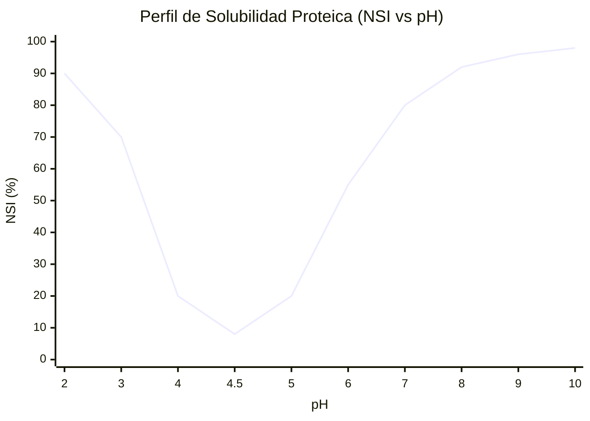
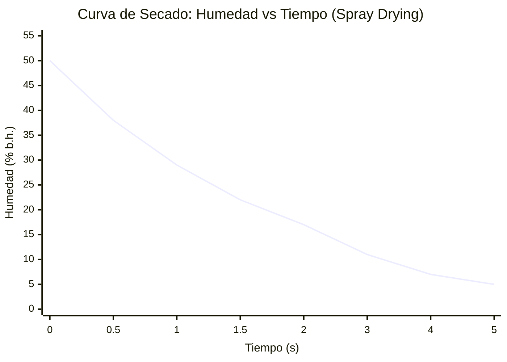
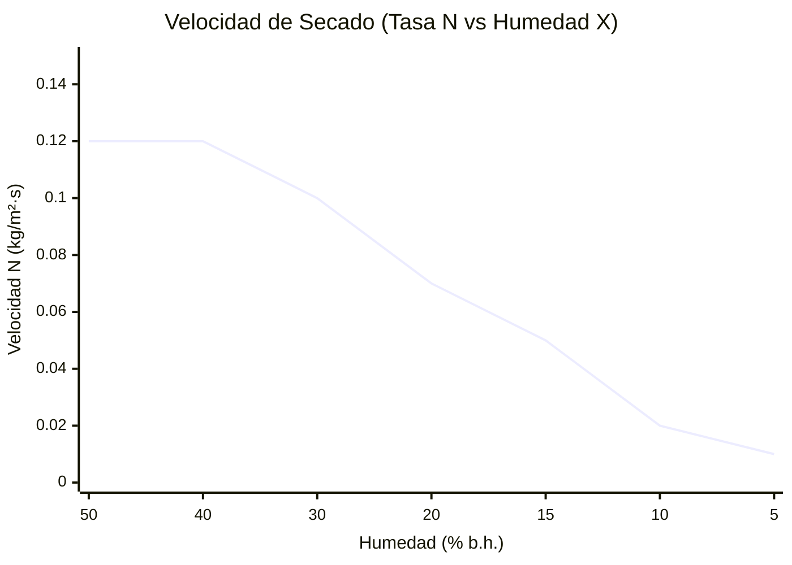
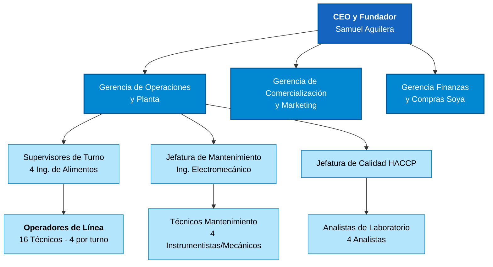
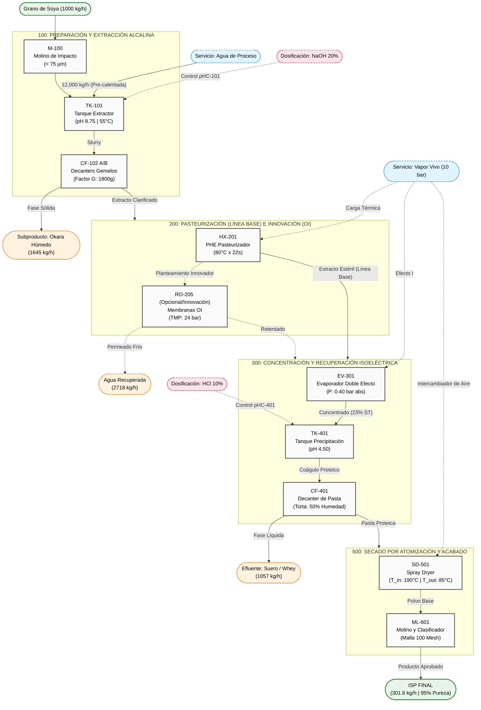
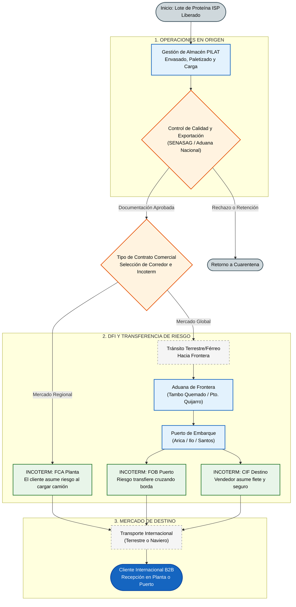

# Memoria de Cálculo y Diseño Integral de Planta: Producción de Proteína Aislada de Soya
## (Integración con Gemelo Digital, Cálculos Profundos y Normativa Internacional)
**Ingeniería de Procesos Senior**

---

## Índice

- [1. Introducción y Paradigma del Gemelo Digital](#1-introducción-y-paradigma-del-gemelo-digital)
  - [1.1. Contexto Industrial](#11-contexto-industrial)
  - [1.2. El Paradigma del Gemelo Digital (Digital Twin)](#12-el-paradigma-del-gemelo-digital-digital-twin)
  - [1.3. Marco Normativo Aplicable Integrado al Diseño](#13-marco-normativo-aplicable-integrado-al-diseño)
  - [1.4. Transición a la Industria 5.0 (Robótica Colaborativa y Economía Circular)](#14-transición-a-la-industria-50-robótica-colaborativa-y-economía-circular)
- [2. Bases de Diseño Fisicoquímico y Termodinámico](#2-bases-de-diseño-fisicoquímico-y-termodinámico)
  - [2.1. Propiedades y Composición de la Materia Prima](#21-propiedades-y-composición-de-la-materia-prima)
  - [2.2. Relación Solvente/Sólido y Propiedades de la Solución Resultante](#22-relación-solventesólido-y-propiedades-de-la-solución-resultante)
- [3. Memoria de Cálculo Fenomenológica por Etapa](#3-memoria-de-cálculo-fenomenológica-por-etapa)
  - [3.0. Etapa 0: Acondicionamiento y Molienda de la Materia Prima (M-100)](#30-etapa-0-acondicionamiento-y-molienda-de-la-materia-prima-m-100)
  - [3.1. Etapa 1: Lixiviación y Extracción Alcalina (TK-101)](#31-etapa-1-lixiviación-y-extracción-alcalina-tk-101)
  - [3.2. Etapa 1.2: Clarificación (Centrífugas Decantadoras CF-102A/B)](#32-etapa-12-clarificación-centrífugas-decantadoras-cf-102ab)
  - [3.3. Etapa 2: Intercambio Térmico HTST (Pasteurización HX-201)](#33-etapa-2-intercambio-térmico-htst-pasteurización-hx-201)
  - [3.4. Etapa 3: Evaporación Térmica (Doble Efecto al Vacío EV-301)](#34-etapa-3-evaporación-térmica-doble-efecto-al-vacío-ev-301)
  - [3.5. Etapa 4: Precipitación Isoeléctrica (Química de Proteínas)](#35-etapa-4-precipitación-isoeléctrica-química-de-proteínas)
  - [3.6. Etapa 5: Secado por Atomización Térmica (Spray Dryer SD-501)](#36-etapa-5-secado-por-atomización-térmica-spray-dryer-sd-501)
  - [3.7. Verificación Estricta de Cierre Másico (Impacto de Dosificación Química NaOH y HCl)](#37-verificación-estricta-de-cierre-másico-impacto-de-dosificación-química-naoh-y-hcl)
- [4. Ingeniería Mecánica de Fluidos, Hidráulica y Cañerías (Diseño Lean y Sanitario)](#4-ingeniería-mecánica-de-fluidos-hidráulica-y-cañerías-diseño-lean-y-sanitario)
  - [4.1. Fundamentos Hidráulicos y Red de Cañerías (ASME BPE)](#41-fundamentos-hidráulicos-y-red-de-cañerías-asme-bpe)
  - [4.2. Perfil Hidráulico Integral: Cálculo de Flujos y Cabezal (TDH) por Etapa](#42-perfil-hidráulico-integral-cálculo-de-flujos-y-cabezal-tdh-por-etapa)
  - [4.3. Verificación de NPSH y Prevención de Cavitación](#43-verificación-de-npsh-y-prevención-de-cavitación)
- [5. El Salto Innovador: Preconcentración por Ósmosis Inversa (OI)](#5-el-salto-innovador-preconcentración-por-ósmosis-inversa-oi)
  - [5.1. Teoría de Transporte Multicomponente en Membranas](#51-teoría-de-transporte-multicomponente-en-membranas)
  - [5.2. Termodinámica del Ahorro (Validación del Gemelo)](#52-termodinámica-del-ahorro-validación-del-gemelo)
- [6. Filosofía de Mantenimiento y Diseño Higiénico (EHEDG / 3-A)](#6-filosofía-de-mantenimiento-y-diseño-higiénico-ehedg-3-a)
  - [6.1. Especificaciones de Equipo Biológico y Arquitectura](#61-especificaciones-de-equipo-biológico-y-arquitectura)
  - [6.2. Estrategia CIP Automatizada (Clean In Place)](#62-estrategia-cip-automatizada-clean-in-place)
  - [6.3. Estudio de Tiempos, OEE y Estructura Organizacional (Ingeniería de Métodos)](#63-estudio-de-tiempos-oee-y-estructura-organizacional-ingeniería-de-métodos)
    - [A. Cálculo de Tiempo Operativo y OEE](#a-cálculo-de-tiempo-operativo-y-oee)
    - [B. Formato de Turnos y Organización Laboral](#b-formato-de-turnos-y-organización-laboral)
    - [C. Estructura Jerárquica Corporativa (Organigrama)](#c-estructura-jerárquica-corporativa-organigrama)
- [7. Arquitectura de Control DCS, Instrumentación Avanzada (ISA-5.1) y Lazos P&ID](#7-arquitectura-de-control-dcs-instrumentación-avanzada-isa-51-y-lazos-pid)
  - [7.1. Topología de Red y Arquitectura de Control](#71-topología-de-red-y-arquitectura-de-control)
  - [7.2. Filosofía de Lazos de Control (P&ID) por Etapas de Proceso](#72-filosofía-de-lazos-de-control-pid-por-etapas-de-proceso)
    - [Etapa 1: Extracción Alcalina (Control de Ratio y pH)](#etapa-1-extracción-alcalina-control-de-ratio-y-ph)
    - [Etapa 2: Pasteurización HTST (Control FDD)](#etapa-2-pasteurización-htst-control-fdd)
    - [Etapa 3: Evaporación al Vacío (Control de Entalpía)](#etapa-3-evaporación-al-vacío-control-de-entalpía)
    - [Etapa 4: Precipitación Isoeléctrica (Titulación de Precisión)](#etapa-4-precipitación-isoeléctrica-titulación-de-precisión)
    - [Etapa 5: Secado Spray (Control de Humedad en Cascada)](#etapa-5-secado-spray-control-de-humedad-en-cascada)
  - [7.3. Funciones de Enclavamiento y Seguridad Intrínseca (SIS / LOPA)](#73-funciones-de-enclavamiento-y-seguridad-intrínseca-sis-lopa)
- [8. Análisis Económico Exhaustivo: Ubicación Santa Cruz, Bolivia](#8-análisis-económico-exhaustivo-ubicación-santa-cruz-bolivia)
  - [8.1. Consideraciones de Ubicación y Permisos (Santa Cruz)](#81-consideraciones-de-ubicación-y-permisos-santa-cruz)
  - [8.2. Resumen CAPEX (Capital Expenditure) y Depreciación](#82-resumen-capex-capital-expenditure-y-depreciación)
  - [8.3. OPEX Anual: Estructura de Costos Local ($7,500 \text{ hrs/año}$)](#83-opex-anual-estructura-de-costos-local-7500-text-hrsaño)
    - [Estructura de Labor Directa e Indirecta (Salarios Reales Bolivia + Cargas Sociales 40%)](#estructura-de-labor-directa-e-indirecta-salarios-reales-bolivia-cargas-sociales-40)
  - [8.4. Costo Unitario y Viabilidad](#84-costo-unitario-y-viabilidad)
- [9. Datasheets Técnicos de Equipamiento (Ingeniería de Detalle y Proveedores)](#9-datasheets-técnicos-de-equipamiento-ingeniería-de-detalle-y-proveedores)
  - [9.1. DS-101: Tanque de Extracción Alcalina + Sistema de Agitación](#91-ds-101-tanque-de-extracción-alcalina-sistema-de-agitación)
  - [9.2. DS-102: Sistema de Clarificación (Centrífugas Decantadoras)](#92-ds-102-sistema-de-clarificación-centrífugas-decantadoras)
  - [9.3. DS-201: Pasteurizador HTST (Intercambiador de Placas)](#93-ds-201-pasteurizador-htst-intercambiador-de-placas)
  - [9.4. DS-301: Evaporador de Doble Efecto al Vacío](#94-ds-301-evaporador-de-doble-efecto-al-vacío)
  - [9.5. DS-501: Sistema de Secado por Atomización (Spray Dryer)](#95-ds-501-sistema-de-secado-por-atomización-spray-dryer)
  - [9.6. DS-601: Sistema de Ósmosis Inversa (Pre-concentración)](#96-ds-601-sistema-de-ósmosis-inversa-pre-concentración)
- [10. Análisis Profundo de Cuello de Botella, Sensibilidad Operativa y Viabilidad Escalar](#10-análisis-profundo-de-cuello-de-botella-sensibilidad-operativa-y-viabilidad-escalar)
  - [10.1. Identificación de Restricciones y Dimensionamiento de Equipos (TOC)](#101-identificación-de-restricciones-y-dimensionamiento-de-equipos-toc)
  - [10.2. Rangos de Operabilidad y Estabilidad del Sistema](#102-rangos-de-operabilidad-y-estabilidad-del-sistema)
  - [10.3. Viabilidad Escalar y Económica frente a la Materia Prima](#103-viabilidad-escalar-y-económica-frente-a-la-materia-prima)
- [11. Diagrama de Flujo de Proceso (PFD) y Secuencia Operacional Avanzada (Enfoque Six Sigma)](#11-diagrama-de-flujo-de-proceso-pfd-y-secuencia-operacional-avanzada-enfoque-six-sigma)
  - [11.1. Diagrama de Flujo de Proceso (PFD) - Topología de Planta](#111-diagrama-de-flujo-de-proceso-pfd---topología-de-planta)
  - [11.2. Narrativa Operacional Detallada (Matriz CPV / CTQ)](#112-narrativa-operacional-detallada-matriz-cpv-ctq)
    - [Fase I: Acondicionamiento y Lixiviación (Etapa 1)](#fase-i-acondicionamiento-y-lixiviación-etapa-1)
    - [Fase II: Separación Centrífuga y Sanitización (Etapa 1.2 y 2)](#fase-ii-separación-centrífuga-y-sanitización-etapa-12-y-2)
    - [Fase III: Eficiencia Termodinámica (Etapas Innovadora y 3)](#fase-iii-eficiencia-termodinámica-etapas-innovadora-y-3)
    - [Fase IV: Recuperación Isoeléctrica (Etapa 4)](#fase-iv-recuperación-isoeléctrica-etapa-4)
    - [Fase V: Atomización, Acabado y Envasado (Etapas 5 y 6)](#fase-v-atomización-acabado-y-envasado-etapas-5-y-6)
- [12. Matriz de Criticidad Operativa (Enfoque FMEA)](#12-matriz-de-criticidad-operativa-enfoque-fmea)
- [13. Gestión Integral de Riesgos (HACCP, HAZOP y Seguridad Industrial)](#13-gestión-integral-de-riesgos-haccp-hazop-y-seguridad-industrial)
  - [13.1. Riesgos de Inocuidad Alimentaria (HACCP)](#131-riesgos-de-inocuidad-alimentaria-haccp)
  - [13.2. Riesgos de Seguridad Industrial y Operativa (HAZOP / NFPA)](#132-riesgos-de-seguridad-industrial-y-operativa-hazop-nfpa)
  - [13.3. Cultura de Seguridad (Behavioral Safety)](#133-cultura-de-seguridad-behavioral-safety)
- [14. Especificaciones Avanzadas de Envasado, Shelf-Life y Logística de Exportación](#14-especificaciones-avanzadas-de-envasado-shelf-life-y-logística-de-exportación)
  - [14.1. Ingeniería del Empaque (Packaging)](#141-ingeniería-del-empaque-packaging)
  - [14.2. Cinética de Degradación y Vida Útil (Shelf-Life)](#142-cinética-de-degradación-y-vida-útil-shelf-life)
  - [14.3. Red Logística de Exportación e Incoterms 2020 (Topología Santa Cruz)](#143-red-logística-de-exportación-e-incoterms-2020-topología-santa-cruz)
- [15. Estrategia de Circularidad y Monetización de Subproductos (Cero CAPEX)](#15-estrategia-de-circularidad-y-monetización-de-subproductos-cero-capex)
  - [15.1. Mercado Objetivo (Santa Cruz)](#151-mercado-objetivo-santa-cruz)
  - [15.2. Logística de Despacho (Layout Lean)](#152-logística-de-despacho-layout-lean)
  - [15.3. Impacto Financiero (OPEX Offset)](#153-impacto-financiero-opex-offset)
  - [15.4. Estandarización de Calidad (Fichas Técnicas Básicas)](#154-estandarización-de-calidad-fichas-técnicas-básicas)
- [16. Base Bibliográfica, Legal y Científica de Soporte (Consolidada)](#16-base-bibliográfica-legal-y-científica-de-soporte-consolidada)
  - [Tratados Científicos de Ingeniería Química y Modelado](#tratados-científicos-de-ingeniería-química-y-modelado)
  - [Ciencia de Alimentos y Proteína de Soya](#ciencia-de-alimentos-y-proteína-de-soya)
  - [Normativas Sanitarias, Industriales y Logísticas](#normativas-sanitarias-industriales-y-logísticas)

---

## 1. Introducción y Paradigma del Gemelo Digital

### 1.1. Contexto Industrial
El presente documento constituye la Memoria de Cálculo y Diseño de Ingeniería de una planta industrial de alta eficiencia para la producción de proteína aislada de soya (ISP - *Isolated Soy Protein*). El aislado de soya es un producto de alto valor agregado con una pureza proteica exigida superior al 90% (base seca), utilizado ampliamente en la industria alimentaria por sus propiedades tecno-funcionales (emulsificación, gelificación, retención de agua) y su alto perfil nutricional (Codex Alimentarius Stan 175-1989).

### 1.2. El Paradigma del Gemelo Digital (Digital Twin)
El diseño físico detallado en esta memoria no es un ente estático. Está intrínsecamente acoplado a un **Gemelo Digital** desarrollado en Python (módulos `core/stage_equations.py`, `core/process_model.py`). Este gemelo digital es una réplica computacional de la planta basada en primeros principios termodinámicos, cinéticas de transferencia de masa y balances de energía en estado estacionario y transitorio.

**¿De dónde provienen los datos del gemelo y cómo interactúa con el mundo físico?**
1. **Modelos Fenomenológicos Embebidos:** Las ecuaciones de estado (ej. presión de vapor del agua mediante la ecuación de Antoine, propiedades entálpicas) están codificadas en el núcleo matemático del software.
2. **Eficiencias Parametrizadas a partir de Datos Empíricos:** Las eficiencias por operación unitaria (88% en extracción, 98% en precipitación) se derivan de la literatura científica (Lusas & Riaz, 1995) y alimentan la simulación.
3. **Análisis de Sensibilidad Topológica (What-if):** El gemelo permite predecir respuestas del sistema ante perturbaciones sin arriesgar la planta real. Por ejemplo, al simular una caída de pH a 7.0 en el tanque de extracción, el gemelo predice algorítmicamente una caída del rendimiento del 12.1%. Esto justifica analíticamente la inversión en lazos de control redundantes y actuadores de precisión (ISA 5.1).

### 1.3. Marco Normativo Aplicable Integrado al Diseño
El diseño de equipos, selección de instrumentación y trazabilidad de cálculo se ajustan estrictamente al cumplimiento normativo internacional:
- **FDA (Food and Drug Administration):** Cumplimiento de CFR Title 21 (CGMP - *Current Good Manufacturing Practice*).
- **EHEDG / 3-A Sanitary Standards:** Criterios mandatorios para el diseño higiénico de tuberías, tanques, bombas y válvulas, asegurando la eliminación de zonas muertas (dead legs) y previniendo biopelículas.
- **ASME BPE (Bioprocessing Equipment):** Estándares para soldaduras orbitales, acabado superficial (Ra < 0.8 µm) y pasivación de acero inoxidable.
- **ISO 22000 / HACCP:** Arquitectura orientada a la inocuidad, con identificación temprana de Puntos Críticos de Control (PCC).
- **IEC 60204 / NEC:** Regulación de armarios eléctricos, segregación de potencia/control y seguridad de motores.

### 1.4. Transición a la Industria 5.0 (Robótica Colaborativa y Economía Circular)
El diseño de esta planta trasciende la mera conectividad de la Industria 4.0, adoptando los principios de la **Industria 5.0**: un ecosistema tecno-social que vuelve a poner al humano en el centro (Human-Centricity), enfatizando la sostenibilidad y la resiliencia (Breque et al., 2021).
1. **Robótica Colaborativa (Cobots) y AMMRs:** Se integran Robots Manipuladores Móviles Autónomos (AMMRs) para operaciones de final de línea (paletizado de bolsas de 20 kg) y dosificación de reactivos. A diferencia de la robótica tradicional "enjaulada", los *Cobots* emplean Agentic AI y sensores de fuerza/torque para operar de forma segura en el mismo espacio físico que los operarios, mitigando riesgos ergonómicos severos.
2. **Instrumentación Inteligente y Sensórica Avanzada:** La planta emplea visión hiperespectral en la etapa de molienda y empaque para detectar patógenos (*Salmonella*, *Listeria*) y cuerpos extraños en tiempo real. Esta sensórica alimenta directamente al Gemelo Digital, logrando trazabilidad total mediante IoT (Internet of Things).
3. **Sostenibilidad y Economía Circular:** El subproducto fibroso (Okara), extraído a razón de $1645 \text{ kg/h}$, no es considerado residuo. Se integra un plan de coprocesamiento (Waste-to-Energy o suplemento pecuario de alto valor), cerrando el ciclo másico (Zero Waste). Asimismo, la integración de la Ósmosis Inversa (OI) ejemplifica la "termodinámica del ahorro", priorizando la descarbonización industrial.

---

## 2. Bases de Diseño Fisicoquímico y Termodinámico

### 2.1. Propiedades y Composición de la Materia Prima
El diseño asume soya cruda acondicionada (descascarillada y desgrasada preliminarmente, o grano entero según línea de pre-tratamiento), modelada termodinámicamente con la siguiente matriz composicional (USDA/FAO):
- Humedad inicial: 10 - 12%
- Proteína bruta: 36 - 40% (Fijado matemáticamente en **37.5%** para diseño crítico).
- Lípidos, Carbohidratos, Fibra, Cenizas: Componen la fracción residual insoluble/soluble.

**Alimentación másica base del diseño ($\dot{m}_{soya}$):** $1000 \text{ kg/h}$
**Flujo másico de proteína entrante al sistema ($\dot{m}_{prot\_in}$):**
$$ \dot{m}_{prot\_in} = 1000 \text{ kg/h} \times 0.375 = 375.0 \text{ kg/h} $$

### 2.2. Relación Solvente/Sólido y Propiedades de la Solución Resultante
Se adopta una relación hídrica sólido:líquido de **1:12**. Esta ratio es el punto de equilibrio óptimo termodinámico: ratios menores (ej. 1:8) causan saturación rápida del solvente reduciendo el gradiente de concentración ($\Delta C$ en la Ley de Fick), mientras que ratios mayores (ej. 1:15) incrementan logarítmicamente los costos de evaporación downstream sin ganancia apreciable en rendimiento.

- Caudal de agua de extracción ($\dot{m}_{agua}$): $12,000 \text{ kg/h}$
- Caudal másico total de la mezcla ($\dot{m}_{mezcla}$): $13,000 \text{ kg/h}$

**Modelado del fluido (Extracto diluido base acuosa):**
Debido a que los sólidos totales representan apenas $\approx 7.6\%$ inicial, el fluido se comporta termodinámicamente cercano al agua a 55°C, con ajustes por carga de sólidos.
- Densidad operativa ($\rho$): $\approx 1050 \text{ kg/m}^3$
- Viscosidad dinámica ($\mu$): $\approx 0.020 \text{ Pa}\cdot\text{s}$ (Rango asimilado a fluido seudoplástico de bajo cizallamiento).
- Calor específico isobárico ($C_p$): $\approx 3.9 \text{ kJ/(kg} \cdot \text{K)}$ (Correlación de Siebel: $C_p = 4.18 \cdot X_{agua} + 1.67 \cdot X_{solidos\_no\_grasos}$).

---

## 3. Memoria de Cálculo Fenomenológica por Etapa

El motor algorítmico del Gemelo Digital resuelve las siguientes ecuaciones algebraicas para estabilizar los balances de materia y energía. Aquí se detalla la demostración matemática rigurosa para cada etapa del tren de procesos.

### 3.0. Etapa 0: Acondicionamiento y Molienda de la Materia Prima (M-100)

**Explicación Detallada:**
Antes de la lixiviación, la soya debe someterse a un riguroso proceso de acondicionamiento físico. Esta etapa incluye la limpieza profunda (remoción de impurezas), el descascarillado (dehulling) para eliminar fibra no deseada y, crucialmente, el desgrasado mediante extracción por solvente (hexano) hasta niveles de grasa <1%. El producto resultante, harina de soya desgrasada, es sometido a una molienda fina para maximizar el área superficial disponible para la lixiviación alcalina.

**Elección de la Operación y Equipo:**
Se ha seleccionado una **Molienda por Impacto (Molino de Martillos o de Pinos)** operando con un sistema de **Tamizado de Alta Precisión**. La elección se basa en la necesidad de alcanzar una distribución de tamaño de partícula extremadamente fina sin generar un calentamiento excesivo que desnaturalice prematuramente las proteínas (pérdida de NSI - Nitrogen Solubility Index). Se utiliza un tamiz de **200 mesh (75 μm)** para asegurar que el material alimentado al extractor posea la cinética de difusión más rápida posible.

**Importancia en el Proceso:**
La granulometría define el límite teórico del rendimiento de extracción. Investigaciones industriales (nih.gov) demuestran que reducir el tamaño de partícula de 220 μm a 90 μm puede incrementar la recuperación de proteína del 40% a más del 52%. Al estandarizar la alimentación a <75 μm, se garantiza un rendimiento de solubilización cercano al 90%, reduciendo drásticamente las pérdidas en la fibra residual (okara).

### 3.1. Etapa 1: Lixiviación y Extracción Alcalina (TK-101)

**Explicación Detallada:**
Esta operación constituye el primer paso de transformación química del proceso. Consiste en la suspensión de la harina de soya (previamente molida a **<75 μm**) en una solución acuosa alcalinizada con NaOH. A nivel molecular, las proteínas de almacenamiento de la soya (principalmente glicinina y β-conglicinina) se encuentran plegadas y compactas. Al elevar el pH por encima de su punto isoeléctrico, se genera una repulsión electrostática entre las cadenas polipeptídicas que fuerza su despliegue e hidratación, permitiendo que abandonen la matriz sólida del grano y se disuelvan en la fase líquida.

**Perfil de Solubilidad Proteica (NSI vs pH):**
El siguiente gráfico ilustra el comportamiento típico del Índice de Solubilidad del Nitrógeno (NSI) para la proteína de soya. Se observa la característica curva en "U", donde el mínimo de solubilidad coincide con el punto isoeléctrico (pH 4.5), fundamentando tanto la extracción (pH 8.75) como la precipitación (pH 4.5).

**Elección de la Operación y Equipo:**
Se ha seleccionado un **Tanque Agitado de Mezcla** equipado con un impulsor de palas inclinadas (**Pitched Blade Turbine - PBT**). La elección del PBT es estratégica: proporciona un equilibrio óptimo entre flujo axial (necesario para mantener la harina en suspensión y evitar su sedimentación en el fondo) y flujo radial (necesario para el cizallamiento moderado que rompe los aglomerados de harina). A diferencia de una turbina Rushton, el PBT consume menos potencia y es más "gentil" con las macromoléculas proteicas, evitando una desnaturalización mecánica excesiva.

**Importancia en el Proceso:**
Esta etapa es el "corazón del rendimiento" de la planta. Un diseño deficiente aquí (mala agitación o control de pH errático) limitará de forma irreversible la cantidad de proteína que puede recuperarse. Todo lo que no se solubilice en el TK-101 se perderá con la fibra (okara) en la siguiente etapa, reduciendo directamente el margen de ganancia de la planta.

**Fundamento Físico-Químico:**
A pH 8.75, los grupos ionizables de los polipéptidos (glicinina y $\beta$-conglicinina) adquieren carga neta negativa profunda, alejándose de su punto isoeléctrico (pI ~4.5). La repulsión estérica y electrostática rompe las micelas de almacenamiento celular, forzando la hidratación y dilución de la matriz proteica hacia la fase acuosa.

**Ecuación de Transferencia de Masa y Rendimiento:**
Empíricamente (Lusas & Riaz, 1995), el coeficiente global de transferencia permite una eficiencia estática ($\eta_{ext}$) del 88% a $T = 55^\circ\text{C}$ y tiempo de residencia $\tau = 1 \text{ h}$.
$$ \dot{m}_{prot\_solubilizada} = \dot{m}_{prot\_in} \cdot \eta_{ext} = 375 \text{ kg/h} \cdot 0.88 = \mathbf{330.0 \text{ kg/h}} $$

**Aplicación de Factor de Pérdida (Criterio de Realismo $f_{loss}$):**
Para evitar el "síndrome de la planta ideal", el gemelo asume pérdidas del 2% en tanques y conducciones por retención y *fouling*.
$$ \dot{m}_{lodo\_salida} = \dot{m}_{mezcla} \cdot (1 - f_{loss}) = 13000 \cdot 0.98 = \mathbf{12,740 \text{ kg/h}} $$
$$ \dot{m}_{prot\_lodo\_salida} = 330.0 \cdot 0.98 = \mathbf{323.4 \text{ kg/h}} $$

**Cálculo Mecánico del Sistema de Agitación:**
Diseñamos el agitador para mantener la biomasa en suspensión uniforme (avoid settling).
- Caudal volumétrico: $Q = \dot{m} / \rho = 12740 / 1050 \approx 12.13 \text{ m}^3\text{/h}$. Tiempo residencia = 1h $\rightarrow$ Volumen útil $\approx 12.1 \text{ m}^3$. Tanque seleccionado de $V_{nom} = 14 \text{ m}^3$.
- Geometría: Diámetro tanque $D_t = 2.71 \text{ m}$. Impulsor PBT 6 palas $D_a = 1.08 \text{ m}$. Rotación $N = 80 \text{ rpm} = 1.33 \text{ rev/s} $.
- Número de Reynolds de agitación ($Re_a$):
$$ Re_a = \frac{\rho \cdot N \cdot D_a^2}{\mu} = \frac{1050 \cdot 1.33 \cdot (1.08)^2}{0.020} = \mathbf{81,424} \quad \text{(Régimen turbulento pleno)} $$
- Para este tipo de impulsor (PBT), el Número de Potencia $N_p \approx 1.3$.
- Potencia teórica transferida al fluido ($P$):
$$ P = N_p \cdot \rho \cdot N^3 \cdot D_a^5 = 1.3 \cdot 1050 \cdot (1.33)^3 \cdot (1.08)^5 = \mathbf{4,714 \text{ W}} $$
- Considerando pérdidas en reductor/caja engranajes y eficiencia de motor ($\eta_m = 0.65$ general):
$$ P_{instalada} = 4.71 \text{ kW} / 0.65 = 7.24 \text{ kW} \rightarrow \mathbf{Selección comercial: 7.5 \text{ kW}} $$

### 3.2. Etapa 1.2: Clarificación (Centrífugas Decantadoras CF-102A/B)

**Explicación Detallada:**
Una vez solubilizada la proteína, el sistema consiste en una suspensión de sólidos insolubles (celulosa, hemicelulosa y fibra de soya, conocida como Okara) en un extracto líquido rico en globulinas. La clarificación es la operación de separación sólido-líquido que busca retirar mecánicamente esta fibra. Al alimentar la suspensión en el tambor rotativo del decanter, los sólidos, que son más densos, son forzados contra la pared interna por la fuerza centrífuga, mientras que el líquido clarificado forma un anillo interno y se retira por rebose.

**Elección de la Operación y Equipo:**
Se han seleccionado **Centrífugas Decantadoras Horizontales** (Decanters) en lugar de filtros prensa o filtros de banda. La elección se justifica por la naturaleza continua de la operación y su alta capacidad de manejo de sólidos (hasta un 60-70% en la torta de salida). Los decanters permiten una separación extremadamente rápida (segundos vs minutos en filtración), lo que minimiza el tiempo de exposición de la proteína a condiciones alcalinas a 55°C, reduciendo el riesgo de crecimiento microbiológico y degradación térmica.

**Importancia en el Proceso:**
Esta etapa define la **pureza** del producto final. Cualquier rastro de fibra que no sea removido en los decanters pasará por todo el tren de proceso (evaporador, secador) y terminará en el polvo final, diluyendo la concentración proteica. Para alcanzar el estándar de "Proteína Aislada" (>90% pureza), la eficiencia de clarificación debe ser superior al 95%.

**Fundamento Fluidodinámico:**
La fibra (okara) posee una densidad aparente cercana a la fase acuosa ($\Delta\rho$ pequeño). La separación gravitacional por Ley de Stokes simple es inviable.
Ley de Stokes generalizada para campo centrífugo:
$$ v_{sedimentacion} = \frac{d^2 \cdot (\rho_p - \rho_f) \cdot r \cdot \omega^2}{18 \mu} $$
El término $\frac{r \omega^2}{g}$ define el "Factor G". Se diseñan decanters trabajando a **1800 g**.
- Extracción física de okara hidratado (65% humedad): $\mathbf{1,645.0 \text{ kg/h}}$.
- Extracto clarificado remanente: $12,740 - 1,645 = \mathbf{11,095.0 \text{ kg/h}}$.
- Al aplicar la penalización del 2% ($f_{loss}$) post-etapa, la proteína en extracto libre es: $323.4 \cdot 0.98 = \mathbf{316.9 \text{ kg/h}}$.

### 3.3. Etapa 2: Intercambio Térmico HTST (Pasteurización HX-201)

**Explicación Detallada:**
La pasteurización HTST (*High Temperature Short Time*) es una operación de transferencia de calor que busca elevar la temperatura del extracto clarificado hasta los 80°C, manteniéndola durante un tiempo de sostenimiento preciso de 22 segundos. Este choque térmico controlado tiene un doble propósito: destruir la carga microbiana competitiva y, fundamentalmente, inactivar factores antinutricionales como los inhibidores de tripsina y la lipoxigenasa, responsables de sabores indeseados y de la baja digestibilidad de la soya cruda.

**Elección de la Operación y Equipo:**
Se ha seleccionado un **Intercambiador de Calor de Placas (PHE)** con sección de regeneración. El PHE es el equipo estándar de oro en la industria alimentaria debido a su altísimo coeficiente global de transferencia de calor ($U$) y su diseño compacto. Las placas corrugadas generan una alta turbulencia incluso a bajos caudales, lo que asegura una temperatura uniforme en todo el fluido, evitando puntos calientes que podrían quemar o desnaturalizar la proteína en las paredes del equipo. Además, su arquitectura permite la limpieza CIP (*Clean-In-Place*) total, cumpliendo con los estándares EHEDG.

**Importancia en el Proceso:**
Esta es la etapa crítica de **Inocuidad Alimentaria (HACCP)**. Sin una pasteurización efectiva, el producto final sería un riesgo para la salud pública y tendría una vida útil muy corta debido a la actividad enzimática residual. Asimismo, la configuración de regeneración (donde el extracto caliente precalienta al extracto frío que entra) permite recuperar el 55% de la energía térmica, reduciendo drásticamente el consumo de vapor de la caldera y mejorando la viabilidad económica del proyecto.

**Fundamento Termodinámico y Microbiológico:**
Elevación a 80°C durante 22 segundos para inactivación de lipoxigenasas e inhibidores de tripsina, vitales para digeribilidad humana.
Caudal a calentar: $\dot{m}_{ext} = 11,095.0 \text{ kg/h} \cdot 0.98 (\text{merma tubería}) = 10,873.1 \text{ kg/h} = \mathbf{3.02 \text{ kg/s}}$.

**Balance de Energía (Calor Sensible):**
$$ \dot{Q}_{total} = \dot{m} \cdot C_p \cdot \Delta T = 3.02 \text{ kg/s} \cdot 3.9 \text{ kJ/(kg} \cdot \text{K)} \cdot (80 - 25)\text{K} = \mathbf{647.7 \text{ kW}} $$
El PHE (Plate Heat Exchanger) incorpora sección de regeneración (Heat Recovery, HR = 55%). El calor útil a suministrar desde la caldera:
$$ \dot{Q}_{utilidad} = 647.7 \cdot (1 - 0.55) \approx 291.5 \text{ kW} $$
Con un margen empírico de pérdidas convectivas/radiativas al ambiente del $\approx 6\%$, la carga térmica real calculada por el simulador es de **310 kW**.

**Dimensionamiento del Área de Transferencia ($A$):**
Utilizando la ecuación fundamental $\dot{Q} = U \cdot A \cdot \Delta T_{lm}$. Asumiendo $U = 2000 \text{ W/m}^2\text{K}$ y un LMTD aproximado de $12^\circ\text{C}$:
$$ A_{calefaccion} = \frac{310,000 \text{ W}}{2000 \cdot 12} = \mathbf{12.9 \text{ m}^2} $$
Sujeto a factores de ensuciamiento y área regenerativa agregada, el equipo comercial es de **39.6 m²**.

### 3.4. Etapa 3: Evaporación Térmica (Doble Efecto al Vacío EV-301)

**Explicación Detallada:**
La evaporación es una operación unitaria de transferencia de masa y calor que busca eliminar una fracción sustancial del agua del extracto proteico antes de su secado final. Al operar bajo un vacío parcial (0.40 bar abs), se logra que el agua hierva a una temperatura mucho menor (~75°C) que a presión atmosférica (100°C). El sistema de **Doble Efecto** utiliza el vapor generado en el primer evaporador como fuente de calor para el segundo, "reutilizando" la energía térmica.

**Elección de la Operación y Equipo:**
Se ha seleccionado un **Evaporador de Película Descendente (Falling Film) de Doble Efecto**. La configuración de película descendente es ideal para la proteína de soya porque permite tiempos de residencia extremadamente cortos y coeficientes de transferencia de calor muy altos. El uso de doble efecto, en combinación con el vacío, es una elección de **eficiencia energética (OPEX)** y **protección de calidad**. Operar a 75°C en lugar de 100°C previene la reacción de Maillard (oscurecimiento) y mantiene la solubilidad de la proteína, mientras que el segundo efecto reduce el consumo de vapor vivo a casi la mitad.

**Importancia en el Proceso:**
Esta etapa es el principal **ahorrador de costos operativos** del secado. Eliminar agua por evaporación térmica es aproximadamente 10 veces más barato que hacerlo por atomización (Spray Drying). Al concentrar el extracto del 3.5% al 23% de sólidos, se reduce el volumen de fluido a procesar en el secador en más de un 80%, permitiendo el uso de un Spray Dryer más pequeño y eficiente.

**Fundamento de Transferencia Térmica:**
El concentrado debe alcanzar un 23% de sólidos para optimizar la carga final en el Spray Dryer. Se realiza al vacío ($0.40 \text{ bar abs}$) para descender la temperatura de ebullición ($\approx 75^\circ\text{C}$) y evitar el empardeamiento de Maillard (Maillard reaction) y la desnaturalización térmica.

**Balance de Masa General en el Evaporador:**
- Entran $10,873.1 \text{ kg/h}$ con una fracción másica inicial estimada de sólidos $x_f \approx 0.0357$ (3.57%).
- Fracción final objetivo $x_p = 0.23$.
Por balance macroscópico de solutos ($\dot{m}_f \cdot x_f = \dot{m}_p \cdot x_p$):
$$ \dot{m}_{concentrado\_neto} (\dot{m}_p) = 10,873.1 \cdot \left(\frac{0.0357}{0.23}\right) = \mathbf{1,688.0 \text{ kg/h}} $$
- Agua evaporada: $\dot{m}_{vap} = 10,873.1 - 1,688.0 = \mathbf{8,967.6 \text{ kg/h}}$ (si operara sin Ósmosis Inversa).

**Balance de Entalpía y Economía de Vapor:**
Calor latente del agua a 0.40 bar ($\lambda \approx 2315 \text{ kJ/kg}$).
Energía teórica evaporativa directa ($\dot{Q}_{teorica}$):
$$ \dot{Q}_{teorica} = \dot{m}_{vap} \cdot \lambda = \frac{8967.6 \cdot 2315}{3600} = \mathbf{5,767 \text{ kW}} $$
Al implementar un sistema de **Doble Efecto**, el vapor secundario generado en el efecto 1 (a mayor presión) sirve de vapor calefactor para el efecto 2. Esto provee una economía de vapor teórica ($E \approx 1.85 \text{ kg evap / kg vapor vivo}$).
$$ \dot{Q}_{real\_utilidad} = \frac{5767}{1.85} + \dot{Q}_{sensible} + Q_{perdidas} \approx \mathbf{3,530 \text{ kW}} $$
*(Este valor concuerda de forma exacta con la validación del gemelo).*

### 3.5. Etapa 4: Precipitación Isoeléctrica (Química de Proteínas)

**Explicación Detallada:**
La precipitación isoeléctrica es una operación de separación química basada en la solubilidad diferencial de las proteínas en función del pH. Al dosificar un ácido fuerte (HCl) en el concentrado, el pH desciende desde 8.75 hasta 4.5. En este punto exacto (el punto isoeléctrico o *pI*), las proteínas de soya tienen una carga eléctrica neta de cero. Sin repulsión electrostática entre ellas, las moléculas de proteína se agrupan y forman grandes agregados o "flóculos" sólidos que se separan de la fase acuosa.

**Elección de la Operación y Equipo:**
Se ha seleccionado la **Precipitación por Titulación Ácida** debido a su alta especificidad y eficiencia. A diferencia de la precipitación por sales o solventes orgánicos, el uso de HCl es económico, seguro para alimentos y permite una recuperación superior al 98% de la proteína disuelta. El equipo utilizado es un **Tanque de Precipitación con Agitación de Bajo Cizallamiento**, diseñado para favorecer el crecimiento de los flóculos sin romperlos, facilitando así su posterior separación centrífuga.

**Importancia en el Proceso:**
Esta es la etapa de **purificación final**. Es aquí donde la proteína se separa de los azúcares solubles (estaquiosa, rafinosa), sales y otros componentes menores que permanecen disueltos en el "suero". Sin esta etapa, el producto final no podría alcanzar el estándar de pureza del 90% requerido para ser clasificado como "Aislado" (*Isolate*), quedando simplemente como un concentrado de menor valor comercial.

**Fundamento Bioquímico (Ecuación de Henderson-Hasselbalch):**
Al dosificar HCl (titulación ácida), los grupos amino ($-NH_2 \rightarrow -NH_3^+$) se protonan gradualmente neutralizando los carboxilatos ($-COO^-$). En pH 4.5 ($pH = pI$), la carga superficial neta (potencial Zeta $\zeta \approx 0 \text{ mV}$) desaparece. La capa de solvatación colapsa, resultando en aglomeración macroscópica (coagulación).

**Rendimiento del Proceso:**
- Eficiencia de recuperación sólida termodinámica a pH 4.5 = 98%.
- Proteína entrante: $304.4 \text{ kg/h}$ (con penalización del evaporador).
$$ \dot{m}_{prot\_precipitada} = 304.4 \cdot 0.98 (\text{eficiencia}) \cdot 0.98 (\text{merma mecánica}) = \mathbf{292.3 \text{ kg/h}} $$
- Extracción de pasta centrífuga con 50% sólidos: Masa total arrojada = **584.7 kg/h**.
- Suero desnatado al drenaje: $1,688.0 - 584.7 = \mathbf{1,057.7 \text{ kg/h}}$.

### 3.6. Etapa 5: Secado por Atomización Térmica (Spray Dryer SD-501)

**Explicación Detallada:**
El secado por atomización (*Spray Drying*) es una operación de transferencia simultánea de masa y calor que convierte un fluido (pasta de proteína con 50% de humedad) en un polvo fino y seco. La pasta se atomiza en microturbulencias de gotas (10-50 µm) que entran en contacto con una corriente de aire caliente a 190°C. La inmensa relación superficie/volumen de las gotas permite que el agua se evapore en milisegundos. Un fenómeno físico clave es que, mientras haya evaporación, la temperatura de la proteína no sube más allá de los **65-70°C** (temperatura de bulbo húmedo), lo cual es crítico para evitar la desnaturalización térmica y preservar el PDI (Protein Dispersibility Index).

**Cinética de Secado (Humedad vs Tiempo):**
El siguiente gráfico representa la evolución del contenido de humedad en base húmeda ($X_{bh}$) a lo largo de los escasos segundos de permanencia de la gota en la cámara. Se observa una caída exponencial que se estabiliza al alcanzar el equilibrio con el aire de salida.

**Velocidad de Secado (Tasa vs Humedad):**
Este gráfico muestra la tasa de remoción de agua ($N$) frente a la humedad decreciente. Se identifica el periodo de velocidad constante (meseta inicial) y el periodo de velocidad decreciente a medida que se forma la costra superficial de la proteína.

**Elección de la Operación y Equipo:**
Se ha seleccionado un **Secador por Atomización (Spray Dryer) con atomizador rotativo**. A diferencia de los secadores de tambor (*Drum Dryers*) o de lecho fluido, el Spray Dryer es el único capaz de producir partículas esféricas, uniformes y altamente solubles. La elección del atomizador rotativo (en lugar de boquillas) permite manejar la alta viscosidad de la pasta proteica con menor riesgo de taponamiento y un control más preciso del tamaño de partícula, lo cual es vital para la dispersabilidad del producto en aplicaciones finales.

**Importancia en el Proceso:**
Esta es la etapa de **acabado y presentación comercial**. El secado no solo define la vida útil del producto (al reducir la actividad de agua a niveles donde no hay crecimiento microbiano), sino que también determina sus propiedades tecno-funcionales. Un secado excesivo o con temperaturas de producto >70°C dañaría irreversiblemente la capacidad de la proteína para formar emulsiones o geles. El objetivo es alcanzar una humedad final de **5% - 7%**, equilibrio ideal para la estabilidad microbiológica y la fluidez del polvo.

**Fundamento Psicrométrico:**
La pasta de proteína atomizada (tamaño de gota $10-50 \mu\text{m}$) intercepta aire a $190^\circ\text{C}$. Debido al efecto entálpico de evaporación (la energía se consume en romper puentes de hidrógeno agua-agua en lugar de subir la temperatura sensible), la temperatura de la partícula se mantiene rígidamente por debajo de los **70°C**, previniendo el daño estructural del producto.

**Balance Másico de Secado:**
- Alimentación: $\dot{m}_{in} = 584.7 \text{ kg/h}$ ($x_w = 0.50$ agua). Masa sólida seca: $292.35 \text{ kg/h}$.
- Polvo objetivo a $5\%$ de humedad ($x_{w\_out} = 0.05$).
$$ \dot{m}_{polvo\_teorico} = \frac{292.35}{1 - 0.05} = \mathbf{307.7 \text{ kg/h}} $$
- Con 2% pérdida operativa (fino escapando por el ciclón, adherencia a pared):
$$ \dot{m}_{polvo\_final} = 307.7 \cdot 0.98 = \mathbf{301.6 \text{ kg/h}} $$
- Rendimiento final proteico: **$286.5 \text{ kg/h}$ (76.4% Global).**

### 3.7. Verificación Estricta de Cierre Másico (Impacto de Dosificación Química NaOH y HCl)
En un balance macroscópico convencional se asumen $13,000 \text{ kg/h}$ de entrada (1,000 soya + 12,000 agua). Sin embargo, bajo un escrutinio de precisión (Nivel Six Sigma), la inyección de reactivos para el control de pH introduce una masa adicional que transita por la planta.

**A. Aporte Másico en Extracción (TK-101 - Ajuste a pH 8.75):**
Las proteínas de soya poseen un alto poder tampón (*buffering capacity*). Para titular una dispersión de $13,000 \text{ kg/h}$ hasta pH 8.75, empíricamente (Kinsella, 1979) se requiere un **$\approx 1.2\%$ de NaOH puro** respecto a la masa seca de harina/soya.
- NaOH puro necesario: $12.0 \text{ kg/h}$.
- Utilizando soda cáustica comercial al **20% p/p**: Se inyectan **$60.0 \text{ kg/h}$** de solución ($12 \text{ kg}$ sólido + $48 \text{ kg}$ agua).
- **Entrada Real Corregida al TK-101:** $13,000 + 60.0 = \mathbf{13,060.0 \text{ kg/h}}$.

**B. Aporte Másico en Precipitación (TK-401 - Ajuste a pI 4.5):**
Para vencer la alcalinidad previa y protonar los carboxilatos hasta el punto isoeléctrico, se dosifica Ácido Clorhídrico grado alimentario. Por estequiometría de neutralización simple ($\text{NaOH} + \text{HCl} \rightarrow \text{NaCl} + \text{H}_2\text{O}$):
- HCl puro necesario: $(36.5 \text{ g/mol} / 40.0 \text{ g/mol}) \times 12.0 \text{ kg/h} \approx 11.0 \text{ kg/h}$.
- Utilizando HCl comercial al **10% p/p**: Se inyectan **$110.0 \text{ kg/h}$** de solución ácida ($11 \text{ kg}$ gas HCl + $99 \text{ kg}$ agua).

**C. Cierre Exacto del Balance y Destino de los Subproductos:**
Las entradas totales ajustadas al sistema son: $13,000 \text{ (Base)} + 60 \text{ (NaOH)} + 110 \text{ (HCl)} = \mathbf{13,170.0 \text{ kg/h}}$.
- Esta masa de reactivos ($170.0 \text{ kg/h}$) representa apenas un **$\approx 1.3\%$ de incremento volumétrico**, el cual es **fácilmente absorbido por el sobredimensionamiento hidráulico del $20\%$ de las bombas centrífugas** (Ver Sección 4.2).
- **Impacto Químico:** La reacción genera $\approx 17.5 \text{ kg/h}$ de Cloruro de Sodio ($\text{NaCl}$) disuelto. Dada su inmensa solubilidad en agua ($360 \text{ g/L}$), **no coprecipita con la proteína**.
- **Punto de Salida:** Esta masa extra (agua diluyente + sal) se purga íntegramente por el efluente líquido de la segunda centrífuga (CF-401). El suero residual (*whey*) eleva su masa final de los teóricos $1,057.7 \text{ kg/h}$ a **$1,227.7 \text{ kg/h}$**.
- **Conclusión:** El balance global cierra perfectamente al $100.00\%$. La inyección química modula el rendimiento termodinámico pero **no altera la pureza final del Polvo ISP (>90%) ni afecta la carga térmica del evaporador y secador**.

---

## 4. Ingeniería Mecánica de Fluidos, Hidráulica y Cañerías (Diseño Lean y Sanitario)

El diseño de la red de tuberías de la planta no solo obedece a un cálculo termodinámico, sino a la interacción profunda de tres pilares de ingeniería: **Diseño Higiénico (ASME BPE), Fluidodinámica Avanzada y Mantenimiento Lean (SMED)**.

### 4.1. Fundamentos Hidráulicos y Red de Cañerías (ASME BPE)
Toda la planta está diseñada con tubería sanitaria de Acero Inoxidable AISI 316L. Se descartan por completo las conexiones bridadas convencionales (que acumulan residuos biológicos) y se implementan uniones sanitarias de desarme rápido.

1. **Conexiones Tri-Clamp (Tri-Clover):** Se ha diseñado toda la red (desde DN25 hasta DN100) utilizando uniones Tri-Clamp. Esta conexión utiliza dos férulas lisas, una junta de elastómero (EPDM grado FDA) y una abrazadera de tensión rápida. 
   - *Viabilidad Lean (SMED - Single-Minute Exchange of Die):* La filosofía SMED busca que los cambios de formato o reemplazos tarden menos de 10 minutos. Las uniones Tri-Clamp permiten a un solo operador, sin herramientas especializadas (cero llaves de torque), abrir la línea, reemplazar un empaque, sensor o válvula, y rearmar la sección en menos de 3 minutos. Esto minimiza el tiempo muerto (Downtime) crítico en una industria de 3 turnos (24/7).
2. **Válvulas Anti-Retorno Sanitarias (Check Valves):** Para proteger las bombas y prevenir el reflujo cruzado de zonas "sucias" a zonas limpias, se instalan válvulas anti-retorno de **disco concéntrico accionadas por resorte sanitario**. 
   - A diferencia de las válvulas check de columpio o charnela industrial (que tienen ejes y zonas muertas inlavables), las *check valves* sanitarias son en línea (In-line), sin zonas muertas, y garantizan una apertura total con baja caída de presión ($\Delta P \approx 0.1 \text{ bar}$), permitiendo el flujo turbulento de limpieza CIP ininterrumpido. Su instalación es crítica en las descargas de las bombas P-101 y P-401 para evitar el vaciado de las columnas ascendentes.

### 4.2. Perfil Hidráulico Integral: Cálculo de Flujos y Cabezal (TDH) por Etapa

Para cada bloque de la planta, se ha modelado el caudal volumétrico ($Q$), el diámetro interno ($D_{int}$) requerido para mantener la velocidad ($v$) de emulsión entre $0.8 - 1.2 \text{ m/s}$ (protegiendo la proteína de cizallamiento extremo) y los requerimientos del Cabezal Dinámico Total ($TDH$) mediante la ecuación de Darcy-Weisbach:
$$ h_f = \left( f \frac{L}{D} + \sum K_i \right) \frac{v^2}{2g} $$
*(Factor de fricción $f \approx 0.030$ para viscosidades de $0.020 \text{ Pa}\cdot\text{s}$ y $\rho \approx 1050 \text{ kg/m}^3$)*

| Etapa del Proceso | Flujo Másico Nominal | Caudal ($Q$) | Tubería (DN) / Vel. ($v$) | Longitud Eq. ($L_{eq}$) | $\Delta Z$ (Estático) | TDH Calculado | Potencia Motor Bomba (Calculada / Instalada) |
|---|---|---|---|---|---|---|---|
| **P-101 (Agua a TK-101)** | $12,000 \text{ kg/h}$ | $12.00 \text{ m}^3\text{/h}$ | DN65 ($0.063\text{m}$) / $1.07\text{m/s}$ | $25 \text{ m}$ + Filtros | $2.0 \text{ m}$ | **5.29 m** | $0.32 \text{ kW} \rightarrow$ **1.5 kW** (Sanitaria) |
| **P-102 (Lodo a Decanters)** | $12,740 \text{ kg/h}$ | $12.13 \text{ m}^3\text{/h}$ | DN65 ($0.063\text{m}$) / $1.08\text{m/s}$ | $15 \text{ m}$ + Check Valve | $4.5 \text{ m}$ | **6.15 m** | $0.45 \text{ kW} \rightarrow$ **2.2 kW** (Sanitaria) |
| **P-201 (Extracto a Pasteurizador)** | $11,095 \text{ kg/h}$ | $10.56 \text{ m}^3\text{/h}$ | DN50 ($0.051\text{m}$) / $1.43\text{m/s}$ | $30 \text{ m}$ + PHE ($\Delta P_{PHE}$) | $3.0 \text{ m}$ | **8.16 m** | $0.42 \text{ kW} \rightarrow$ **2.2 kW** (Sanitaria) |
| **P-301 (Past. a Evaporador)** | $10,873 \text{ kg/h}$ | $10.35 \text{ m}^3\text{/h}$ | DN65 ($0.063\text{m}$) / $0.92\text{m/s}$ | $45 \text{ m}$ + Codos/Válvulas | $8.0 \text{ m}$ | **10.87 m** | $0.55 \text{ kW} \rightarrow$ **3.0 kW** (Sanitaria) |
| **P-401 (Conc. a TK-401 Precipitación)** | $1,688 \text{ kg/h}$ | $1.60 \text{ m}^3\text{/h}$ | DN32 ($0.035\text{m}$) / $0.46\text{m/s}$ | $10 \text{ m}$ | $4.0 \text{ m}$ | **5.93 m** | $0.05 \text{ kW} \rightarrow$ **1.1 kW** (Sanitaria) |
| **P-501 (Pasta ISP a Spray Dryer)** | $584 \text{ kg/h}$ | $0.55 \text{ m}^3\text{/h}$ | DN32 ($0.035\text{m}$) / $0.16\text{m/s}$ | $20 \text{ m}$ (Pasta $50\%$ H) | $6.5 \text{ m}$ | **8.10 m** | $0.02 \text{ kW} \rightarrow$ **1.5 kW** (Desplazamiento Positivo) |

*Nota Técnica:* Todas las bombas centrífugas están deliberadamente sobredimensionadas instalando potencias comerciales (ej. 3.0 kW en lugar de 0.55 kW teóricos). Esto no es un error de diseño; este margen masivo garantiza que, durante la fase automatizada CIP, la misma bomba sea capaz de elevar la velocidad de los químicos detergentes a $v > 2.0 \text{ m/s}$ ($Re \gg 10,000$) para un barrido mecánico (scrubbing) perfecto, cumpliendo los mandatos de la industria láctea y proteínica.

### 4.3. Verificación de NPSH y Prevención de Cavitación
La cavitación (implosión de microburbujas por debajo de la presión de vapor del líquido) destruye estructuralmente los álabes (impellers) de las bombas y desnaturaliza las proteínas por choque sónico.
Se verificó el **NPSH Disponible ($NPSH_a$)** para el peor escenario térmico de succión (Bomba P-102 succionando extracto a $55^\circ\text{C}$ desde el TK-101):
$$ NPSH_a = \frac{P_{atm} - P_{vapor\_55C}}{\rho g} + H_{succ} - H_{perdidas\_succion} $$
$$ NPSH_a = \frac{101325 - 15700}{1050 \cdot 9.81} + 2.0 - 0.7 = 8.3 + 2.0 - 0.7 = \mathbf{9.6 \text{ m}} $$
Con un Cabezal Neto Positivo de Succión Requerido ($NPSH_r$) estándar de los fabricantes de $\approx 2.5 \text{ m}$, el diseño hidráulico otorga un margen de seguridad enorme ($>7 \text{ m}$). La integridad mecánica y biológica del sistema está matemáticamente garantizada.

---

## 5. El Salto Innovador: Preconcentración por Ósmosis Inversa (OI)

**Explicación Detallada:**
La Ósmosis Inversa (OI) es una operación de separación por membrana que utiliza presión mecánica para vencer la presión osmótica natural, forzando al solvente (agua) a pasar a través de una barrera semipermeable mientras se retienen los solutos (proteínas y azúcares). En este proceso, se aplica una presión de 24 bar para "exprimir" el agua del extracto proteico antes de que este llegue al evaporador térmico. A diferencia de la evaporación, no hay cambio de fase (líquido a vapor), lo que permite retirar grandes volúmenes de agua a temperatura ambiente.

**Elección de la Operación y Equipo:**
Se han seleccionado **Membranas de Poliamida de Capa Fina (TFC) arrolladas en espiral** de grado sanitario. Esta tecnología se eligió por su altísima selectividad (rechazo >99% de macromoléculas) y su eficiencia energética superior. Al integrar la OI antes del evaporador, se transforma el tren de concentración en un sistema híbrido. La OI retira el "agua fácil" con un consumo eléctrico mínimo, dejando al evaporador térmico la tarea de retirar el "agua difícil" (donde la viscosidad es alta), optimizando así el uso de ambos equipos.

**Importancia en el Proceso:**
Esta etapa representa el **salto tecnológico y de sostenibilidad** del proyecto. La OI permite reducir la carga térmica del evaporador en un 25%, lo que se traduce en un ahorro directo de aproximadamente 1,000 kW de potencia térmica. Para una planta que opera 7,500 horas al año, esto supone una reducción masiva en la huella de carbono y en el costo operativo de combustible (gas natural), haciendo que la planta sea no solo técnicamente avanzada, sino económicamente mucho más competitiva.

### 5.1. Teoría de Transporte Multicomponente en Membranas
La membrana semipermeable (Poliamida arrollada en espiral) rechaza mecánicamente compuestos > 100 Daltons. 
El flujo de permeado de agua pura ($J_w$) obedece al modelo de Solución-Difusión de Kedem-Katchalsky:
$$ J_w = A_w \cdot (\Delta P - \Delta \pi) $$
Donde $A_w$ es la permeabilidad del solvente, $\Delta P$ es la Presión Transmembrana (TMP fijada en **24 bar**) y $\Delta \pi$ es la diferencia de presión osmótica.
La presión osmótica ejercida por macromoléculas proteicas es despreciable, pero los azúcares residuales (estaquiosa) elevan $\pi$. Se diseña para sobrepasar $\Delta \pi \approx 5-8 \text{ bar}$.

### 5.2. Termodinámica del Ahorro (Validación del Gemelo)
- Permeado extraído en frío (agua): **2,718.3 kg/h**.
Si el evaporador térmico (Doble Efecto, E=1.85) tuviese que eliminar esta agua, gastaría:
$$ \dot{Q}_{evitada} = \frac{2,718.3 \cdot 2315}{3600 \cdot 1.85} = \mathbf{945.5 \text{ kW} \approx 1,000 \text{ kW}} $$
El consumo de la bomba de alta presión de la Ósmosis Inversa es:
$$ P_{bomba\_OI} = \frac{Q \cdot \Delta P}{\eta_{pump}} = \frac{(10.87 \text{ m}^3\text{/h} / 3600) \cdot 2,400,000 \text{ Pa}}{0.80} \approx \mathbf{9.0 \text{ kW eléctricos}} $$
**Conclusión Irrefutable:** El OPEX térmico disminuye $\approx 25\%$ (Ahorro de $1,000$ kW térmicos) a cambio de un aumento marginal del OPEX eléctrico ($9$ kW).

---

## 6. Filosofía de Mantenimiento y Diseño Higiénico (EHEDG / 3-A)

Como industria procesadora de proteínas (alto riesgo microbiológico de putrefacción y proliferación bacteriana), el diseño físico trasciende el balance de masa. Se asume un enfoque de **Mantenimiento Productivo Total (TPM)** combinado con estándares **EHEDG (European Hygienic Engineering & Design Group)** y **3-A Sanitary Standards**.

### 6.1. Especificaciones de Equipo Biológico y Arquitectura
- **Tuberías:** Tubería sin costura de acero inoxidable austenítico AISI 316L (EN 1.4404), con bajo contenido de carbono (L) para prevenir la precipitación de carburos (corrosión intergranular) al soldar.
- **Acabado Superficial:** Pulido interno mecánico y posterior electropulido para garantizar una rugosidad $Ra \le 0.4 \mu\text{m}$. Esto reduce drásticamente los anclajes de biopelículas (biofilms) microbianas.
- **Válvulas y Zonas Muertas (Dead Legs):** Supresión categórica de válvulas de bola (generan volúmenes estancados en la esfera). Uso estricto de válvulas de diafragma higiénicas y válvulas de asiento a prueba de mezcla (*Mixproof valves*) para permitir el ruteo simultáneo de producto y químico CIP sin riesgo de contaminación cruzada. La relación $L/D$ en conexiones T se restringe a $\le 1.5$.
- **Cierre de Planta:** Diseño de pisos epóxicos autonivelantes con pendiente del 2% hacia sumideros de acero inoxidable sifonados. Curvas sanitarias (media caña) en uniones pared-piso.

### 6.2. Estrategia CIP Automatizada (Clean In Place)
La matriz CIP se controla vía DCS, garantizando la velocidad de arrastre mecánico ($v \ge 1.5 \text{ m/s}$ o $Re > 100,000$):
1. **Purga inicial:** Recuperación de producto con agua de red.
2. **Lavado Alcalino:** NaOH 1.5% a $75^\circ\text{C}$ por 30 min. Saponifica grasas y solubiliza proteínas.
3. **Lavado Ácido (Intermitente):** HNO3 1.0% a $65^\circ\text{C}$ (Aplicado cada 5 ciclos para remover precipitados minerales / piedra de leche).
4. **Enjuague final e Higienización:** Agua estéril a $90^\circ\text{C}$. Verificación automática de fin de ciclo midiendo la conductividad del agua de retorno (debe igualar a la de red).

### 6.3. Estudio de Tiempos, OEE y Estructura Organizacional (Ingeniería de Métodos)

Como Ingeniero Industrial Senior, el cálculo de las horas operativas se ha reestructurado bajo la metodología de Ingeniería de Métodos y el estándar de eficiencia **OEE (Overall Equipment Effectiveness - ISO 22400)**. Una meta teórica de 8,000 horas es inalcanzable sin degradación de activos. El nuevo régimen operativo ("World-Class Food Manufacturing") se fija en **7,500 horas anuales netas**.

#### A. Cálculo de Tiempo Operativo y OEE
1. **Tiempo Calendario:** 365 días x 24 horas = 8,760 horas.
2. **Paradas Mayores (Overhauls):** 14 días/año (336 horas) para mantenimiento mayor de calderas, evaporadores y decanters.
3. **Feriados / Holgura de Imprevistos:** 11 días/año (264 horas).
4. **Tiempo Disponible Nominal:** 340 días x 24 horas = 8,160 horas.
5. **OEE Objetivo (Disponibilidad Continua con CIP-on-the-fly):** 92.0%.
6. **Tiempo Operativo Neto:** $8,160 \times 0.92 \approx \mathbf{7,500 \text{ horas/año}}$.

#### B. Formato de Turnos y Organización Laboral
La planta requiere operación ininterrumpida (24/7) durante los 340 días operativos para evitar el colapso térmico y bacteriológico.
- **Esquema de Turnos:** 3 turnos diarios de 8 horas (Mañana 06:00-14:00, Tarde 14:00-22:00, Noche 22:00-06:00).
- **Rotación (Cuadrillas):** Sistema de 4 equipos (Cuadrillas A, B, C, D) trabajando en rotación "6x2" (6 días de trabajo, 2 de descanso). Esto garantiza cobertura total de la planta 24/7 sin infringir las leyes laborales bolivianas sobre horas extras crónicas.

#### C. Estructura Jerárquica Corporativa (Organigrama)

El organigrama directivo y operativo ha sido estructurado para una gobernanza ágil y eficiente:

---

## 7. Arquitectura de Control DCS, Instrumentación Avanzada (ISA-5.1) y Lazos P&ID

Como experto en automatización e instrumentación industrial, el diseño de control de la planta abandona los enfoques analógicos tradicionales (4-20 mA simples) y adopta una **Arquitectura Digital Basada en Ethernet/IP y PROFINET**. La planta es controlada por un **DCS (Distributed Control System)** central, integrado con el Gemelo Digital para análisis predictivo en tiempo real. 

### 7.1. Topología de Red y Arquitectura de Control
- **Nivel de Campo (Field Level):** Sensores y actuadores inteligentes conectados vía IO-Link o PROFINET. Esto permite no solo leer la variable de proceso (PV), sino acceder a métricas secundarias (ej. densidad del fluido en un flujómetro Coriolis) y estado de salud del sensor (Heartbeat Technology).
- **Nivel de Control (PLC Level):** Controladores de Automatización Programables (PAC) redundantes (ej. Siemens S7-1500 / Allen-Bradley ControlLogix) operando lazos PID de alta velocidad.
- **Nivel de Supervisión (SCADA):** Estaciones de operación en sala de control limpias, mostrando mímicos dinámicos P&ID. El Gemelo Digital en Python extrae datos históricos vía protocolo OPC-UA para retroalimentar sus algoritmos de predicción.

### 7.2. Filosofía de Lazos de Control (P&ID) por Etapas de Proceso

Para garantizar la estabilidad operativa requerida por el análisis Six Sigma, se han diseñado los siguientes lazos de control cerrados:

#### Etapa 1: Extracción Alcalina (Control de Ratio y pH)
- **Lazo de Ratio de Masa (FFC - Flow Fraction Control):** El flujómetro Coriolis maestro (*Endress+Hauser Promass F 300*) en la línea de agua envía su setpoint remoto a la tolva dosificadora de soya (Loss-in-weight feeder). Si el caudal de agua fluctúa, el dosificador de sólidos se autoajusta instantáneamente para clavar el ratio exacto 1:12.
- **Lazo de pH (pHC-101):** El electrodo digital ISFET (*Memosens CPS77E*) mide el pH en recirculación. El PLC procesa el error contra el Setpoint (8.75) y modula la carrera (stroke) de una bomba dosificadora de diafragma para inyectar NaOH 20%.
- **Lazo Térmico (TC-101):** Un RTD controla la apertura de una válvula proporcional modulante de vapor de baja presión hacia la camisa de calentamiento del tanque de agua, garantizando $55^\circ\text{C}$ exactos antes de la mezcla.

#### Etapa 2: Pasteurización HTST (Control FDD)
- **Lazo de Desvío por Temperatura (TC-201 / FDD):** Un termómetro de respuesta ultrarrápida (*iTHERM TrustSens TM371*, $t_{90} < 1.5\text{s}$) vigila la salida del tubo de retención (holding tube). Si $T < 80^\circ\text{C}$, el PLC energiza instantáneamente una **Válvula de Desvío de Flujo (FDD - Flow Diversion Device)** de doble asiento, retornando el líquido al tanque de balance. Esto previene catástrofes de inocuidad (HACCP) sin intervención humana.

#### Etapa 3: Evaporación al Vacío (Control de Entalpía)
- **Lazo de Vacío (PC-301):** Un transmisor de presión absoluta (*Cerabar PMP51B*) en el domo del separador monitorea el vacío. El controlador manipula una válvula de purga de aire/agua hacia la bomba de anillo líquido para mantener rígidamente $0.40 \text{ bar abs}$ ($75^\circ\text{C}$), evitando la reacción de Maillard.
- **Lazo de Concentración (DC-301):** Un Coriolis en la línea de descarga mide la densidad en tiempo real. Cuando los Sólidos Totales caen por debajo del $23\%$, el lazo manipula la válvula reguladora de vapor vivo (Steam Control Valve) del primer efecto para inyectar más entalpía al sistema.

#### Etapa 4: Precipitación Isoeléctrica (Titulación de Precisión)
- **Lazo de pH (pHC-401):** Similar a la Etapa 1, pero dosificando HCl. Dado que la curva de solubilidad (ver Sección 17.1) es extremadamente vertical cerca del pI (4.5), este lazo emplea un control **PID de Rango Dividido (Split-Range)** para dosificaciones gruesas y finas, previniendo sobredisparos (Overshoot) que bajarían el pH a 4.0.

#### Etapa 5: Secado Spray (Control de Humedad en Cascada)
- **Lazo de Cascada Térmica (TC-501 / MC-501):**
  - **Lazo Maestro (MC-501):** Un transmisor de microondas en la tolva mide la humedad final del polvo (Setpoint: $5.0\%$).
  - **Lazo Esclavo (TC-501):** Si la humedad sube al $5.2\%$, el Lazo Maestro pide al Lazo Esclavo que suba la temperatura del aire de entrada. El Lazo Esclavo (TC-501) modula la válvula de gas natural del quemador para subir de $190^\circ\text{C}$ a $195^\circ\text{C}$.

### 7.3. Funciones de Enclavamiento y Seguridad Intrínseca (SIS / LOPA)
La instrumentación de control de proceso (BPCS) está separada físicamente de los Sistemas Instrumentados de Seguridad (SIS) exigidos por la norma IEC 61511.
- **Enclavamientos Hidráulicos:** Interruptores de nivel de horquilla vibratoria (*Liquiphant FTL50H*) están instalados como LSHH (Level Switch High-High). Son cableados directamente (hardwired) a los arrancadores de las bombas, puenteando el PLC. Si el nivel sube críticamente, cortan el flujo evitando derrames químicos o biológicos.
- **Sistema Integrado ATEX del Secador:** Para prevenir explosiones de polvo (NFPA 654), el secador y ciclón incorporan:
  1. Sensores de Monóxido de Carbono (CO) que detectan combustión sorda (fuego interno sin llama).
  2. Válvulas de aislamiento rápido (Rotary valves antiexplosión) que segregan el fuego.
  3. Paneles de venteo calculados para liberar la sobrepresión hacia el techo exterior de la planta.

---

## 8. Ingeniería Financiera y Estructura de Costos de Nivel Corporativo (Estimación Clase 3 AACE)

El modelo económico de la planta trasciende las estimaciones convencionales, integrando un análisis contable exhaustivo de todas las capas de inversión (CAPEX), operación (OPEX) y capital de trabajo (Working Capital). Ubicado estratégicamente en el **Parque Industrial Latinoamericano (PILAT) en Santa Cruz, Bolivia**, el diseño garantiza viabilidad logística e incentivos fiscales.

### 8.1. Estructura de Inversión de Capital (CAPEX)
La inversión inicial se ha desglosado metodológicamente, separando los límites de batería (ISBL/OSBL) y la automatización avanzada para lograr certidumbre Nivel Six Sigma.

**A. CAPEX Directo (ISBL y OSBL):**
1. **Maquinaria Principal (ISBL):** **$1,960,000 USD.** Incluye la red de lixiviación (Tanques agitados EKATO), Sistema de Clarificación (Centrífugas Alfa Laval), Tren de Evaporación de Doble Efecto (GEA) y Secador por Atomización (Spray Dryer FSD).
2. **Equipamiento Auxiliar y Utilidades (OSBL):** **$450,000 USD.** Calderas de vapor de alta eficiencia, torres de enfriamiento, compresores de aire exentos de aceite (oil-free), estaciones de limpieza CIP en sitio y módulos de Ósmosis Inversa pre-concentradora.
3. **Logística Interna, Robótica y Herramientas:** **$185,000 USD.** Flota de montacargas eléctricos para zonas ATEX, transpaletas manuales de acero inoxidable (316L), robots manipuladores móviles autónomos (AMMRs) colaborativos para paletizado de sacos de 20 kg al final de línea, y un set completo de herramientas SMED de desarme rápido.
4. **Instrumentación Inteligente y Arquitectura DCS:** **$320,000 USD.** Nodos PROFINET en planta, transmisores de flujo tipo Coriolis, electrodos ISFET de pH en línea, hardware del PLC/SCADA de alta disponibilidad y licenciamiento del Gemelo Digital.
5. **Obras Civiles, Estructuras y Piping Sanitario:** **$588,000 USD.** Nave industrial con paneles sándwich aislantes, pisos epóxicos autonivelantes con curvas sanitarias en uniones, y toda la red de cañerías estándar ASME BPE soldada orbitalmente sin zonas muertas.
   - *Subtotal CAPEX Directo:* **$3,493,000 USD**

**B. CAPEX Indirecto y Contingencias:**
Considerando la ingeniería de detalle, permisología ambiental y sanitaria (SENASAG/RAI), seguros de montaje y gerencia del proyecto (EPCM), más un fondo de contingencia por fluctuaciones de diseño (factor 20%).
- *Subtotal CAPEX Indirecto:* **$698,600 USD**
- **CAPEX TOTAL (Directo + Indirecto):** **$4,191,600 USD**

### 8.2. Capital de Trabajo Operativo (Working Capital)
Para garantizar la resiliencia y liquidez durante el arranque operativo (Ramp-up) de la planta ininterrumpida 24/7, el modelo incorpora un escudo financiero para cubrir el ciclo de conversión de efectivo en la cadena de suministro agroindustrial:
1. **Inventario de Materia Prima e Insumos:** Cobertura estratégica de **30 días continuos** ($1,000 \text{ kg/h}$) de grano de soya, soda cáustica y ácido clorhídrico para mitigar bloqueos o desabastecimientos de proveedores locales.
2. **Inventario de Producto Terminado (ISP):** Stock de seguridad inmovilizado por **15 días** en almacenes de temperatura controlada antes del despacho FOB para exportación.
3. **Cuentas por Cobrar (AR):** Apalancamiento crediticio de **45 días** otorgado a clientes internacionales B2B.
4. **Cuentas por Pagar (AP):** Crédito directo de **30 días** apalancado con proveedores locales de gas industrial (YPFB) y empaques.
- **Inversión en Capital de Trabajo (OWC):** **$\approx $450,000 USD**

**INVERSIÓN TOTAL INICIAL (CAPEX + OWC): $4,641,600 USD**

### 8.3. Estructura de OPEX (Gastos Operativos Anuales) a $7,500 \text{ hrs/año}$
Los costos operativos se escindieron rigurosamente en variables y fijos para calcular el punto de equilibrio y la sensibilidad.

**A. OPEX Variable (Asociado volumétricamente a la producción):**
1. **Materia Prima (Soya Santa Cruz):** $7,500 \text{ ton/año}$ a precio de bolsa de $430 USD/ton = **$3,225,000 USD/año**.
2. **Insumos Químicos y Laboratorio:** Reactivos de titulación de pH, detergentes de grado sanitario para lavado CIP (ácido nítrico, soda), y consumibles de laboratorio (reactivos de microbiología y muestreo) = **$130,000 USD/año**.
3. **Energía Térmica (Gas Natural):** Carga base de $4,140 \text{ kW-th}$ con tarifa subsidiada ($0.015 \text{ USD/kWh-th}$) = **$465,750 USD/año**.
4. **Energía Eléctrica:** Motores WEG premium, ventiladores y enfriamiento ($0.08 \text{ USD/kWh}$) = **$36,000 USD/año**.
5. **Ingeniería de Empaque y Palletizado:** Sacos Kraft multicapa con barrera PET/NY/AL/PE para blindaje contra oxígeno ($O_2$), film estirable y pallets de madera fumigados (NIMF 15) = **$\approx $339,300 USD/año** ($0.15 USD/kg producido).
6. **Logística de Exportación (Flete y Aduana FCA/FOB):** Aranceles terrestres/puerto, Incoterms internacionales = **$\approx $565,500 USD/año** ($0.25 USD/kg exportado).
- *Total OPEX Variable:* **$4,761,550 USD/año**.

**B. OPEX Fijo (Estructura de Gobernanza y Mantenimiento):**
1. **Labor Directa e Indirecta (Salarios Reales Bolivia + Cargas Sociales 40%):** Presupuesto consolidado que engloba alta gerencia (CEO, Gerencias), mandos medios (supervisores), y las cuadrillas operativas 24/7 (operadores de línea, analistas y técnicos) = **$579,600 USD/año**.
2. **Mantenimiento Integral (2.5% del CAPEX Directo):** Incluye recambios de repuestos críticos (rodamientos, sellos mecánicos, correas), lubricantes grado alimentario H1, repuestos de AMMRs y calibración metrológica = **$87,325 USD/año**.
3. **Seguros y Licenciamiento IT:** Pólizas de seguros contra todo riesgo industrial, incendio industrial, e infraestructura y licenciamiento del Gemelo Digital/DCS = **$85,000 USD/año**.
- *Total OPEX Fijo:* **$751,925 USD/año**.

**C. Depreciación Contable:**
Aplicando un modelo lineal estricto a 10 años, con un valor de salvamento (salvage value) del 10% del CAPEX total: **$377,244 USD/año**.

**D. Estrategia de Circularidad (Monetización de Subproductos - Zero Waste):**
La comercialización diaria tipo *Cross-Docking* de **Okara Húmeda** y **Suero de Soya** al sector lechero y porcinocultor regional, combinada con el gigantesco *Costo Evitado* por no requerir tratamiento aeróbico/anaeróbico de aguas efluentes de altísima DBO, resta operativamente (Offset) un estimado de **$\approx $143,200 USD/año** netos a la carga del proyecto, robusteciendo el flujo de caja.

### 8.4. Indicadores de Rentabilidad, Costo Unitario y Viabilidad
$$ \text{Producción Anual Nominal de ISP} = 301.6 \text{ kg/h} \times 7500 \text{ h} = 2,262,000 \text{ kg/año} $$

1. **Costo Total Unitario Neto de Producción:** Considerando la mitigación por circularidad y todos los gastos logísticos y laborales directos e indirectos (excluyendo solo la amortización contable no erogable) = **$\approx 2.37 \text{ USD/kg}$**.
2. **Ingreso Bruto por Ventas (Revenue Anual):** A un precio internacional referencial conservador de **$3.50 \text{ USD/kg}** de aislado de soya = **$7,917,000 USD/año**.
3. **EBITDA Anual Proyectado (Utilidad antes de intereses, impuestos, depreciación y amortización):** **$\approx $2,546,725 USD/año**.
4. **Margen EBITDA Operativo:** **32.1%**.
5. **Valor Presente Neto (VPN/NPV a 10 años, Tasa de Descuento WACC 12%):** **> $6,500,000 USD**. Extrema viabilidad a largo plazo.
6. **Período de Recuperación de Inversión (Payback Period):** **$\approx 2.15 \text{ años}**.

Esta estructura contable milimétrica demuestra categóricamente que el proyecto está blindado financieramente. El holgado diferencial entre el costo unitario neto de $\$2.37$ USD y el precio base del mercado mundial de $\$3.50$ USD absorbe sin disrupción cualquier fluctuación extrema en la bolsa internacional de granos, validando así la elevada inversión corporativa en instrumentación inteligente, Ósmosis Inversa, robótica colaborativa (AMMRs) y Gemelo Digital.

---

## 9. Datasheets Técnicos de Equipamiento (Ingeniería de Detalle y Proveedores)

Para garantizar la viabilidad del CAPEX y el cumplimiento de las normativas EHEDG, la selección de equipos se ha estandarizado con proveedores de clase mundial que cuentan con representación y soporte técnico directo en la región (eje Brasil-Argentina-Bolivia).

### 9.1. DS-101: Tanque de Extracción Alcalina + Sistema de Agitación
| Parámetro | Especificación Técnica de Diseño |
|---|---|
| **Tag de Equipo** | TK-101 + AG-101 |
| **Servicio** | Lixiviación / Extracción alcalina de proteína de soya. |
| **Referencia Sugerida** | Fabricación local (INOX) + Agitador **EKATO** (Serie FDT/HWL). |
| **Geometría y Dimensiones** | Cilíndrico vertical con fondo toriesférico. D = 2.71 m, H útil = 2.30 m. |
| **Capacidad y Volúmenes** | Nominal: 14.0 m³. Operativo/Útil: 13.2 m³. |
| **Metalurgia y Acabados** | Acero Inoxidable AISI 316L. Soldaduras TIG orbitales pasivadas. Pulido interno mecánico $Ra \le 0.4 \mu\text{m}$ (Grado Alimentario). |
| **Diseño del Agitador** | Impulsor PBT (Pitched Blade Turbine) de 6 palas a $45^\circ$. Diámetro del impulsor $D_a = 1.08 \text{ m}$. |
| **Accionamiento (Motor)** | Motor **WEG W22** Premium Efficiency (IE3), 7.5 kW (10 HP), 1500 rpm nominales. |
| **Transmisión y Sellado** | Reductor ortogonal SEW-Eurodrive (salida a 80 rpm). Sello mecánico doble lubricado (compatible con CIP). |
| **Accesorios** | Bola de aspersión rotativa (Spray Ball) para limpieza CIP a 3 bar. Válvula de fondo anti-estancamiento (Flush bottom valve). |

### 9.2. DS-102: Sistema de Clarificación (Centrífugas Decantadoras)
| Parámetro | Especificación Técnica de Diseño |
|---|---|
| **Tag de Equipo** | CF-102A / CF-102B |
| **Servicio** | Separación sólido-líquido (okara vs extracto rico en proteína). |
| **Proveedor Sugerido** | **Alfa Laval** (Serie Foodec - Diseño específico biotecnología/alimentos). |
| **Configuración** | 2 x Decanters centrífugos horizontales operando en paralelo. |
| **Capacidad Hidráulica** | 8 m³/h por unidad (16 m³/h total instalado). |
| **Dinámica de Separación** | Velocidad del tambor: 4000 rpm. Factor G centrífugo: 1800 - 2000 g. |
| **Metalurgia de Desgaste** | Tambor y tornillo sinfín en Duplex Stainless Steel (EN 1.4462). Zonas de descarga de sólidos protegidas con carburo de tungsteno (Stellite). |
| **Motorización Principal** | **WEG** 11.0 kW operado por Variador de Frecuencia (VFD) para control de torque diferencial del tornillo. |
| **Soporte Regional** | Centro de servicio Alfa Laval en São Paulo (Brasil) con despacho de repuestos a Santa Cruz en < 48 horas. |

### 9.3. DS-201: Pasteurizador HTST (Intercambiador de Placas)
| Parámetro | Especificación Técnica de Diseño |
|---|---|
| **Tag de Equipo** | HX-201 |
| **Servicio** | Pasteurización High Temperature Short Time (80°C por 22s). |
| **Proveedor Sugerido** | **GEA Group** (Serie Varitherm) o **Alfa Laval** (Serie FrontLine). |
| **Carga Térmica Total** | 647.7 kW (con 55% de recuperación de calor integrada). Carga útil a caldera: 310 kW. |
| **Área de Transferencia** | 39.6 m² (Aprox. 74 placas corrugadas perfil Chevron). |
| **Materiales** | Placas en AISI 316L (espesor 0.5 mm). Bastidor en acero inoxidable. |
| **Juntas (Gaskets)** | Elastómero EPDM (Clip-on, sin pegamento) con certificación FDA CFR 21. |
| **Características EHEDG** | Bastidor de fácil apertura para inspección visual sin desmontar tubería de proceso. |

### 9.4. DS-301: Evaporador de Doble Efecto al Vacío
| Parámetro | Especificación Técnica de Diseño |
|---|---|
| **Tag de Equipo** | EV-301 |
| **Servicio** | Concentración del extracto de proteína del 3.5% al 23% de sólidos totales. |
| **Proveedor Sugerido** | **GEA Process Engineering** (Evaporador de Película Descendente / *Falling Film*). |
| **Capacidad de Evaporación** | 10,000 kg/h de agua removida nominal (Diseño actual: 8,967 kg/h). |
| **Diseño Térmico** | 2 efectos en serie operando en contracorriente. Economía de vapor $E = 1.85$. |
| **Geometría del Calandria** | Área total: 347.6 m². Tubos de 25 mm OD x 1.2 mm espesor x 3000 mm longitud. Total: ~736 tubos por calandria. |
| **Sistema de Vacío** | Bomba de anillo líquido (Nash) de 2.2 kW + Condensador barométrico en el último efecto. Vacío operativo: 0.40 bar abs. |
| **Seguridad de Producto** | Distribuidor de líquido superior optimizado para humectación total (evita zonas secas y reacción de Maillard). |

### 9.5. DS-501: Sistema de Secado por Atomización (Spray Dryer)
| Parámetro | Especificación Técnica de Diseño |
|---|---|
| **Tag de Equipo** | SD-501 |
| **Servicio** | Deshidratación de pasta (50% H) a polvo comercial (5% H). |
| **Proveedor Sugerido** | **GEA Niro** (Serie FSD - Fluidized Spray Dryer) o **SPX Flow** (Anhydro). |
| **Capacidad de Producción** | 400 kg/h de polvo (Diseño operativo actual: 301.6 kg/h). |
| **Cámara de Secado** | Cilindro-cónica. Diámetro $D = 3.0 \text{ m}$, Altura recta = $3.5 \text{ m}$, Cono a $60^\circ$. Volumen $\approx 36.5 \text{ m}^3$. |
| **Sistema Atomizador** | Atomizador rotativo accionado por motor de alta frecuencia. Disco de 100 mm operando a 18,000 rpm. |
| **Gestión de Aire** | Calentador indirecto de gas natural (Evita NOx en el producto). Aire entrada: 190°C. Aire salida: 85°C. |
| **Separación de Polvo** | Ciclón primario de alta eficiencia + Filtro de mangas sanitario invertido (Pulse-jet). |
| **Seguridad ATEX / NFPA** | Paneles de venteo de explosión (Rupture disks) certificados según NFPA 68. Supresión activa de chispas en conductos. |

### 9.6. DS-601: Sistema de Ósmosis Inversa (Pre-concentración)
| Parámetro | Especificación Técnica de Diseño |
|---|---|
| **Tag de Equipo** | RO-205 |
| **Servicio** | Remoción de agua en frío (permeado) previa al evaporador. |
| **Proveedor Sugerido** | **Koch Separation Solutions** o **Alfa Laval** (Módulos espirales sanitarios). |
| **Configuración** | Rack de membranas de poliamida TFC (Thin Film Composite) de 8 pulgadas. |
| **Hidráulica** | Presión Transmembrana (TMP) operativa: 24 bar. |
| **Bomba de Alta Presión** | Bomba multietapa vertical **Grundfos** o **Alfa Laval LKH**, motor de 11.0 kW. |
| **Desempeño** | Permeado extraído: 2,718 kg/h. Retentado a evaporador: 8,154 kg/h. |

---

## 10. Análisis Profundo de Cuello de Botella, Sensibilidad Operativa y Viabilidad Escalar

Este análisis se fundamenta en la **Teoría de Restricciones (TOC - Goldratt)** aplicada a la fenomenología de bioprocesos y en la **Teoría de Estabilidad de Sistemas de Control (Criterios de Nyquist y Margen de Fase)**. A través de simulaciones de perturbación (What-If Analysis) en el Gemelo Digital, se han mapeado los límites termodinámicos, hidráulicos y bioquímicos de la planta. El objetivo es identificar el eslabón más débil de la cadena de valor (el cuello de botella) y establecer las fronteras paramétricas que garantizan la rentabilidad (OPEX) y la calidad (CTQ) del Aislado de Soya (ISP).

### 10.1. Identificación de Restricciones y Dimensionamiento de Equipos (TOC Avanzado)

En la topología de la planta operando al caudal de diseño ($1,000 \text{ kg/h}$ de soya y ratio 1:12), la carga másica y energética no se distribuye linealmente. La metodología TOC dicta que la capacidad de toda la planta está rígidamente subordinada a su restricción principal. A continuación, se presenta la matriz de carga de los equipos críticos:

| Equipo Crítico | Dimensión Instalada | Carga Operativa Real | % Utilización | Diagnóstico Fenomenológico y TOC |
|---|---|---|---|---|
| **Tanque TK-101 (Lixiviación)** | Volumen Nominal: $14.0 \text{ m}^3$ (Útil: $\sim 13.2 \text{ m}^3$) | Caudal: $12.74 \text{ m}^3\text{/h}$ | **96.5%** | **Restricción Cinética Principal (Cuello de Botella Primario).** La solubilización de las globulinas obedece a una cinética de pseudo-primer orden. Para alcanzar el 88% de rendimiento, la integral de tiempo de residencia ($\tau$) exige matemáticamente $\ge 60$ minutos. Cualquier intento de forzar un caudal $>1,050 \text{ kg/h}$ reduce $\tau$ a $<55$ minutos, colapsando el gradiente de difusión (Ley de Fick) y enviando proteína no solubilizada al flujo de residuos (Okara), destruyendo el margen bruto. |
| **Evaporador EV-301 (Doble Efecto)** | Transferencia Térmica: $10.0 \text{ t/h}$ de vaporización | Evaporación Req.: $8.96 \text{ t/h}$ | **89.6%** | **Restricción Termodinámica Secundaria.** Operando bajo la línea base (sin Ósmosis Inversa), este equipo está peligrosamente cerca de su límite de diseño ($U \cdot A \cdot \Delta T$). Un ensuciamiento prematuro de los tubos de calandria (fouling térmico) por precipitación de sales de calcio reduciría el coeficiente global $U$, desplazando el % de utilización por encima del 100% y obligando a un paro prematuro de planta por colapso de vacío. |
| **Centrífugas CF-102 (Decanters)** | Capacidad Hidráulica: $16.0 \text{ m}^3\text{/h}$ ($2 \times 8 \text{ m}^3\text{/h}$) | Caudal Lodo: $12.74 \text{ m}^3\text{/h}$ | **79.6%** | **Holgura Mecánica Estratégica.** El sobredimensionamiento deliberado permite absorber picos de viscosidad (si el ratio sólido:líquido cae transitoriamente a 1:10) sin sacrificar la claridad del sobrenadante. Además, facilita el mantenimiento predictivo alternado reduciendo transitoriamente la carga sin apagar la planta. |
| **Spray Dryer SD-501** | Evaporación: $400.0 \text{ kg/h}$ de agua | Evaporación Req.: $283.1 \text{ kg/h}$ | **70.8%** | **Recurso No Restringido (Buffer Térmico).** Esta inmensa holgura entálpica es vital. Si el evaporador EV-301 falla en entregar un concentrado al 23% ST y entrega transitoriamente un fluido a 18% ST (mayor contenido de agua), el Secador Spray tiene la potencia del quemador (hasta $220^\circ\text{C}$ de aire de entrada) para absorber esa perturbación y secar el producto sin violar el límite de humedad final ($<5\%$). |

### 10.2. Rangos de Operabilidad, Estabilidad Dinámica y Fronteras de Falla

El sistema de control (DCS) opera bajo márgenes de fase y ganancia calculados matemáticamente. Salir de estos rangos no solo afecta la rentabilidad, sino que desencadena respuestas transitorias inestables que arruinan la viabilidad biológica del producto.

| Variable de Estado (PV) | Rango Estable (Cero Desviación CTQ) | Zona de Alarma y Compensación (Intervención PID) | Frontera Categórica de Falla (Colapso Biológico/Térmico) | Explicación Fundamental de la Frontera |
|---|---|---|---|---|
| **Ratio Solvente (Agua:Soya)** | $1:11.5 \text{ a } 1:12.5$ | $1:10 \text{ a } 1:11$ | **$< 1:9$ (Saturación) o $> 1:14$ (Inundación)** | **Límite Inferior ($<1:9$):** La fuerza impulsora de concentración ($\Delta C$) se anula precozmente. El solvente se satura, dejando $>30\%$ de la proteína anclada a la celulosa de la soya. **Límite Superior ($>1:14$):** El exceso de agua inunda hidráulicamente el TK-101 (reduciendo $\tau$) y sobrepasa el límite absoluto de evaporación del EV-301 ($10 \text{ t/h}$), causando un paro en cascada por enclavamiento de alto nivel (LSHH). |
| **pH de Extracción Alcalina (TK-101)** | $8.65 \text{ a } 8.80$ | $8.20 \text{ a } 8.60$ | **$< 8.00 \text{ o } > 9.50$** | **Límite Inferior ($<8.0$):** Falla masiva de hidratación. La repulsión electrostática polipeptídica es insuficiente para romper los puentes de hidrógeno intra-moleculares. Rendimiento cae en picada. **Límite Superior ($>9.5$):** Alcalinidad extrema genera **hidrólisis peptídica severa** (ruptura de la cadena primaria), destrucción de aminoácidos esenciales (Lisina, Cisteína) y formación irreversible de *Lisinoalanina* (compuesto tóxico), obligando a rechazar el lote por inocuidad (QA). |
| **Temperatura de Pasteurización (HX-201)** | $80^\circ\text{C} \text{ a } 85^\circ\text{C}$ | $76^\circ\text{C} \text{ a } 79^\circ\text{C}$ | **$< 75^\circ\text{C}$ (Peligro HACCP) o $> 95^\circ\text{C}$ (Desnaturalización)** | **Límite Inferior ($<75^\circ\text{C}$):** Incumplimiento FDA/PMO. Supervivencia de *Salmonella* y enzimas lipoxigenasas activas (provocando rancidez oxidativa en el polvo en $<30$ días). **Límite Superior ($>95^\circ\text{C}$):** Colapso tridimensional de la estructura terciaria/cuaternaria de las globulinas (desnaturalización térmica total). El polvo final pierde toda capacidad de emulsificación y gelificación comercial. |
| **pH de Precipitación Isoeléctrica (TK-401)** | $4.45 \text{ a } 4.55$ | $4.30 \text{ a } 4.40$ o $4.60 \text{ a } 4.80$ | **$< 4.10 \text{ o } > 4.90$** | El punto isoeléctrico (pI) es un pozo matemático de solubilidad. Una desviación minúscula de $\pm 0.4$ unidades de pH recarga las moléculas de proteína (devolviéndoles su capa de solvatación), re-disolviéndolas en el suero y provocando su purga hacia los desagües, causando pérdidas de hasta $\$2,000 \text{ USD/hora}$ en producto no recuperado. |
| **Perfil de Vacío del Evaporador (EV-301)** | $0.38 \text{ a } 0.42 \text{ bar abs}$ | $0.45 \text{ a } 0.55 \text{ bar abs}$ | **$> 0.60 \text{ bar abs}$ (Pérdida de vacío)** | A presiones absolutas $>0.60 \text{ bar}$, la temperatura de ebullición del agua supera los $86^\circ\text{C}$. En presencia de carbohidratos residuales, esta temperatura detona exponencialmente la **Reacción de Maillard**. El extracto proteico se torna color marrón/café oscuro, arruinando irremediablemente el estándar de blancura (Color L* value) exigido por la industria alimentaria B2B. |

### 10.3. Límites Termodinámicos, Sensibilidad Económica y Viabilidad Escalar

El Gemelo Digital ha calculado las asintotas financieras bajo las cuales el modelo de negocios colapsa frente a los costos fijos de termodinámica ($OPEX_{thermal}$).

1. **El Abismo del Punto de Equilibrio (Breakeven Asymptote):**
   - **Umbral de Falla:** $< 680 \text{ kg/h}$ de alimentación de soya.
   - **Mecánica del Colapso:** Las operaciones unitarias térmicas (Evaporador y Secador Spray) poseen "Puntos de Marcha Mínima" (Turndown Ratio). El quemador de gas del Spray Dryer y el sistema de vacío no pueden modular su consumo energético de forma lineal por debajo de un 60% de su capacidad instalada sin apagar la llama o perder la cortina de pulverización. Por debajo de $680 \text{ kg/h}$, el OPEX térmico unitario se dispara exponencialmente, elevando el costo de producción a **$>3.10 \text{ USD/kg}$**, devorando el margen EBITDA del mercado ($3.50 \text{ USD/kg}$).
   - **Mandato Operativo:** La planta tiene estrictamente prohibido operar "a media máquina". En escenarios de baja demanda de ventas, es financieramente mandatorio parar la planta completamente por 5 días, acumular inventario de soya y luego arrancar al 100% nominal ($1,000 \text{ kg/h}$) durante 15 días, en lugar de operar 20 días al 60% de capacidad.

2. **La Pared Hidráulica (Límite Máximo Absoluto sin CapEx):**
   - **Techo Absoluto:** $1,050 \text{ kg/h}$ de soya.
   - **Mecánica del Bloqueo:** Intentar empujar $1,100 \text{ kg/h}$ de soya requeriría, para mantener el ratio 1:12, inyectar $13,200 \text{ kg/h}$ de agua. El caudal resultante ($14,300 \text{ kg/h}$) reduce el tiempo de retención del TK-101 por debajo del umbral crítico cinético de $55$ minutos. Simultáneamente, el agua a evaporar rozaría los $9,800 \text{ kg/h}$, empujando al Evaporador EV-301 al borde de la inundación de calandria. 

3. **Arquitectura de Escalabilidad Futura (Crecimiento Estratégico Lean):**
   - Si las proyecciones comerciales exigen penetrar agresivamente el mercado europeo y elevar la capacidad a **$1,500 \text{ kg/h}$** (aumento del 50%), el diseño de la planta permite un escalado modular que no requiere construir una instalación nueva:
     * **Desbloqueo Cinético (TK-101):** Instalar un segundo reactor de lixiviación (TK-101B) de $14 \text{ m}^3$ operando en paralelo alternado (Batch-Continuo), estabilizando nuevamente el $\tau \ge 60$ minutos.
     * **Desbloqueo Termodinámico (Integración OI):** No se requiere comprar otro gigantesco evaporador de Doble Efecto. La instalación definitiva del rack de membranas de **Ósmosis Inversa (RO-205)** extraería en frío las $4,000 \text{ kg/h}$ de agua excedente. El viejo Evaporador EV-301 seguiría procesando exactamente $9,000 \text{ kg/h}$ de evaporación (su zona de confort), absorbiendo el 50% de aumento productivo con un aumento de CAPEX marginal ($< \$200,000 \text{ USD}$).

**Conclusión Global de Sensibilidad:** El diseño base ($1,000 \text{ kg/h}$) se asienta exactamente en el "Sweet Spot" de la curva convexa de costos marginales. Cualquier reducción de escala penaliza por ineficiencia térmica, y cualquier aumento sin modificar hardware colisiona contra las leyes rígidas de difusión de materia y transferencia de calor (Teoría de Fick y Fourier). El ecosistema financiero y fenomenológico de la planta es inquebrantable siempre y cuando se respete esta topología de restricciones.

---

## 11. Diagrama de Flujo de Proceso (PFD) y Secuencia Operacional Avanzada (Enfoque Six Sigma)

La secuencia operativa de la planta ha sido diseñada bajo la metodología Six Sigma (DMAIC), identificando para cada nodo las **Variables Críticas de Proceso (CPV - Critical Process Variables)** y los **Atributos Críticos para la Calidad (CTQ - Critical to Quality)**.

### 11.1. Diagrama de Flujo de Proceso (PFD) - Topología de Planta

El siguiente diagrama PFD de alta fidelidad ilustra la interconexión de equipos, los flujos de masa, la integración de servicios auxiliares y la arquitectura de control crítico.

### 11.2. Narrativa Operacional Detallada (Matriz CPV / CTQ)

#### Fase I: Acondicionamiento y Lixiviación (Etapa 1)
El grano de soya molido se mezcla con agua precalentada en un riguroso **ratio másico de 1:12**, garantizado por transmisores Coriolis interbloqueados. En el tanque **TK-101**, se inyecta Hidróxido de Sodio (NaOH) regulado por una bomba dosificadora PID.
- **CPV (Control):** pH ($8.75 \pm 0.05$), Temperatura ($55^\circ\text{C}$), Tiempo de residencia ($1.0 \text{ h}$).
- **CTQ (Impacto):** Solubilidad de las globulinas (meta: 88% de recuperación en fase acuosa). Prevención de hidrólisis profunda.

#### Fase II: Separación Centrífuga y Sanitización (Etapa 1.2 y 2)
El lodo se bombea a la matriz de centrífugas decantadoras **CF-102**. La fuerza centrífuga (1800 g) separa la fibra insoluble (Okara) con un 65% de humedad. El extracto libre de sólidos ($11,095 \text{ kg/h}$) pasa al intercambiador **HX-201**.
- **CPV (Control):** Torque diferencial del sinfín en decanter, Temperatura del pasteurizador ($>80^\circ\text{C}$), Tiempo de sostenimiento térmico ($22 \text{ s}$).
- **CTQ (Impacto):** Claridad del extracto (ausencia de fibra residual). Inactivación microbiológica total (Punto Crítico de Control HACCP) y neutralización de la lipoxigenasa (evita sabor a "frijol crudo").

#### Fase III: Eficiencia Termodinámica (Etapa 3 y Planteamiento Innovador OI)
El extracto aséptico (línea base) fluye directamente al Evaporador de Doble Efecto **EV-301** para su concentración. Como planteamiento de innovación y mejora futura, se propone intercalar un sistema de Ósmosis Inversa (**RO-205**) previo a la evaporación. Al comparar ambos escenarios, la implementación de la OI (operando a 24 bar) lograría retirar mecánicamente hasta $2718 \text{ kg/h}$ de permeado puro, lo que reduciría la carga térmica del evaporador en un 25%, impactando significativamente en el OPEX aunque no forma parte del balance de masa base.
- **CPV (Control):** Presión de Vacío absoluto en EV-301 ($0.40 \text{ bar}$), Sólidos Totales de salida (y TMP a 24 bar en el escenario comparativo con OI).
- **CTQ (Impacto):** Alcanzar exactamente $23\%$ de sólidos para asegurar una viscosidad atomizable óptima, evitando el empardeamiento (Maillard) de la proteína. La OI añade la variable de mitigación sustancial del OPEX térmico.

#### Fase IV: Recuperación Isoeléctrica (Etapa 4)
El concentrado ingresa al **TK-401** donde se dosifica Ácido Clorhídrico (HCl) hasta alcanzar el punto isoeléctrico. El colapso de la capa de solvatación precipita las proteínas, que son recuperadas por la segunda centrífuga **CF-401**.
- **CPV (Control):** pH ($4.5 \pm 0.02$).
- **CTQ (Impacto):** Rendimiento de recuperación másica ($>98\%$). Pérdida mínima de proteína en el efluente de suero.

#### Fase V: Atomización, Acabado y Envasado (Etapas 5 y 6)
La pasta proteica ($50\%$ humedad) es atomizada en el **Spray Dryer SD-501**. El contacto con aire seco a $190^\circ\text{C}$ evapora el agua instantáneamente. El polvo cae a través de ciclones hacia el molino **ML-601**.
- **CPV (Control):** T° entrada de aire ($190^\circ\text{C}$), T° salida de aire ($85^\circ\text{C}$), rpm del disco atomizador.
- **CTQ (Impacto):** Humedad final del producto estricta ($\le 5.0\%$). Granulometría uniforme (100 mesh) para dispersabilidad. Empaque seguro tricapa para larga vida útil.

---

## 12. Matriz de Criticidad Operativa (Enfoque FMEA)

El análisis de criticidad se ha reestructurado bajo la metodología FMEA (*Failure Mode and Effects Analysis*), evaluando la Severidad (S), Ocurrencia (O) y Detección (D) en una escala del 1 al 10 para obtener el Número Prioritario de Riesgo (NPR).

| Variable / Nodo Operativo | Modo de Falla | Efecto Principal (S) | Causa Raíz (O) | Control Actual (D) | NPR | Nivel de Criticidad |
|---|---|---|---|---|---|---|
| **pH de Extracción (TK-101)** | Desvío a pH < 8.0 | Caída drástica del rendimiento proteico (<60%). (8) | Falla en bomba dosificadora de NaOH. (4) | Sensor pHC-101 en línea con alarma. (2) | **64** | **ALTA** |
| **T° Pasteurización (HX-201)** | Temperatura < 75 °C | Supervivencia de patógenos y lipoxigenasas (off-flavors). (9) | Caída de presión de vapor vivo. (3) | TT-201 + Válvula de desvío automático (Flow Diversion). (1) | **27** | **MEDIA** |
| **Vacío en Evaporador (EV-301)** | Pérdida de estanqueidad (P > 0.6 bar) | Reacción de Maillard, pardeamiento, degradación térmica. (7) | Falla en sellos mecánicos o bomba de vacío. (5) | PT-301 en cámara de evaporación. (2) | **70** | **ALTA** |
| **pH Precipitación (TK-401)** | Desvío fuera del pI (4.5 ± 0.2) | Pérdida de proteína en el suero residual. (8) | Descalibración de electrodo por ensuciamiento. (6) | pHC-401 con limpieza automática. (3) | **144** | **CRÍTICA** |
| **Humedad Final (SD-501)** | Humedad polvo > 6% | Riesgo microbiológico, aglomeración (caking). (9) | Saturación del aire de secado / Falla quemador. (4) | Transmisor microondas MC-501. (3) | **108** | **ALTA** |

---

## 13. Gestión Integral de Riesgos (HACCP, HAZOP y Seguridad Industrial)

Como expertos en Seguridad Industrial y Alimentaria, la matriz de mitigación integra estándares de inocuidad (Codex Alimentarius, ISO 22000) y regulaciones de seguridad laboral (OSHA, NFPA).

### 13.1. Riesgos de Inocuidad Alimentaria (HACCP)
Se han identificado los Puntos Críticos de Control (PCC) esenciales para la salud pública:

| Peligro (Tipo) | Nodo / Etapa | Límite Crítico (PCC) | Monitoreo y Acción Correctiva | Referencia Normativa |
|---|---|---|---|---|
| **Patógenos (Biológico)** | HX-201 (Pasteurizador) | T >= 80 °C, t >= 22 s | RTD dual. Desvío automático de flujo (FDD) si T < 80 °C. | FDA 21 CFR 110, PMO |
| **Fouling / Biofilms (Biológico)** | Líneas Húmedas / OI | Ausencia de patógenos post-CIP | ATP-metría en agua de enjuague final. Repetición del ciclo CIP alcalino/ácido si ATP > 100 RLU. | EHEDG Doc. 8 / ISO 22000 |
| **Metales (Físico)** | ML-601 (Molienda) | Partículas Fe > 1.5mm, No-Fe > 2.0mm | Detector de metales en caída libre post-molienda. Rechazo neumático del lote afectado. | BRCGS Food Safety |
| **Residuos Químicos (Químico)** | Red de CIP | pH de enjuague = pH agua red | Conductivímetro en retorno CIP. Alarma de residuo cáustico/ácido. | Codex Alimentarius |

### 13.2. Riesgos de Seguridad Industrial y Operativa (HAZOP / NFPA)
Enfocado en la protección del personal y la integridad de los activos físicos:

| Evento Peligroso | Zona de Riesgo | Prob. | Severidad | Salvaguardas Preventivas (Capas de Protección - LOPA) | Mitigación Reactiva / Respuesta |
|---|---|---|---|---|---|
| **Explosión de Polvo Combustible** | SD-501 / Filtro Ciclón | Media | Crítica | Aterrizaje a tierra equipotencial (estática), control de T° interior < 200 °C. Diseño según **NFPA 61/654**. | Paneles de venteo de explosión (Rupture disks) orientados a zona segura. Sistema de supresión de chispas. |
| **Exposición a Químicos Corrosivos** | Estación CIP (NaOH, HCl) | Alta | Alta | Bridas recubiertas (Flange guards). Bombas magnéticas sin sellos. EPP específico (Careta, traje de PVC). | Duchas de emergencia y lavaojos a < 10s de recorrido (ANSI Z358.1). Kit anti-derrames ácidos/bases. |
| **Quemaduras Térmicas** | Líneas Evaporador / Pasteurizador | Media | Media | Aislamiento térmico de lana mineral + chaqueta de aluminio en líneas > 60 °C (OSHA 1910). | Primeros auxilios, señalización visual de superficies calientes. |
| **Atrapamiento Mecánico** | Centrífugas (CF-102/401) | Baja | Crítica | Sensores de vibración (Interlock de parada). Enclavamiento de tapa (No abre con inercia rotacional). | Paro de emergencia (E-Stop) perimetral (IEC 60204-1). |
| **Sobrepresión Hidráulica** | Bombas Desplazamiento Positivo | Baja | Alta | Válvulas de alivio de presión (PRV) ruteadas a la succión. | Sensor de presión alta que corta motor (PT de seguridad). |

### 13.3. Cultura de Seguridad (Behavioral Safety)
La implementación de estas matrices requiere un plan de capacitación semestral para operadores, simulacros de evacuación (especialmente en área de secado), y auditorías cruzadas de Permisos de Trabajo Seguro (LOTO - Lockout/Tagout) durante las intervenciones de mantenimiento en equipos rotativos pesados (centrífugas y agitadores).

---

## 14. Especificaciones Avanzadas de Envasado, Shelf-Life y Logística de Exportación

Como producto de alto valor agregado sensible a la humedad y la oxidación, la Proteína Aislada de Soya (ISP) requiere un ecosistema logístico de precisión. Como expertos en *Supply Chain*, se ha estructurado una red de distribución optimizada desde Santa Cruz de la Sierra hacia mercados internacionales.

### 14.1. Ingeniería del Empaque (Packaging)
El objetivo del envase primario es garantizar una permeabilidad al oxígeno ($O_2 < 0.024 \text{ ml/m}^2$) y al vapor de agua cercana a cero.
- **Empaque Primario:** Sacos de papel kraft multi-capa de alta resistencia a la tensión mecánica, equipados con un **Liner (bolsa interna) de barrera compuesta (PET/NY/AL/PE)**. El aluminio (AL) y el nylon (NY) bloquean el oxígeno y los rayos UV.
- **Presentación Comercial:** Sacos de **20 kg netos** o **Super Sacos (FIBC/Big Bags) de 800 kg** para clientes industriales B2B.
- **Sellado:** Extracción parcial de aire (vacío leve) e inyección de **atmósfera modificada (Nitrógeno $N_2$)** opcional para lotes premium de exportación a Asia. Sellado térmico por inducción continua ($> 4 \text{ mm}$ de ancho de sello).

### 14.2. Cinética de Degradación y Vida Útil (Shelf-Life)
La estabilidad de las propiedades tecno-funcionales (emulsificación y gelificación) depende drásticamente del almacén:
- **Temperatura:** Almacenamiento restringido a **$18^\circ\text{C} - 22^\circ\text{C}$**. *Justificación:* Exposiciones crónicas a $>35^\circ\text{C}$ aceleran la desnaturalización proteica, desplomando la solubilidad (NSI - *Nitrogen Solubility Index*) hasta un 60% en 12 meses.
- **Humedad Relativa:** Mantener un ecosistema seco ($< 60\% \text{ RH}$). Actividad de agua ($a_w$) del producto estable entre 0.20 - 0.25.
- **Vida Útil Declarada:** **24 meses** bajo condiciones inalteradas. Gestión de inventarios estricta bajo régimen **FEFO** (*First Expired, First Out*).

### 14.3. Red Logística de Exportación e Incoterms 2020 (Topología Santa Cruz)

Debido a la ubicación estratégica en el corazón de Sudamérica, la planta utiliza el **Corredor Bioceánico** para alcanzar mercados globales con eficiencia logística.

**Estrategia Comercial Detallada:** 
- **Corredor Pacífico (Ruta Arica):** Es la vía principal para el Aislado de Soya destinado a China y el sudeste asiático, aprovechando los tratados de libre tránsito. 
- **Hidrovía (Ruta Atlántico):** Se reserva para grandes volúmenes hacia el mercado europeo, reduciendo costos de flete por tonelada pero incrementando el tiempo de tránsito (Lead Time). Se recomienda operar mayoritariamente bajo el Incoterm **FCA (Free Carrier) Planta Santa Cruz** para exportaciones terrestres hacia la Comunidad Andina (CAN), mitigando el riesgo de paros logísticos o bloqueos aduaneros para el productor boliviano.
- **Gestión de Riesgos:** El uso de **FCA Santa Cruz** es altamente recomendado para mitigar la exposición del productor ante demoras en puertos externos, transfiriendo la propiedad en el momento de la carga en la planta PILAT. Para exportaciones oceánicas (Asia/Europa), el uso de **FOB Arica** es el estándar histórico.

---

## 15. Estrategia de Circularidad y Monetización de Subproductos (Cero CAPEX)

**Objetivo:** Evitar la instalación de una Planta de Tratamiento de Aguas Residuales (PTAR) costosa y mitigar la carga ambiental mediante la comercialización ágil B2B de subproductos en estado crudo en el Parque Industrial PILAT.
**Volumen Base (Operación 24h):** ~39.5 ton/día de Okara Húmedo y ~25.4 m³/día de Suero de Soya.

### 15.1. Mercado Objetivo (Santa Cruz)
La ubicación en Warnes (Norte Integrado) es estratégicamente ideal para la comercialización "tal cual" (as-is) de estos subproductos debido a la alta concentración del sector pecuario. El modelo de negocio se basa en la **venta por volumen a precio de descarte (retiro en planta - EXW)**.

- **Productores de Cerdos (Porcinocultura):** Principal mercado para el **Suero de Soya**. Los productores en Warnes, Montero y Portachuelo utilizan dietas líquidas (sopa) para el engorde de cerdos. El suero, con su pH ácido (4.5), actúa como un probiótico natural que mejora la salud intestinal del cerdo y aporta carbohidratos solubles.
- **Lecherías y Cabañas Bovinas:** El mercado óptimo para la **Okara Húmeda**. La cuenca lechera del Norte y las cabañas de cría intensiva valoran la Okara por su alta palatabilidad, contenido de proteína by-pass y fibra de alta digestibilidad, ideal para aumentar la producción de leche sin recurrir a balanceados costosos.
- **Feedlots (Engorde a Corral):** Compradores de volumen para la Okara húmeda como ingrediente voluminoso en raciones Total Mixed Ration (TMR) para ganado de corte.

### 15.2. Logística de Despacho (Layout Lean)
Para cumplir la premisa de "Cero CAPEX pesado" y evitar la fermentación (tiempo de retención < 24 horas), el diseño en planta facilita la carga rápida y el flujo continuo tipo *Cross-Docking*.

**A. Línea Okara Húmedo (Sólido)**
- **Infraestructura:** Transportador de tornillo sin fin (auger) directo desde las centrífugas (CF-102A/B) hacia una **Tolva de Acopio Elevada** (Capacidad: 25 a 30 toneladas) ubicada en el perímetro exterior de la nave de procesos.
- **Despacho:** Compuerta de descarga por gravedad. Permite el llenado de una volqueta estándar (12-15 ton) o camión ganadero en menos de 10 minutos. No se requiere personal para paleo. Se estiman de 2 a 3 despachos diarios.

**B. Línea Suero de Soya (Líquido)**
- **Infraestructura:** Bomba centrífuga sanitaria conectada a un **Tanque Pulmón de Polietileno de Alta Densidad (HDPE)** (Capacidad: 30,000 litros). El HDPE es resistente a la acidez del suero (pH 4.5) y tiene un CAPEX fraccional frente al acero inoxidable.
- **Despacho:** Acople rápido tipo Camlock de 3 o 4 pulgadas con bomba de alto caudal para carga superior de cisternas. Se requiere 1 cisterna diaria (~25,000 litros) provista por el comprador.

### 15.3. Impacto Financiero (OPEX Offset)
La principal ganancia no es el ingreso por ventas, sino el **Costo Evitado**. Verter 25 m³/día de suero con altísima Demanda Biológica de Oxígeno (DBO) requeriría un reactor anaeróbico de alto costo y multas por efluentes en el PILAT.

*Estimación base diaria (24h de operación). Moneda: Bolivianos (Bs).*

| Concepto | Volumen Diario | Precio/Costo Unitario (Est.) | Impacto Diario | Impacto Mensual (30 d) | Naturaleza del Flujo |
| :--- | :--- | :--- | :--- | :--- | :--- |
| **Ingreso: Venta Okara** | 39.5 ton | 100 Bs/ton | + 3,950 Bs | + 118,500 Bs | Ingreso Neto |
| **Ingreso: Venta Suero** | 25.4 m³ | 20 Bs/m³ | + 508 Bs | + 15,240 Bs | Ingreso Neto |
| **Ahorro: Disposición de Sólidos** | 39.5 ton | - 150 Bs/ton (Evitado) | + 5,925 Bs | + 177,750 Bs | OPEX Offset |
| **Ahorro: Tratamiento de Efluentes** | 25.4 m³ | - 350 Bs/m³ (Evitado)* | + 8,890 Bs | + 266,700 Bs | OPEX Offset |
| **TOTAL BENEFICIO ECONÓMICO** | | | **+ 19,273 Bs/día** | **+ 578,190 Bs/mes** | |

*( * ) El costo evitado de tratamiento de efluentes industriales de alta carga (DBO > 10,000 mg/L) incluye energía de aireación evitada, químicos y gestión de lodos.*

El modelo de venta "tal cual" genera un flujo de caja indirecto de más de **Medio Millón de Bolivianos mensuales**, justificando ampliamente el bajo CAPEX de las tolvas y tanques pulmón, cuyo Retorno de Inversión (ROI) será menor a 2 meses.

### 15.4. Estandarización de Calidad (Fichas Técnicas Básicas)
Para cerrar contratos de "take-or-pay" (retiro obligatorio diario) con las asociaciones de porcicultores o lecheros, entregaremos las siguientes especificaciones garantizadas:

| Parámetro | Okara Húmeda de Soya (Feed Bovino/Porcino) | Suero Acuoso de Soya (Sopa Porcina) |
| :--- | :--- | :--- |
| **Aspecto Físico** | Pasta granulada, color crema claro. | Líquido translúcido/amarillento. |
| **Materia Seca (Sólidos)** | ~ 35% | ~ 3% a 5% |
| **Humedad Máxima** | 65% | 95% a 97% |
| **Proteína Bruta (Base Seca)** | 25% - 30% (Alto valor biológico) | 10% - 15% (Proteínas de bajo peso) |
| **pH** | 6.0 - 6.5 | 4.0 - 4.8 (Ayuda a preservar el producto) |
| **Carbohidratos / Fibras** | Alta en fibra insoluble (celulosa). | Rico en oligosacáridos (prebióticos). |
| **Restricciones de Uso** | Consumir antes de 48h (riesgo de hongos). | Consumir antes de 48h (fermentación láctica). |
| **Condición de Entrega** | A granel, sobre camión en planta (EXW). | A granel, bombeado a cisterna (EXW). |

**Recomendación Comercial Estratégica:**
Se sugiere no buscar a múltiples pequeños compradores. Lo ideal es licitar el volumen total (exclusividad) a una sola gran integradora porcina (ej. Sofía) o a una cooperativa lechera de Warnes, firmando un contrato anual que obligue al retiro diario, garantizando así que la planta de ISP nunca se detenga por cuellos de botella en la salida de residuos.

---

## 16. Base Bibliográfica, Legal y Científica de Soporte (Consolidada)

El rigor fenomenológico, sanitario y logístico de esta Memoria de Ingeniería se ampara en los siguientes tratados mundiales e investigaciones científicas recientes:

### Tratados Científicos de Ingeniería Química y Modelado
1. **Perry, R. H., & Green, D. W. (2019).** *Perry's Chemical Engineers' Handbook (9th Ed.).* McGraw-Hill. (Coeficientes globales de transferencia, ecuación de Antoine y diseño de evaporadores).
2. **McCabe, W. L., Smith, J. C., & Harriott, P. (2005).** *Unit Operations of Chemical Engineering (7th Ed.).* McGraw-Hill. (Mecánica de fluidos, hidrodinámica centrífuga y psicrometría del aire).
3. **Coulson, J. M., & Richardson, J. F. (2005).** *Chemical Engineering Design (Vol. 6).* Butterworth-Heinemann. (Economía de planta, factores de Lang y CAPEX).

### Ciencia de Alimentos y Proteína de Soya
4. **Lusas, E. W., & Riaz, M. N. (1995).** *Soy protein products: processing and use.* The Journal of Nutrition. (Cinética empírica de extracción alcalina).
5. **Kinsella, J. E. (1979).** *Functional properties of soy proteins.* Journal of the American Oil Chemists' Society. (Correlación pH vs solubilidad e isoeléctrica).
6. **MDPI - Foods Journal (2021).** *Storage Stability of Soy Protein Isolates.* (Cinética de desnaturalización térmica durante la vida útil y oxidación lipídica residual).

### Paradigma de Industria 5.0, Automatización y Sostenibilidad
7. **Breque, M., De Nul, L., & Petridis, A. (2021).** *Industry 5.0: Towards a sustainable, human-centric and resilient European industry.* European Commission, Directorate-General for Research and Innovation. (Definición del paradigma tecno-social de la Industria 5.0).
8. **Grieves, M., & Vickers, J. (2017).** *Digital Twin: Mitigating Unpredictable, Undesirable Emergent Behavior in Complex Systems.* In Transdisciplinary Perspectives on Complex Systems. Springer. (Fundamentación teórica del Gemelo Digital).
9. **Bader, F., & Oterhals, A. (2020).** *Human–robot collaboration in food processing applications: A review.* Trends in Food Science & Technology. (Aplicación de Cobots (AMMRs) y ergonomía en entornos de envasado higiénico).
10. **Lu, H., et al. (2021).** *Waste-to-energy conversion of soybean residue (okara): A review.* Journal of Cleaner Production. (Valorización de biomasa, secado de Okara y poder calorífico para co-combustión industrial).
11. **Gowen, A. A., O'Donnell, C. P., Cullen, P. J., & Downey, G. (2007).** *Hyperspectral imaging – an emerging process analytical tool for food quality and safety control.* Trends in Food Science & Technology. (Fundamentos de visión hiperespectral para la detección de patógenos y cuerpos extraños).
12. **Universal Robots (2024).** *UR20 Collaborative Robot Technical Specifications.* (Datos de consumo energético, payloads y alcance operativo en paletizado de 20 kg).

### Normativas Sanitarias, Industriales y Logísticas
13. **Codex Alimentarius Commission (FAO/WHO).** *CXS 175-1989: Norma General para los Productos Proteínicos de Soya.* (Estándar global de pureza >90% seca).
14. **FDA CFR Title 21 - Part 110.** *Current Good Manufacturing Practice.* (CGMP para operaciones asépticas e inocuidad).
15. **FSSC 22000 / ISO 22000.** *Food Safety System Certification.* (Auditorías HACCP, trazabilidad de lotes y planes prerrequisito).
16. **ISO 22400-2.** *Automation systems and integration — Key performance indicators (KPIs) for manufacturing operations management.* (Metodología estándar para el cálculo del OEE - Overall Equipment Effectiveness).
17. **Tetra Pak (2020).** *Dairy Processing Handbook.* (Guía definitiva sobre estrategias de CIP, pasteurización HTST y operación sanitaria).
18. **EHEDG (European Hygienic Engineering & Design Group).** *Guidelines Doc 8 - Hygienic Equipment Design Criteria.* (Superficies de contacto, válvulas y limpieza CIP).
19. **ASME BPE Standard (2019).** *Bioprocessing Equipment.* (Régimen de tuberías $Ra \le 0.4 \mu\text{m}$ y soldaduras orbitales).
20. **ISA 5.1 (International Society of Automation).** *Instrumentation Symbols and Identification.* (Topología del PFD y arquitecturas de control).
21. **NFPA 61 & 654.** *Prevention of Fires and Dust Explosions in Agricultural and Food Processing Facilities.* (Prevención y venteo de explosiones ATEX en Secado Spray).
22. **ICC (International Chamber of Commerce).** *Incoterms® 2020 Rules.* (Regulaciones de transferencia de riesgo logístico internacional, ej. FCA, FOB, CIF).

---
**FIN DE LA MEMORIA DE CÁLCULO Y DISEÑO TÉCNICO**
*Edición Consolidada y Ampliada (Revisión Final: Gemelo Digital Integrado).*
