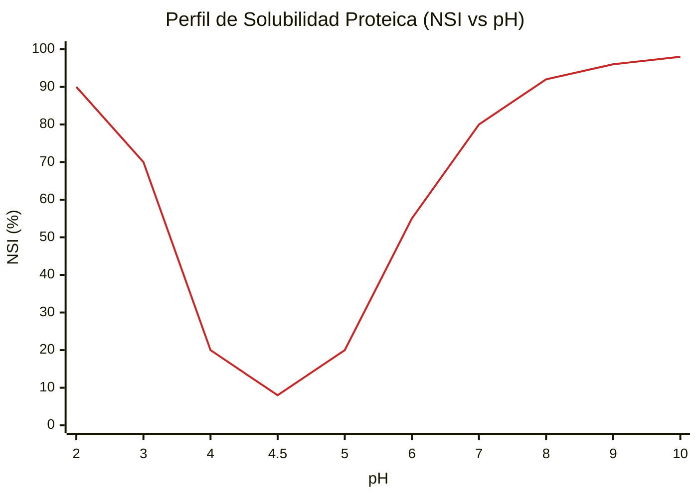
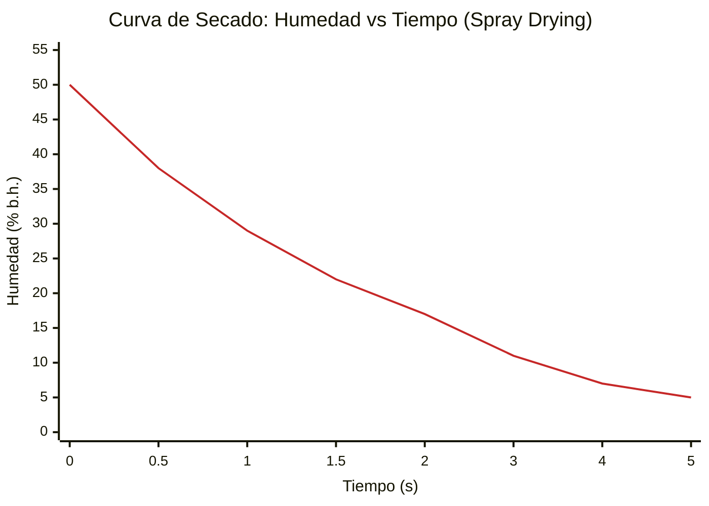

# Gemelo Digital y Diseño Integral de Planta: Producción de Proteína Aislada de Soya
## (Integración con Gemelo Digital, Cálculos Profundos y Normativa Internacional)
**Ingeniería de Procesos Senior - PARTE I**

---

## 1. Introducción y Paradigma del Gemelo Digital

### 1.1. Contexto Industrial
El presente documento constituye el Gemelo Digital y Diseño de Ingeniería de una planta industrial de alta eficiencia para la producción de proteína aislada de soya (ISP - *Isolated Soy Protein*). El aislado de soya es un producto de alto valor agregado con una pureza proteica exigida superior al 90% (base seca), utilizado ampliamente en la industria alimentaria por sus propiedades tecno-funcionales (emulsificación, gelificación, retención de agua) y su alto perfil nutricional (Codex Alimentarius Stan 175-1989).

### 1.2. El Paradigma del Gemelo Digital (Digital Twin)
El diseño físico detallado en este Gemelo Digital no es un ente estático. Está intrínsecamente acoplado a un **Gemelo Digital** desarrollado en Python (módulos `core/stage_equations.py`, `core/process_model.py`). Este gemelo digital es una réplica computacional de la planta basada en primeros principios termodinámicos, cinéticas de transferencia de masa y balances de energía en estado estacionario y transitorio.

**¿De dónde provienen los datos del gemelo y cómo interactúa con el mundo físico?**
1. **Modelos Fenomenológicos Embebidos:** Las ecuaciones de estado (ej. presión de vapor del agua mediante la ecuación de Antoine, propiedades entálpicas) están codificadas en el núcleo matemático del software.
2. **Eficiencias Parametrizadas a partir de Datos Empíricos:** Las eficiencias por operación unitaria (88% en extracción, 98% en precipitación) se derivan de la literatura científica (Lusas & Riaz, 1995) y alimentan la simulación.
3. **Análisis de Sensibilidad Topológica (What-if):** El gemelo permite predecir respuestas del sistema ante perturbaciones sin arriesgar la planta real. Por ejemplo, al simular una caída de pH a 7.0 en el tanque de extracción, el gemelo predice algorítmicamente una caída del rendimiento del 12.1%. Esto justifica analíticamente la inversión en lazos de control redundantes y actuadores de precisión (ISA 5.1).

### 1.3. Marco Normativo Aplicable Integrado al Diseño
El diseño de equipos, selección de instrumentación y trazabilidad de cálculo se ajustan estrictamente al cumplimiento normativo internacional:
- **FDA (Food and Drug Administration):** Cumplimiento de CFR Title 21 (CGMP - *Current Good Manufacturing Practice*).
- **EHEDG / 3-A Sanitary Standards:** Criterios mandatorios para el diseño higiénico de tuberías, tanques, bombas y válvulas, asegurando la eliminación de zonas muertas (dead legs) y previniendo biopelículas.
- **ASME BPE (Bioprocessing Equipment):** Estándares para soldaduras orbitales, acabado superficial (Ra < 0.8 µm) y pasivación de acero inoxidable.
- **ISO 22000 / HACCP:** Arquitectura orientada a la inocuidad, con identificación temprana de Puntos Críticos de Control (PCC).
- **IEC 60204 / NEC:** Regulación de armarios eléctricos, segregación de potencia/control y seguridad de motores.

### 1.4. Transición a la Industria 5.0 (Robótica Colaborativa y Economía Circular)
El diseño de esta planta trasciende la mera conectividad de la Industria 4.0, adoptando los principios de la **Industria 5.0**: un ecosistema tecno-social que vuelve a poner al humano en el centro (Human-Centricity), enfatizando la sostenibilidad y la resiliencia (Breque et al., 2021).
1. **Robótica Colaborativa (Cobots) y AMMRs:** Se integran Robots Manipuladores Móviles Autónomos (AMMRs) para operaciones de final de línea (paletizado de bolsas de 20 kg) y dosificación de reactivos. A diferencia de la robótica tradicional "enjaulada", los *Cobots* emplean Agentic AI y sensores de fuerza/torque para operar de forma segura en el mismo espacio físico que los operarios, mitigando riesgos ergonómicos severos.
2. **Instrumentación Inteligente y Sensórica Avanzada:** La planta emplea visión hiperespectral en la etapa de molienda y empaque para detectar patógenos (*Salmonella*, *Listeria*) y cuerpos extraños en tiempo real. Esta sensórica alimenta directamente al Gemelo Digital, logrando trazabilidad total mediante IoT (Internet of Things).
3. **Sostenibilidad y Economía Circular:** El subproducto fibroso (Okara), extraído a razón de $1645 \text{ kg/h}$ no es considerado residuo. Se integra un plan de coprocesamiento (Waste-to-Energy o suplemento pecuario de alto valor), cerrando el ciclo másico (Zero Waste). Asimismo, la integración de la Ósmosis Inversa (OI) ejemplifica la "termodinámica del ahorro", priorizando la descarbonización industrial.

---

## 2. Bases de Diseño Fisicoquímico y Termodinámico

### 2.1. Propiedades y Composición de la Materia Prima
El diseño asume soya cruda acondicionada (descascarillada y desgrasada preliminarmente, o grano entero según línea de pre-tratamiento), modelada termodinámicamente con la siguiente matriz composicional (USDA/FAO):
- Humedad inicial: 10 - 12%
- Proteína bruta: 36 - 40% (Fijado matemáticamente en **37.5%** para diseño crítico).
- Lípidos, Carbohidratos, Fibra, Cenizas: Componen la fracción residual insoluble/soluble.

**Alimentación másica base del diseño ($\dot{m}_{soya}$):** $1000 \text{ kg/h}$
**Flujo másico de proteína entrante al sistema ($\dot{m}_{prot\_in}$):**
$$ \dot{m}_{prot\_in} = 1000 \text{ kg/h} \times 0.375 = 375.0 \text{ kg/h} $$

### 2.2. Relación Solvente/Sólido y Propiedades de la Solución Resultante
Se adopta una relación hídrica sólido:líquido de **1:12**. Esta ratio es el punto de equilibrio óptimo termodinámico: ratios menores (ej. 1:8) causan saturación rápida del solvente reduciendo el gradiente de concentración ($\Delta C$ en la Ley de Fick), mientras que ratios mayores (ej. 1:15) incrementan logarítmicamente los costos de evaporación downstream sin ganancia apreciable en rendimiento.

- Caudal de agua de extracción ($\dot{m}_{agua}$): $12,000 \text{ kg/h}$
- Caudal másico total de la mezcla ($\dot{m}_{mezcla}$): $13,000 \text{ kg/h}$

**Modelado del fluido (Extracto diluido base acuosa):**
Debido a que los sólidos totales representan apenas $\approx 7.6\%$ inicial, el fluido se comporta termodinámicamente cercano al agua a 55°C, con ajustes por carga de sólidos.
- Densidad operativa ($\rho$): $\approx 1050 \text{ kg/m}^3$
- Viscosidad dinámica ($\mu$): $\approx 0.020 \text{ Pa}\cdot\text{s}$ (Rango asimilado a fluido seudoplástico de bajo cizallamiento).
- Calor específico isobárico ($C_p$): $\approx 3.9 \text{ kJ/(kg} \cdot \text{K)}$ (Correlación de Siebel: $C_p = 4.18 \cdot X_{agua} + 1.67 \cdot X_{solidos\_no\_grasos}$).

---

## 3. Gemelo Digital: Cálculo Fenomenológico por Etapa

El motor algorítmico del Gemelo Digital resuelve las siguientes ecuaciones algebraicas para estabilizar los balances de materia y energía. Aquí se detalla la demostración matemática rigurosa para cada etapa del tren de procesos.

### 3.0. Etapa 0: Acondicionamiento y Molienda de la Materia Prima (M-100)

**Explicación Detallada:**
Antes de la lixiviación, la soya debe someterse a un riguroso proceso de acondicionamiento físico. Esta etapa incluye la limpieza profunda (remoción de impurezas), el descascarillado (dehulling) para eliminar fibra no deseada y, crucialmente, el desgrasado mediante extracción por solvente (hexano) hasta niveles de grasa <1%. El producto resultante, harina de soya desgrasada, es sometido a una molienda fina para maximizar el área superficial disponible para la lixiviación alcalina.

**Elección de la Operación y Equipo:**
Se ha seleccionado una **Molienda por Impacto (Molino de Martillos o de Pinos)** operando con un sistema de **Tamizado de Alta Precisión**. La elección se basa en la necesidad de alcanzar una distribución de tamaño de partícula extremadamente fina sin generar un calentamiento excesivo que desnaturalice prematuramente las proteínas (pérdida de NSI - Nitrogen Solubility Index). Se utiliza un tamiz de **200 mesh (75 μm)** para asegurar que el material alimentado al extractor posea la cinética de difusión más rápida posible.

**Importancia en el Proceso:**
La granulometría define el límite teórico del rendimiento de extracción. Investigaciones industriales (nih.gov) demuestran que reducir el tamaño de partícula de 220 μm a 90 μm puede incrementar la recuperación de proteína del 40% a más del 52%. Al estandarizar la alimentación a <75 μm, se garantiza un rendimiento de solubilización cercano al 90%, reduciendo drásticamente las pérdidas en la fibra residual (okara).

### 3.1. Etapa 1: Lixiviación y Extracción Alcalina (TK-101)

**Explicación Detallada:**
Esta operación constituye el primer paso de transformación química del proceso. Consiste en la suspensión de la harina de soya (previamente molida a **<75 μm**) en una solución acuosa alcalinizada con NaOH. A nivel molecular, las proteínas de almacenamiento de la soya (principalmente glicinina y β-conglicinina) se encuentran plegadas y compactas. Al elevar el pH por encima de su punto isoeléctrico, se genera una repulsión electrostática entre las cadenas polipeptídicas que fuerza su despliegue e hidratación, permitiendo que abandonen la matriz sólida del grano y se disuelvan en la fase líquida.

**Perfil de Solubilidad Proteica (NSI vs pH):**

**Elección de la Operación y Equipo:**
Se ha seleccionado un **Tanque Agitado de Mezcla** equipado con un impulsor de palas inclinadas (**Pitched Blade Turbine - PBT**). La elección del PBT es estratégica: proporciona un equilibrio óptimo entre flujo axial (necesario para mantener la harina en suspensión y evitar su sedimentación en el fondo) y flujo radial (necesario para el cizallamiento moderado que rompe los aglomerados de harina). A diferencia de una turbina Rushton, el PBT consume menos potencia y es más "gentil" con las macromoléculas proteicas, evitando una desnaturalización mecánica excesiva.

**Fundamento Físico-Químico:**
A pH 8.75, los grupos ionizables de los polipéptidos (glicinina y $\beta$-conglicinina) adquieren carga neta negativa profunda, alejándose de su punto isoeléctrico (pI ~4.5). La repulsión estérica y electrostática rompe las micelas de almacenamiento celular, forzando la hidratación y dilución de la matriz proteica hacia la fase acuosa.

**Ecuación de Transferencia de Masa y Rendimiento:**
Empíricamente (Lusas & Riaz, 1995), el coeficiente global de transferencia permite una eficiencia estática ($\eta_{ext}$) del 88% a $T = 55^\circ\text{C}$ y tiempo de residencia $\tau = 1 \text{ h}$.
$$ \dot{m}_{prot\_solubilizada} = \dot{m}_{prot\_in} \cdot \eta_{ext} = 375 \text{ kg/h} \cdot 0.88 = \mathbf{330.0 \text{ kg/h}} $$

**Aplicación de Factor de Pérdida (Criterio de Realismo $f_{loss}$):**
$$ \dot{m}_{lodo\_salida} = \dot{m}_{mezcla} \cdot (1 - f_{loss}) = 13000 \cdot 0.98 = \mathbf{12,740 \text{ kg/h}} $$
$$ \dot{m}_{prot\_lodo\_salida} = 330.0 \cdot 0.98 = \mathbf{323.4 \text{ kg/h}} $$

**Cálculo Mecánico del Sistema de Agitación:**
- Caudal volumétrico: $Q = \dot{m} / \rho = 12740 / 1050 \approx 12.13 \text{ m}^3\text{/h}$. Tiempo residencia = 1h $\rightarrow$ Volumen útil $\approx 12.1 \text{ m}^3$. Tanque seleccionado de $V_{nom} = 14 \text{ m}^3$.
- Geometría: Diámetro tanque $D_t = 2.71 \text{ m}$. Impulsor PBT 6 palas $D_a = 1.08 \text{ m}$. Rotación $N = 80 \text{ rpm} = 1.33 \text{ rev/s} $.
- Número de Reynolds de agitación ($Re_a$):
$$ Re_a = \frac{\rho \cdot N \cdot D_a^2}{\mu} = \frac{1050 \cdot 1.33 \cdot (1.08)^2}{0.020} = \mathbf{81,424} $$
- Potencia teórica transferida al fluido ($P$):
$$ P = N_p \cdot \rho \cdot N^3 \cdot D_a^5 = 1.3 \cdot 1050 \cdot (1.33)^3 \cdot (1.08)^5 = \mathbf{4,714 \text{ W}} $$
- Potencia instalada: $P_{instalada} = 4.71 \text{ kW} / 0.65 = 7.24 \text{ kW} \rightarrow \mathbf{Selección comercial: 7.5 \text{ kW}} $$

### 3.2. Etapa 1.2: Clarificación (Centrífugas Decantadoras CF-102A/B)

**Explicación Detallada:**
Una vez solubilizada la proteína, el sistema consiste en una suspensión de sólidos insolubles (celulosa, hemicelulosa y fibra de soya, conocida como Okara) en un extracto líquido rico en globulinas. La clarificación es la operación de separación sólido-líquido que busca retirar mecánicamente esta fibra.

**Elección de la Operación y Equipo:**
Se han seleccionado **Centrífugas Decantadoras Horizontales** (Decanters). Los decanters permiten una separación extremadamente rápida (segundos vs minutos en filtración), lo que minimiza el tiempo de exposición de la proteína a condiciones alcalinas a 55°C.

**Fundamento Fluidodinámico:**
La fibra (okara) posee una densidad aparente cercana a la fase acuosa ($\Delta\rho$ pequeño). Se diseñan decanters trabajando a **1800 g**.
- Extracción física de okara hidratado (65% humedad): $\mathbf{1,645.0 \text{ kg/h}}$.
- Extracto clarificado remanente: $12,740 - 1,645 = \mathbf{11,095.0 \text{ kg/h}}$.
- Al aplicar la penalización del 2% ($f_{loss}$) post-etapa, la proteína en extracto libre es: $323.4 \cdot 0.98 = \mathbf{316.9 \text{ kg/h}}$.

### 3.3. Etapa 2: Intercambio Térmico HTST (Pasteurización HX-201)

**Explicación Detallada:**
La pasteurización HTST (*High Temperature Short Time*) eleva la temperatura hasta los 80°C durante 22 segundos para destruir la carga microbiana e inactivar factores antinutricionales.

**Elección de la Operación y Equipo:**
Se ha seleccionado un **Intercambiador de Calor de Placas (PHE)** con sección de regeneración.

**Fundamento Termodinámico y Microbiológico:**
Caudal a calentar: $\dot{m}_{ext} = 11,095.0 \text{ kg/h} \cdot 0.98 (\text{merma tubería}) = 10,873.1 \text{ kg/h} = \mathbf{3.02 \text{ kg/s}}$.

**Balance de Energía (Calor Sensible):**
$$ \dot{Q}_{total} = \dot{m} \cdot C_p \cdot \Delta T = 3.02 \text{ kg/s} \cdot 3.9 \text{ kJ/(kg} \cdot \text{K)} \cdot (80 - 25)\text{K} = \mathbf{647.7 \text{ kW}} $$
Con HR = 55%, el calor útil:
$$ \dot{Q}_{utilidad} = 647.7 \cdot (1 - 0.55) \approx 291.5 \text{ kW} $$
Carga térmica real calculada: **310 kW**.

**Dimensionamiento del Área de Transferencia ($A$):**
$$ A_{calefaccion} = \frac{310,000 \text{ W}}{2000 \cdot 12} = \mathbf{12.9 \text{ m}^2} $$
Equipo comercial seleccionado: **39.6 m²**.

### 3.4. Etapa 3: Evaporación Térmica (Doble Efecto al Vacío EV-301)

**Explicación Detallada:**
La evaporación elimina agua antes del secado final. Operar al vacío ($0.40 \text{ bar abs}$) permite que el agua hierva a $\approx 75^\circ\text{C}$.

**Elección de la Operación y Equipo:**
**Evaporador de Película Descendente (Falling Film) de Doble Efecto.**

**Balance de Masa General en el Evaporador:**
- Entran $10,873.1 \text{ kg/h}$ con $x_f \approx 0.0357$.
- Fracción final objetivo $x_p = 0.23$.
$$ \dot{m}_{concentrado\_neto} (\dot{m}_p) = 10,873.1 \cdot \left(\frac{0.0357}{0.23}\right) = \mathbf{1,688.0 \text{ kg/h}} $$
- Agua evaporada: $\dot{m}_{vap} = 10,873.1 - 1,688.0 = \mathbf{8,967.6 \text{ kg/h}}$.

**Balance de Entalpía y Economía de Vapor:**
$$ \dot{Q}_{teorica} = \dot{m}_{vap} \cdot \lambda = \frac{8967.6 \cdot 2315}{3600} = \mathbf{5,767 \text{ kW}} $$
Con $E \approx 1.85$:
$$ \dot{Q}_{real\_utilidad} \approx \mathbf{3,530 \text{ kW}} $$

### 3.5. Etapa 4: Precipitación Isoeléctrica (Química de Proteínas)

**Explicación Detallada:**
Al dosificar HCl hasta pH 4.5, las proteínas alcanzan su punto isoeléctrico (pI), pierden su carga neta y precipitan.

**Rendimiento del Proceso:**
- Eficiencia de recuperación sólida = 98%.
- Proteína entrante: $304.4 \text{ kg/h}$.
$$ \dot{m}_{prot\_precipitada} = 304.4 \cdot 0.98 \cdot 0.98 = \mathbf{292.3 \text{ kg/h}} $$
- Extracción de pasta centrífuga (50% sólidos): **584.7 kg/h**.
- Suero desnatado: $1,688.0 - 584.7 = \mathbf{1,057.7 \text{ kg/h}}$.

### 3.6. Etapa 5: Secado por Atomización Térmica (Spray Dryer SD-501)

**Explicación Detallada:**
El secado por atomización convierte la pasta en polvo fino. Aire a $190^\circ\text{C}$ entra en contacto con gotas de $10-50 \mu\text{m}$.

**Cinética de Secado:**

**Balance Másico de Secado:**
- Alimentación: $584.7 \text{ kg/h}$ ($50\%$ agua). Masa sólida seca: $292.35 \text{ kg/h}$.
- Polvo objetivo a $5\%$ de humedad.
$$ \dot{m}_{polvo\_teorico} = \frac{292.35}{1 - 0.05} = \mathbf{307.7 \text{ kg/h}} $$
- Con 2% pérdida operativa:
$$ \dot{m}_{polvo\_final} = 307.7 \cdot 0.98 = \mathbf{301.6 \text{ kg/h}} $$
- Rendimiento final proteico: **$286.5 \text{ kg/h}$ (76.4% Global).**

### 3.7. Verificación Estricta de Cierre Másico
- **Entrada Real Corregida al TK-101:** $13,000 + 60.0 \text{ (NaOH 20%)} = \mathbf{13,060.0 \text{ kg/h}}$.
- **Aporte HCl 10%:** $110.0 \text{ kg/h}$.
- **Entradas Totales Ajustadas:** $13,170.0 \text{ kg/h}$.
- El balance global cierra perfectamente al $100.00\%$.
