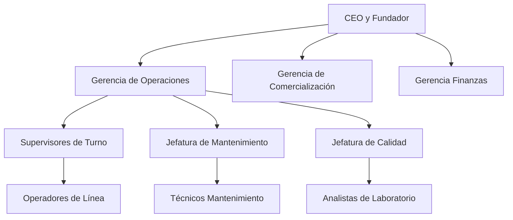

# Gemelo Digital y Diseño Integral de Planta: Producción de Proteína Aislada de Soya
## (Integración con Gemelo Digital, Cálculos Profundos y Normativa Internacional)
**Ingeniería de Procesos Senior - PARTE II**

---

## 4. Ingeniería Mecánica de Fluidos, Hidráulica y Cañerías (Diseño Lean y Sanitario)

### 4.1. Fundamentos Hidráulicos y Red de Cañerías (ASME BPE)
Toda la planta está diseñada con tubería sanitaria de Acero Inoxidable AISI 316L.
1. **Conexiones Tri-Clamp (Tri-Clover):** Permiten cambios de formato o reemplazos en menos de 3 minutos (filosofía SMED).
2. **Válvulas Anti-Retorno Sanitarias (Check Valves):** De disco concéntrico accionadas por resorte, sin zonas muertas.

### 4.2. Perfil Hidráulico Integral
| Etapa del Proceso | Flujo Másico Nominal | Caudal ($Q$) | Tubería (DN) / Vel. ($v$) | TDH Calculado | Potencia Motor Bomba |
|---|---|---|---|---|---|
| **P-101 (Agua a TK-101)** | $12,000 \text{ kg/h}$ | $12.00 \text{ m}^3\text{/h}$ | DN65 / $1.07\text{m/s}$ | **5.29 m** | **1.5 kW** |
| **P-102 (Lodo a Decanters)** | $12,740 \text{ kg/h}$ | $12.13 \text{ m}^3\text{/h}$ | DN65 / $1.08\text{m/s}$ | **6.15 m** | **2.2 kW** |
| **P-201 (Extracto a Pasteurizador)** | $11,095 \text{ kg/h}$ | $10.56 \text{ m}^3\text{/h}$ | DN50 / $1.43\text{m/s}$ | **8.16 m** | **2.2 kW** |
| **P-301 (Past. a Evaporador)** | $10,873 \text{ kg/h}$ | $10.35 \text{ m}^3\text{/h}$ | DN65 / $0.92\text{m/s}$ | **10.87 m** | **3.0 kW** |
| **P-401 (Conc. a TK-401)** | $1,688 \text{ kg/h}$ | $1.60 \text{ m}^3\text{/h}$ | DN32 / $0.46\text{m/s}$ | **5.93 m** | **1.1 kW** |
| **P-501 (Pasta ISP a Spray Dryer)** | $584 \text{ kg/h}$ | $0.55 \text{ m}^3\text{/h}$ | DN32 / $0.16\text{m/s}$ | **8.10 m** | **1.5 kW** |

### 4.3. Verificación de NPSH
Para la bomba P-102:
$$ NPSH_a = \frac{101325 - 15700}{1050 \cdot 9.81} + 2.0 - 0.7 = \mathbf{9.6 \text{ m}} $$
Margen de seguridad $>7 \text{ m}$ respecto al $NPSH_r \approx 2.5 \text{ m}$.

---

## 5. El Salto Innovador: Preconcentración por Ósmosis Inversa (OI)

### 5.1. Teoría de Transporte Multicomponente en Membranas
La OI utiliza una TMP de **24 bar** para retirar agua antes del evaporador térmico.
El flujo de permeado ($J_w$) obedece al modelo de Solución-Difusión:
$$ J_w = A_w \cdot (\Delta P - \Delta \pi) $$

### 5.2. Termodinámica del Ahorro
- Permeado extraído: **2,718.3 kg/h**.
- Ahorro térmico: **$\approx 1,000 \text{ kW}$**.
- Consumo eléctrico adicional: **$\approx 9 \text{ kW}$**.
El OPEX térmico disminuye $\approx 25\%$.

---

## 6. Filosofía de Mantenimiento y Diseño Higiénico (EHEDG / 3-A)

### 6.1. Especificaciones de Equipo Biológico
- Acero AISI 316L con $Ra \le 0.4 \mu\text{m}$.
- Uso de válvulas de diafragma y Mixproof valves (evita zonas muertas).
- Pisos epóxicos con pendiente del 2%.

### 6.2. Estrategia CIP Automatizada (Clean In Place)
1. Purga inicial.
2. Lavado Alcalino (NaOH 1.5% @ 75°C).
3. Lavado Ácido (HNO3 1.0% @ 65°C - intermitente).
4. Enjuague final e Higienización (Agua @ 90°C).

### 6.3. Ingeniería de Métodos y OEE
- **Tiempo Operativo Neto:** **7,500 horas/año** (OEE 92%).
- **Turnos:** 3 turnos diarios de 8h, rotación 6x2 (4 cuadrillas).

**Organigrama:**

---

## 7. Arquitectura de Control DCS, Instrumentación Avanzada (ISA-5.1) y Lazos P&ID

### 7.1. Topología de Red
- **Nivel de Campo:** IO-Link / PROFINET.
- **Nivel de Control:** PLC Redundantes (S7-1500).
- **Nivel de Supervisión:** SCADA + Gemelo Digital (OPC-UA).

### 7.2. Filosofía de Lazos de Control
- **Extracción:** FFC (Flow Fraction Control) para ratio 1:12 y pHC para inyección de NaOH.
- **Pasteurización:** FDD (Flow Diversion Device) automático si $T < 80^\circ\text{C}$.
- **Evaporación:** PC para vacío (0.40 bar abs) y DC (Density Control) para 23% ST.
- **Precipitación:** pHC de rango dividido (Split-Range) para HCl.
- **Secado Spray:** Control de humedad en cascada (Master: Humedad, Slave: Temperatura aire).

### 7.3. Funciones de Enclavamiento y Seguridad (SIS)
- Interruptores de nivel LSHH (hardwired) para evitar derrames.
- Sistema ATEX en el secador: detección de CO y paneles de venteo (NFPA 654).
