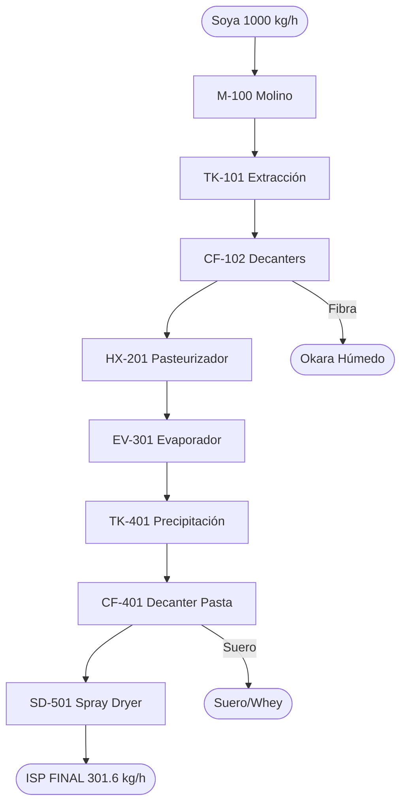

# Gemelo Digital y Diseño Integral de Planta: Producción de Proteína Aislada de Soya
## (Integración con Gemelo Digital, Cálculos Profundos y Normativa Internacional)
**Ingeniería de Procesos Senior - PARTE IV**

---

## 11. Diagrama de Flujo de Proceso (PFD) y Secuencia Operacional

### 11.1. Diagrama PFD

### 11.2. Narrativa (CPV / CTQ)
- **Fase I:** Ratio 1:12, pH 8.75. Meta: 88% recuperación.
- **Fase II:** Separación 1800g, Pasteurización 80°C x 22s (PCC HACCP).
- **Fase III:** Evaporación 0.40 bar abs hasta 23% ST.
- **Fase IV:** Precipitación pH 4.5 (punto isoeléctrico).
- **Fase V:** Secado 190°C entrada, Humedad final $\le 5\%$.

---

## 12. Matriz de Criticidad Operativa (FMEA)
- **pH Precipitación (TK-401):** NPR 144 (**CRÍTICA**). Riesgo de pérdida masiva de producto en suero.
- **Humedad Final (SD-501):** NPR 108 (**ALTA**). Riesgo de caking y microbiología.
- **Vacío Evaporador:** NPR 70 (**ALTA**). Riesgo de coloración Maillard.

---

## 13. Gestión Integral de Riesgos (HACCP / HAZOP)

### 13.1. PCC HACCP
- **Biológico:** HX-201 (T $\ge$ 80°C).
- **Físico:** ML-601 (Detectores de metales).
- **Químico:** Residuos de CIP (Conductivímetro final).

### 13.2. Seguridad Industrial
- **Explosión de Polvo:** Diseño NFPA 61/654 en secador.
- **Químicos:** Duchas ANSI Z358.1 en estación CIP.
- **Térmico:** Aislamiento OSHA 1910 en líneas calientes.

---

## 14. Envasado, Shelf-Life y Logística de Exportación

### 14.1. Packaging
- Sacos de **20 kg** con Liner de barrera (PET/NY/AL/PE).
- Atmósfera modificada con Nitrógeno ($N_2$).

### 14.2. Shelf-Life
- **Vida Útil:** 24 meses.
- **Almacenamiento:** $18^\circ\text{C} - 22^\circ\text{C}$, $< 60\%$ RH.

### 14.3. Logística (Incoterms 2020)
- Ruta principal: Corredor Pacífico (Arica) para Asia.
- Incoterm recomendado: **FCA Planta Santa Cruz** (mitiga riesgo de transporte externo).

---

## 15. Estrategia de Circularidad (Monetización Subproductos)

### 15.1. Mercado Objetivo
- **Suero:** Venta a porcicultores de Warnes (probiótico natural).
- **Okara:** Venta a lecherías del Norte Integrado (suplemento proteico).

### 15.2. Impacto Financiero
- Beneficio total (Ingreso + Costo Evitado): **$\approx + 578,190 \text{ Bs/mes}$**.
- Cero CAPEX pesado: Uso de tolvas y tanques de HDPE.

---

## 16. Base Bibliográfica y Normativa
- **Ingeniería:** Perry, McCabe & Smith, Coulson & Richardson.
- **Soya:** Lusas & Riaz, Kinsella.
- **Normativa:** Codex Alimentarius Stan 175, FDA 21 CFR, ASME BPE, EHEDG.
- **Industria 5.0:** Breque et al., Grieves (Digital Twin).
